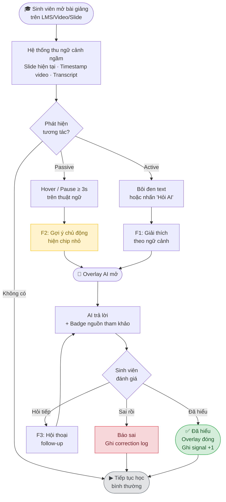
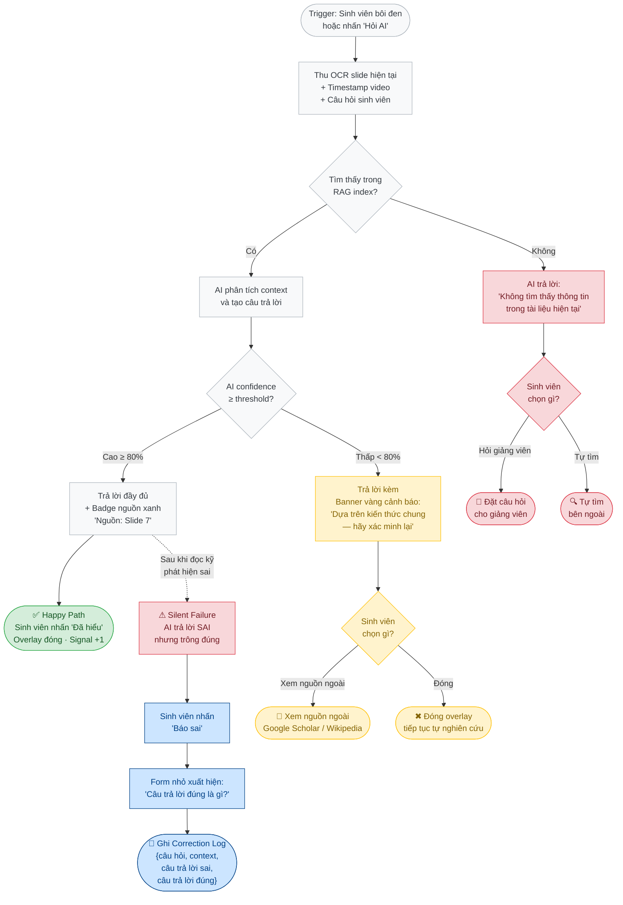
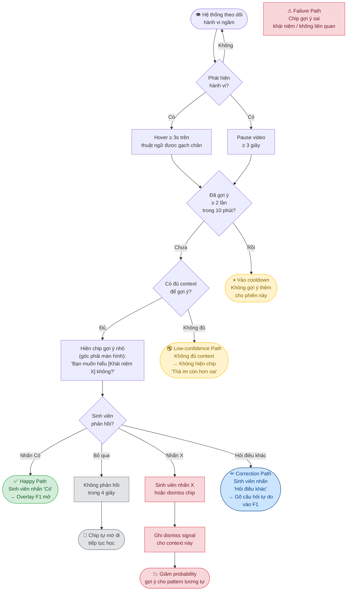
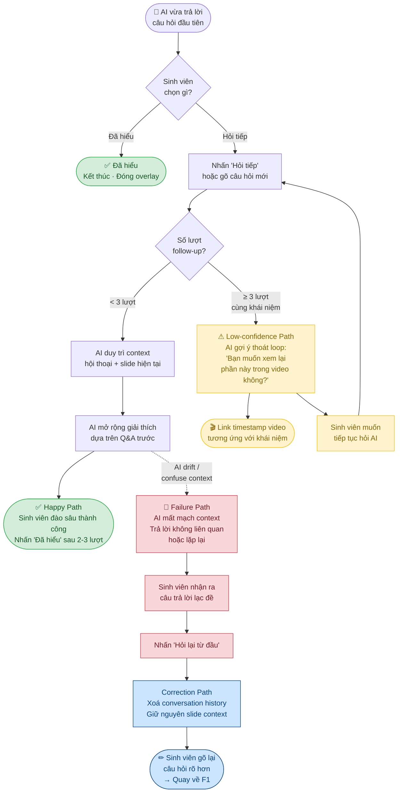
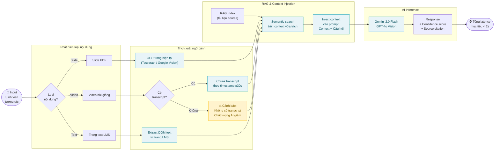
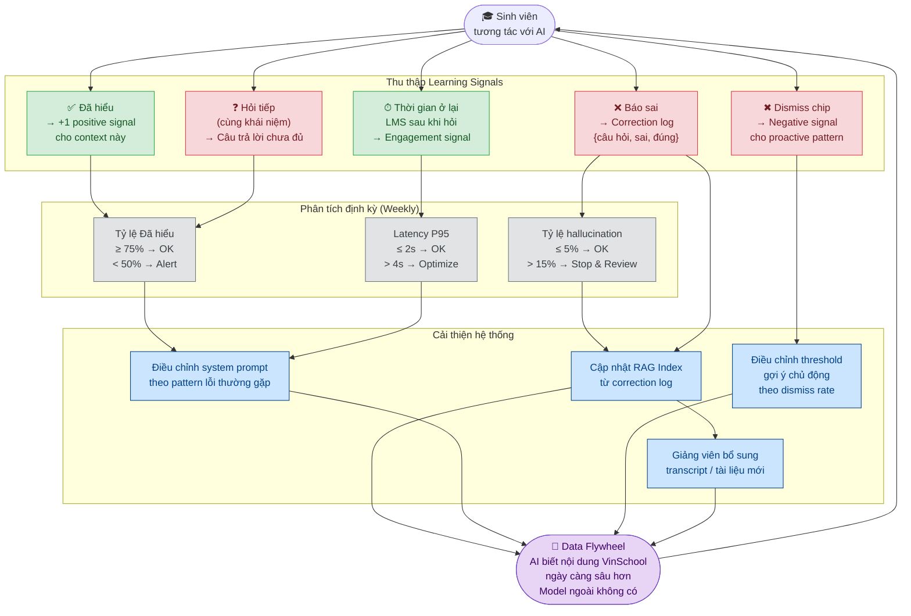

# UX Flowcharts — AI Tutor Overlay (VinSchool)

Tài liệu này mô tả trải nghiệm người dùng qua **6 sơ đồ Mermaid**:

1. Tổng quan luồng UX
2. F1 — Giải thích khái niệm: 4 paths
3. F2 — Gợi ý chủ động: 4 paths
4. F3 — Hội thoại follow-up: 4 paths
5. Luồng phát hiện ngữ cảnh (Context Detection Pipeline)
6. Vòng lặp phản hồi & Data Flywheel

---

## 1. Tổng quan luồng UX

Luồng chính từ lúc sinh viên mở bài giảng đến khi kết thúc tương tác với AI.

---

## 2. F1 — Giải thích khái niệm theo ngữ cảnh (4 Paths)

Sinh viên chủ động hỏi → hệ thống phân nhánh theo độ tự tin và tính đúng đắn của AI.

---

## 3. F2 — Gợi ý chủ động (Proactive Suggestion) — 4 Paths

AI chủ động gợi ý khi phát hiện sinh viên có thể đang gặp khó khăn.

---

## 4. F3 — Hội thoại Follow-up — 4 Paths

Sau câu trả lời đầu tiên, sinh viên tiếp tục đào sâu trong cùng overlay.

---

## 5. Luồng phát hiện ngữ cảnh (Context Detection Pipeline)

Pipeline kỹ thuật xảy ra trong nền mỗi khi sinh viên tương tác — trước khi AI nhận được bất kỳ câu hỏi nào.

---

## 6. Vòng lặp phản hồi & Data Flywheel

Mỗi tương tác của sinh viên tạo ra signal → cải thiện chất lượng AI theo thời gian.

---

## Tóm tắt các paths

| Sơ đồ | Happy | Low-confidence | Failure | Correction |
|-------|-------|----------------|---------|------------|
| F1 — Giải thích | AI trả lời đúng + nguồn → Đã hiểu | Trả lời + banner vàng cảnh báo | Không tìm thấy trong RAG → từ chối | Sinh viên báo sai → correction log |
| F2 — Gợi ý chủ động | Sinh viên chấp nhận chip → F1 | Không đủ context → không gợi ý | Gợi ý sai khái niệm → dismiss | Dismiss → giảm probability proactive |
| F3 — Follow-up | Multi-turn rõ ràng, đào sâu | ≥3 lượt cùng khái niệm → escalate sang video | AI mất context, lạc đề | Reset hội thoại, hỏi lại rõ hơn |
