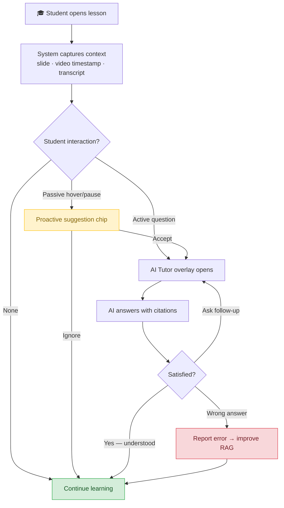
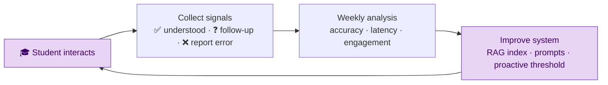

# UX Flows — AI Tutor Overlay

---

## 1. Tổng quan luồng UX

```mermaid
graph TD
    A["🎓 Student opens lesson"] --> B["System captures context\nslide · video timestamp · transcript"]
    B --> C{"Student interaction?"}

    C -->|"Passive hover/pause"| D["Proactive suggestion chip"]
    C -->|"Active question"| E["AI Tutor overlay opens"]
    C -->|"None"| F["Continue learning"]

    D -->|"Accept"| E
    D -->|"Ignore"| F

    E --> G["AI answers with citations"]
    G --> H{"Satisfied?"}

    H -->|"Yes — understood"| F
    H -->|"Ask follow-up"| E
    H -->|"Wrong answer"| I["Report error → improve RAG"]
    I --> F

    classDef happy fill:#d4edda,stroke:#28a745,color:#155724
    classDef warn  fill:#fff3cd,stroke:#ffc107,color:#856404
    classDef fail  fill:#f8d7da,stroke:#dc3545,color:#721c24

    class F happy
    class D warn
    class I fail
```

---

## 2. Data Flywheel — Continuous Improvement Loop

```mermaid
flowchart LR
    A["🎓 Student interacts"] --> B["Collect signals\n✅ understood · ❓ follow-up · ❌ report error"]
    B --> C["Weekly analysis\naccuracy · latency · engagement"]
    C --> D["Improve system\nRAG index · prompts · proactive threshold"]
    D --> A

    classDef flywheel fill:#e8d5f5,stroke:#6f42c1,color:#3d0066
    class A,D flywheel
```
