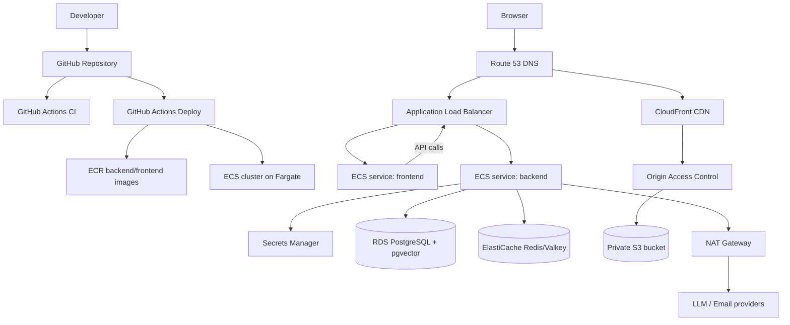
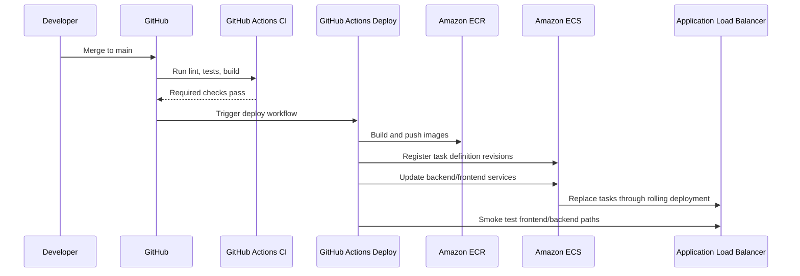

# AWS Architecture — ECS Managed V1

This diagram set matches `DEPLOYMENT_PLAN.md`.

## Runtime Architecture

## Deploy Flow

## Responsibility Split

| Component | Responsibility |
|---|---|
| GitHub Actions CI | Validate code before deploy |
| GitHub Actions Deploy | Build, push, rollout, smoke |
| Terraform | Provision reviewed infrastructure |
| ECR | Private image registry |
| ECS cluster | Shared compute control plane |
| ECS services | Frontend/backend runtime |
| ALB | Public ingress and health-based traffic routing |
| RDS | Authoritative application data |
| ElastiCache | Cache/session/rate limit store |
| S3 | Private asset storage |
| CloudFront | Browser asset and video delivery |
| Secrets Manager | Runtime secrets |
| CloudWatch / Budgets | Logs, alarms, cost controls |

## Boundary Notes

- Terraform manages infrastructure, not app releases.
- ECS service rollout uses new task definition revisions, not mutable containers.
- Frontend and backend stay separate services even when sharing one cluster.
- Course videos must stream `CloudFront -> Browser`, not through FastAPI.
