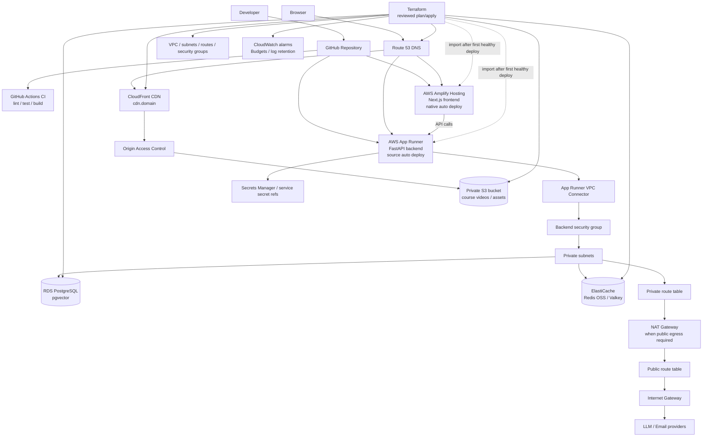
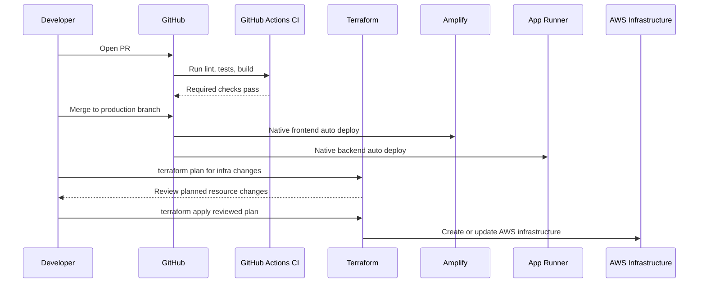

# AWS Architecture - Simple Managed V1

This diagram set matches `DEPLOYMENT_PLAN.md`.

## Runtime Architecture

## Deploy Flow

## Responsibility Split

| Component | Responsibility |
|---|---|
| GitHub Actions CI | Validate code before merge |
| Terraform | Provision foundational AWS infrastructure through reviewed `plan/apply` |
| Amplify | Build and deploy Next.js frontend from GitHub |
| App Runner | Build and deploy FastAPI backend from GitHub/source |
| App Runner VPC connector | Private backend access to VPC resources |
| NAT Gateway | Public egress for backend calls when private VPC access is enabled |
| RDS PostgreSQL | Authoritative application data and pgvector-backed data |
| ElastiCache | Redis-compatible cache/session/rate-limit backend |
| S3 | Private storage for course/video assets |
| CloudFront | Public video streaming and asset delivery |
| Route 53 / ACM | DNS and HTTPS certificates |
| Secrets Manager | Secret containers and runtime secret values |
| CloudWatch / Budgets | Logs, alarms, and cost controls |

## Boundary Notes

- Terraform manages infrastructure, not large S3 objects or app releases.
- Course videos must stream `CloudFront -> Browser`, not through FastAPI.
- App Runner and Amplify use native AWS GitHub authorization for the first
  deployment. Import into Terraform later only if it improves drift control.
- Custom domains are attached only after temporary AWS domains pass smoke tests.
