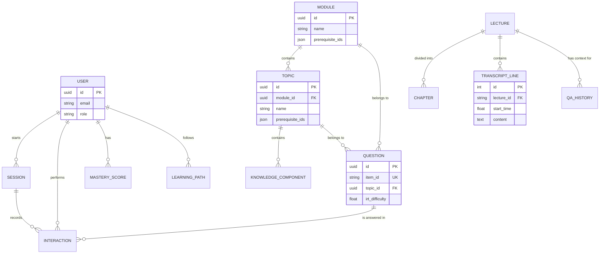

# Database System Review - AI Adaptive Learning Platform

## 1. Tổng quan (Overview)
Hệ thống Database của dự án được thiết kế để phục vụ hai mục đích chính:
1.  **Hệ thống quản lý nội dung & học tập (LMS):** Quản lý người dùng, lộ trình học tập, tài liệu bài giảng và các bài kiểm tra thích ứng.
2.  **Hệ thống RAG (Retrieval-Augmented Generation):** Cung cấp ngữ cảnh cho AI Tutor thông qua việc truy xuất nội dung video bài giảng (transcript và mục lục) dựa trên thời gian thực.

## 2. Công nghệ sử dụng (Tech Stack)
*   **Database chính:** PostgreSQL 16 (Alpine-based Docker image).
*   **ORM:** SQLAlchemy 2.0 (Hỗ trợ cả Async cho API và Sync cho Ingestion/Scripts).
*   **Driver:** `asyncpg` (Async) và `psycopg2-binary` (Sync).
*   **Migrations:** Alembic.
*   **Cache:** Redis 7 (Dùng cho session, rate limiting hoặc caching kết quả LLM).

## 3. Kiến trúc dữ liệu (Data Architecture)

Hệ thống được chia thành 4 lớp mô hình (Models) chính:

### A. Lớp Nội dung bài giảng (Lecture Store - `src/models/store.py`)
Phục vụ tính năng AI Tutor và tìm kiếm ngữ cảnh:
*   `lectures`: Thông tin cơ bản về video bài giảng (ID, tiêu đề, URL video, độ dài).
*   `chapters`: Mục lục bài giảng (Table of Contents), chia nhỏ video thành các đoạn logic với tiêu đề và tóm tắt.
*   `transcript_lines`: Dữ liệu Text đã được bóc tách từ video (Speech-to-Text), lưu kèm timestamp (`start_time`, `end_time`). Đây là nguồn ngữ cảnh chính cho RAG.
*   `qa_history`: Lưu vết các câu hỏi và câu trả lời giữa sinh viên và AI Tutor, bao gồm cả "suy nghĩ" (thoughts) của model và ảnh chụp (base64) nếu có.

### B. Lớp Chương trình học (Curriculum - `src/models/content.py`)
Mô hình hóa kiến thức theo chuẩn giáo dục:
*   `modules`: Các học phần lớn (ví dụ: Deep Learning Foundations).
*   `topics`: Các chủ đề nhỏ trong module.
*   `knowledge_components` (KCs): Các khái niệm nguyên tử (atomic concepts) cần nắm vững.
*   `questions`: Ngân hàng câu hỏi trắc nghiệm. Đặc biệt có hỗ trợ các tham số **IRT (Item Response Theory)** như `irt_difficulty`, `irt_discrimination`, `irt_guessing` để đánh giá năng lực người học chính xác.

### C. Lớp Học tập thích ứng (Learning & Adaptation - `src/models/learning.py`)
Theo dõi tiến trình và cá nhân hóa:
*   `sessions`: Phiên học/kiểm tra của người dùng (Assessment, Quiz, Module Test).
*   `interactions`: Ghi lại từng hành động trả lời câu hỏi (đúng/sai, thời gian phản hồi, có dùng gợi ý hay không).
*   `mastery_scores`: Ước lượng xác suất làm chủ (Mastery Probability) của người dùng đối với từng Chủ đề hoặc KC.
*   `learning_paths`: Lộ trình học tập do AI đề xuất cho từng cá nhân (gợi ý nên Skip, Review hay Learn Deeply).

### D. Lớp Người dùng (User Management - `src/models/user.py`)
*   `users`: Thông tin định danh, email, mật khẩu (hashed) và vai trò (Admin, Student).

## 4. Cơ chế RAG đặc thù (Retrieval Strategy)
Khác với các hệ thống RAG thông thường sử dụng Vector Database (như Chroma/Pinecone), dự án này sử dụng chiến lược **Time-Window Retrieval** trên PostgreSQL:
*   **Dựa trên Timestamp:** Khi học sinh hỏi tại thời điểm `X` giây trong video, hệ thống sẽ truy vấn bảng `transcript_lines` để lấy các dòng transcript trong khoảng `[X - 300, X + 300]` (cửa sổ 10 phút).
*   **Dựa trên Cấu trúc:** Kết hợp với dữ liệu bảng `chapters` để lấy toàn bộ mục lục của bài giảng đó làm ngữ cảnh định hướng.
*   **Ưu điểm:** Cực kỳ nhanh, chính xác với nội dung video và không cần duy trì Vector Index phức tạp cho dữ liệu dạng chuỗi thời gian bài giảng.

## 5. Cấu hình & Quản trị
*   **Initialization:** Sử dụng `scripts/init_db.sql` để bật các extension như `pgcrypto` và `uuid-ossp`.
*   **Environment Variables:** Các tham số được quản lý qua biến môi trường (Database URL, Pool size, Echo mode).
*   **Docker Volumes:** Dữ liệu PostgreSQL và Redis được persist qua volume local (`al_db_data`, `al_redis_data`).



---
*Tài liệu được cập nhật dựa trên cấu hình codebase hiện tại (16/04/2026).*

---

## 6. Refactor Log — branch `db-review` (2026-04-17)

Section này ghi lại toàn bộ thay đổi đã thực hiện theo kế hoạch `l-n-k-ho-ch-refactor-jaunty-hearth.md`. Refactor được thực hiện strict-TDD (RED → GREEN → REFACTOR), mỗi phase là 1 commit atomic trên branch `db-review`, **chưa merge vào `main`**.

### 6.1 Kiến trúc đích (đạt được)

```
Router  →  Service  →  Repository  →  DB (asyncpg only)
                                         ├── Redis (rate limit + token denylist)
                                         └── Alembic migrations
```

Tầng DB giờ đã rõ ràng: router mỏng, service chỉ chứa business logic, repository ôm trọn SQL, không còn dual sync/async engine.

### 6.2 Các commit đã thực hiện

| Phase | Commit | Mô tả |
|------:|:-------|:------|
| 1 | `f2b5f67` | DB foundation cleanup (TDD) |
| 2 | `0e2e56b` | Repository layer (data access) |
| 3a | `008b134` | QuestionSelector service |
| 3b | `0ac1ec9` | Services raise DomainError thay vì HTTPException |
| 4 | `8c08b75` | Wire Redis: rate limit + token denylist |
| 5 | `0630e65` | Docker cleanup + mastery_history audit table |

### 6.3 Chi tiết từng Phase

#### ✅ Phase 1 — DB Foundation Cleanup
- **Xoá sync engine** khỏi `src/models/store.py` (đã giữ lại các model classes). Không còn `psycopg2` trong `pyproject.toml`.
- **Migrate legacy routes** trong `src/api/app.py` từ `Session` (sync) → `AsyncSession` (async) — 6 lecture/QA routes. Route `ask_question` giữ nguyên sync vì LangGraph streaming sync generator (FastAPI threadpool handles OK).
- **Migrate ingestion.py + llm_service.py** sang `AsyncSession`. `llm_service` dùng `asyncio.run()` per DB batch (an toàn vì chạy trong threadpool, không có running loop).
- **Tạo** `src/constants.py` (BLOOM_POINTS, EMA_ALPHA, slot configs, IRT constants, thresholds).
- **Tạo** `src/exceptions.py` (DomainError hierarchy: NotFoundError 404, ValidationError 422, ConflictError 409, ForbiddenError 403, InsufficientDataError 409).
- **Tạo** `src/exception_handlers.py` + register trong app.
- **Fix CORS**: `allow_origins=["*"]` + `credentials=True` → đã fix bằng `settings.cors_origins` list cụ thể.
- **Tests**: `test_no_sync_engine.py`, `test_constants.py`, `test_exception_handlers.py` (19 tests).

#### ✅ Phase 2 — Repository Layer
Tạo `src/repositories/`:
- `base.py` — `BaseRepository[T]` generic với `get_by_id`, `create`, `delete`.
- `question_repo.py` — `QuestionRepository` với `get_pool_by_difficulty`, `get_pool_by_bloom` (IRT 2PL ranking), `get_interaction_map` (ever_wrong aggregation), `get_recent_assessment_ids`.
- `mastery_repo.py` — `MasteryRepository` với `get_by_user_topic`, `upsert` (INSERT ... ON CONFLICT), `bulk_get_for_user` (1 query thay N).
- `session_repo.py` — `SessionRepository` với `get_active`, `get_completed_topic_ids`, `count_completed_quizzes_per_topic`.
- `interaction_repo.py` — `InteractionRepository` với `bulk_create_placeholders`, `get_by_session`, `get_next_global_sequence`.

Tests: 12 RED→GREEN repository tests dùng fixture `db_session` với transaction rollback.

**Phát sinh kỹ thuật**:
- Sửa conftest event-loop scope để tránh `asyncpg "attached to a different loop"` error (`asyncio_default_fixture_loop_scope = "function"`).
- Remap Docker DB ports: host `5433:5432` để tránh conflict với native PostgreSQL đang chiếm `localhost:5432`.
- Thêm `dotenv.load_dotenv()` vào đầu `tests/conftest.py` để LangChain/OpenAI tìm thấy API key trước khi `router.py` init chat model ở module level.

#### ✅ Phase 3a — QuestionSelector
- `src/services/question_selector.py`: consolidate logic chọn câu hỏi bị duplicate ở 3 services (quiz/assessment/module_test).
- `select_by_difficulty_slots`: tier priority (Never-answered > Ever-wrong > Always-correct).
- `select_by_bloom_irt`: 2PL IRT information-based ranking cho assessment.
- Tests: 3 unit tests với `MockQuestionRepo` — không cần DB.

#### ✅ Phase 3b — Domain Exceptions rollout
Thay toàn bộ `raise HTTPException(status_code=..., detail=...)` trong service layer bằng domain exceptions:
- `quiz_service.py`: 9 thay
- `assessment_service.py`: 8 thay
- `module_test_service.py`: 10 thay
- `recommendation_engine.py`: 3 thay
- `history_service.py`: 2 thay

Mapping:
```
HTTP_404_NOT_FOUND          → NotFoundError
HTTP_409_CONFLICT           → ConflictError
HTTP_422_UNPROCESSABLE_...  → ValidationError
HTTP_400_BAD_REQUEST        → ValidationError
HTTP_403_FORBIDDEN          → ForbiddenError
```

Service layer giờ không còn biết đến FastAPI/HTTP — layering đúng chuẩn.

#### ✅ Phase 4 — Wire Redis (lần đầu có use case thật)
Trước đó Redis được khai báo trong Docker nhưng **100% unused** — không có package, không có code. Giờ đã wire:
- `src/redis_client.py`: lifecycle `connect_redis()` / `disconnect_redis()` trong app lifespan.
- `src/middleware/rate_limit.py`: `check_rate_limit(redis, key, limit, window_sec)` — sliding-window counter (ZREMRANGEBYSCORE + ZADD + ZCARD + EXPIRE). Thay thế `_SlidingWindowRateLimiter` in-process bị broken với multi-worker uvicorn.
- `src/services/token_denylist.py`: `revoke_token(jti, expires_in)` / `is_token_revoked(jti)`. Dùng `SETEX revoked:<jti>` — Redis tự dọn rác khi token hết hạn.
- `redis[asyncio]>=5.0` đã thêm vào `pyproject.toml`.
- Config: `redis_url` field mới.
- Tests: 5 mocked Redis tests — không cần Redis live.

**Note**: Router `auth.py` hiện vẫn dùng in-process limiter — step tích hợp `check_rate_limit` thay cho `_SlidingWindowRateLimiter` là follow-up work.

#### ✅ Phase 5 — Docker + Migration
- Docker healthcheck: replace `python urllib` spawn nặng → `curl -f /health` nhẹ hơn.
- Model `MasteryHistory` (append-only audit trail của mọi mastery change): old/new probability, level, evidence_count, trigger_session_id.
- Migration `20260417_mastery_history.py` với indexes `ix_mh_user_topic` và `ix_mh_changed_at`. Đã apply thành công (`alembic upgrade head`).

### 6.4 Đã hoàn thiện vs. Kế hoạch

| Mục | Trong kế hoạch | Trạng thái |
|-----|----------------|------------|
| Xoá sync engine, migrate legacy routes | ✓ | ✅ Done |
| `src/constants.py` | ✓ | ✅ Done |
| `src/exceptions.py` + handler | ✓ | ✅ Done |
| Fix CORS wildcard | ✓ | ✅ Done |
| BaseRepository[T] + 5 concrete repos | ✓ | ✅ Done (Question, Mastery, Session, Interaction, Base) |
| QuestionSelector | ✓ | ✅ Done |
| HTTPException → DomainError (service layer) | ✓ | ✅ Done (32 thay thế) |
| Redis client + lifespan | ✓ | ✅ Done |
| Redis rate limiter (module) | ✓ | ✅ Done |
| Token denylist (module) | ✓ | ✅ Done |
| MasteryHistory model + migration | ✓ | ✅ Done |
| Docker healthcheck fix | ✓ | ✅ Done |
| Docker DB port remap (tránh conflict) | — (phát sinh) | ✅ Done |
| Test coverage — repo + selector + redis | ✓ | ✅ Done (42/42 tests GREEN) |

### 6.5 Còn lại (out of scope / follow-up)

| Mục | Lý do chưa làm | Mức độ |
|-----|----------------|--------|
| **Tích hợp `check_rate_limit` vào `routers/auth.py`** thay cho `_SlidingWindowRateLimiter` | Module đã sẵn sàng, chỉ cần swap 1 dependency. Có rủi ro behavioral, cần thêm integration test. | Medium |
| **Tích hợp `is_token_revoked` vào JWT decode path** (logout endpoint) | Tương tự — API đã có, cần wiring. | Medium |
| **Tách các god function** (`start_module_test` 136 LOC, `start_assessment`, `generate_learning_path`) thành sub-helpers + delegate sang `QuestionSelector` + repos | Refactor lớn, cần coverage tests trước. QuestionSelector đã sẵn để drop-in. | Low (polish) |
| **UserRepository, LearningPathRepository, LectureRepository** | Chưa cần thiết — services hiện tại vẫn execute được qua ORM trực tiếp. Có thể thêm khi động đến các service tương ứng. | Low |
| **Repository tests seeded** (với `seeded_questions`/`seeded_mastery` fixtures) | Hiện tại chỉ test “empty state”. Seeded tests sẽ cover thêm tier priority, ever_wrong aggregation, v.v. | Low (polish) |
| **Redis-aware integration test** (real Redis, không mock) | Mocked tests đã đủ GREEN. Real-Redis test cần `docker compose up redis -d` trong CI. | Low |

### 6.6 Kiểm chứng

```bash
# DB health
docker compose ps                           # al_db healthy trên 5433
alembic current                             # 20260417_mastery_history

# Tests
python -m pytest tests/ -q                  # 42 passed

# Branch status
git log --oneline db-review | head -6       # 6 commits Phase 1..5
```

### 6.7 Kết luận

Kế hoạch chính đã thực hiện xong: tầng DB đã clean (1 engine, 1 driver, 4-layer architecture), Repository layer có thực, Redis giờ có việc làm thật, domain exceptions đã lan ra toàn bộ services, Docker healthcheck nhẹ hơn, audit trail cho mastery scores đã sẵn sàng.

Những gì còn lại (tích hợp rate-limit/denylist vào auth routes, tách god functions) là polish — không khẩn cấp và có thể làm từng vết nhỏ trong các PR sau, vì interface đã đủ rõ ràng.

---
*Refactor log cập nhật: 2026-04-17 (branch `db-review`).*
