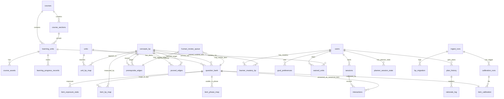
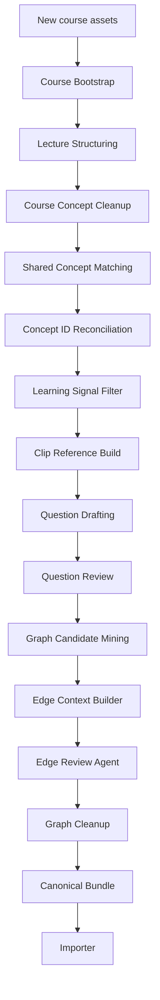
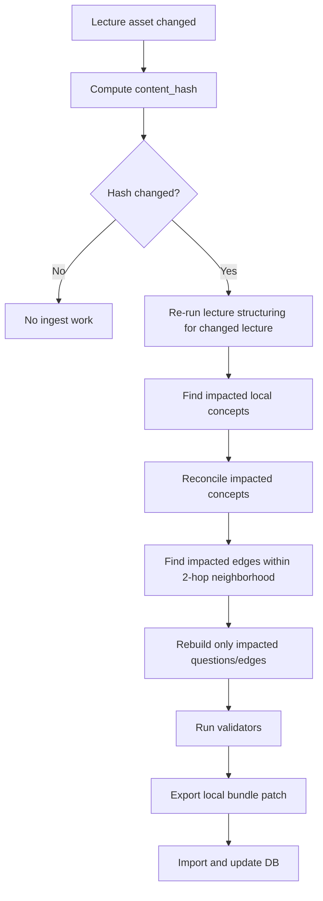
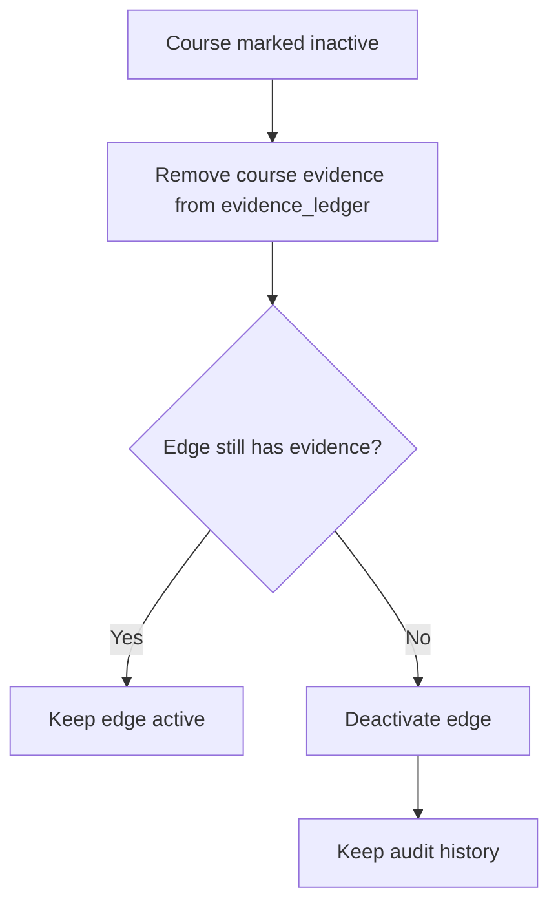

# Schema v2 Guide — Ingest, Assessment, Planner, and Future AI Models

Date: 2026-04-27  
Status: planning baseline for schema patch v4 and team onboarding  
Related plan: `docs/superpowers/plans/2026-04-26-incremental-agent-ingest-plan.md`

## 1. Why This Document Exists

This document explains the database shape we want teammates to understand before touching ingest, assessment, planner, or future adaptive learning work.

It has three goals:

1. Explain the current database in plain language.
2. Explain the proposed Schema v2 additions needed for incremental ingest, IRT/CAT, HITL, and admin dashboard readiness.
3. Make future work possible for IRT/CAT, NCD, BECAT, and DKT without creating duplicate sources of truth.

The most important rule:

> Keep canonical facts in one place. Do not create parallel tables that store the same truth with a different name.

Example: response events already live in `interactions`. Do not create `assessment_responses` unless there is a very strong reason and a migration plan.

---

## 2. Big Picture

The platform has four data layers.

| Layer | What It Stores | Main Tables |
| --- | --- | --- |
| Product runtime | What users browse and play in the app | `courses`, `course_sections`, `learning_units`, `course_assets`, `learning_progress_records` |
| Canonical content | Course-independent learning content, KPs, questions, graph | `concepts_kp`, `units`, `unit_kp_map`, `question_bank`, `item_calibration`, `item_phase_map`, `item_kp_map`, `prerequisite_edges`, `pruned_edges` |
| Learner runtime | User sessions, answers, mastery, planner state | `sessions`, `interactions`, `learner_mastery_kp`, `goal_preferences`, `waived_units`, `plan_history`, `rationale_log`, `planner_session_state` |
| Ingest/admin audit | How content was created, changed, calibrated, reviewed | proposed: `ingest_runs`, `kp_migration`, `calibration_runs`, `item_exposure_stats`, `human_review_queue` |

The product runtime layer is what the UI uses.  
The canonical layer is what the learning engine trusts.  
The learner runtime layer is what adapts the path for each user.  
The ingest/admin layer is what makes the system maintainable when courses are updated.

---

## 3. ERD Overview



Notes:

- `learning_units.canonical_unit_id` bridges product runtime units to canonical `units.unit_id`.
- `interactions.canonical_item_id` bridges learner answer events to canonical `question_bank.item_id`.
- `learner_mastery_kp.kp_id` stores user mastery against canonical `concepts_kp.kp_id`.

---

## 4. Current Runtime Layer

### 4.1 `courses`

Product-facing course catalog.

Important fields:

| Field | Meaning |
| --- | --- |
| `slug` | URL/product slug |
| `title` | Display course title |
| `short_description` | Catalog description |
| `status` | Product availability state |
| `visibility` | Public/private catalog visibility |
| `canonical_course_id` | Bridge to canonical course ID, e.g. `CS230`, `CS231n`, `CS224n` |

Use this table for course cards, catalog, and user-facing course metadata.

### 4.2 `course_sections`

Product grouping layer. Usually maps to lecture/module groups.

Important fields:

| Field | Meaning |
| --- | --- |
| `course_id` | Parent course |
| `parent_section_id` | Optional nested section |
| `title` | Section title |
| `kind` | Type of section |
| `sort_order` | Product order |
| `is_entry_section` | Whether users can start here |

This is not the same as canonical `units`. It is a product grouping layer.

### 4.3 `learning_units`

Product runtime learning unit. This is what the UI opens.

Important fields:

| Field | Meaning |
| --- | --- |
| `course_id` | Product course |
| `section_id` | Product section |
| `slug` | Runtime URL slug |
| `title` | Display title |
| `unit_type` | Video, reading, quiz, etc. |
| `status` | Metadata/live state |
| `sort_order` | Product order |
| `estimated_minutes` | Runtime duration |
| `canonical_unit_id` | Bridge to canonical `units.unit_id` |
| `entry_mode` | How user should enter this unit |

Rule:

> If the learning engine needs KP/question/graph data, resolve through `canonical_unit_id`.

### 4.4 `course_assets`

Stores video, transcript, slide, and other course asset references.

Important fields:

| Field | Meaning |
| --- | --- |
| `asset_type` | Video/transcript/slide/etc. |
| `storage_key` | Internal storage key |
| `delivery_url` | Runtime delivery URL if available |
| `availability_status` | Processing/ready/missing |
| `metadata_json` | Extra asset details |

Do not ask LLMs to generate asset paths or URLs. Code should attach these.

### 4.5 `learning_progress_records`

Runtime progress for `user x learning_unit`.

Important fields:

| Field | Meaning |
| --- | --- |
| `user_id` | Learner |
| `course_id` | Product course |
| `learning_unit_id` | Product runtime unit |
| `status` | `not_started`, `in_progress`, `completed`, `blocked`, `skipped` |
| `last_position_seconds` | Video resume point |
| `last_opened_at` | Last activity |
| `completed_at` | Completion timestamp |

This is the source of truth for UI progress.

---

## 5. Current Canonical Content Layer

### 5.1 `concepts_kp`

Global knowledge point catalog.

Important fields:

| Field | Meaning |
| --- | --- |
| `kp_id` | Stable global KP ID |
| `name` | Human-readable KP name |
| `description` | Meaning of the KP |
| `track_tags`, `domain_tags`, `career_path_tags` | Tags for goals/recommendations |
| `difficulty_level` | Current numeric difficulty value |
| `difficulty_source`, `difficulty_confidence` | How difficulty was assigned |
| `importance_level` | `critical`, `high`, `medium`, `low` |
| `structural_role` | `gateway`, `supporting`, `optional`, `capstone` |
| `importance_scope` | `lecture_local`, `course_global`, `curriculum_global` |
| `source_course_ids` | Courses that support this KP |
| `description_embedding` | Embedding for retrieval/matching |

Important distinction:

- `importance_level` means how important the KP is.
- `structural_role` means what role the KP plays in the learning graph.

Example:

> A KP can be `structural_role=gateway` but only `importance_level=medium` in one course.

Schema v2 addition:

| Field | Meaning |
| --- | --- |
| `description_embedding_version` | Embedding model/version used for `description_embedding` |

Why:

> Embeddings from different models should not be compared silently. If the embedding model changes, old vectors need a version marker and a rebuild path.

### 5.2 `units`

Canonical learning unit extracted from lecture content.

Important fields:

| Field | Meaning |
| --- | --- |
| `unit_id` | Stable canonical unit ID |
| `course_id` | Canonical course ID |
| `lecture_id`, `lecture_order`, `lecture_title` | Lecture source |
| `unit_name` | Unit title |
| `summary` | Short summary with timestamp citations |
| `ordering_index` | Canonical order inside course/lecture |
| `content_ref` | Time span and source references |
| `key_points` | Timestamped key points |
| `difficulty` | Unit difficulty |
| `duration_min` | Duration |
| `transcript_path` | Transcript source |
| `video_clip_ref` | Clip reference if generated |

Schema v2 rule:

- `summary` should include timestamp citations like `[ts=123]`.
- `key_points[].timestamp_s` must be inside the unit time range.

### 5.3 `unit_kp_map`

Maps canonical units to KPs.

Important fields:

| Field | Meaning |
| --- | --- |
| `unit_id` | Canonical unit |
| `kp_id` | Global KP |
| `planner_role` | `main`, `prereq`, `support` |
| `instruction_role` | `intro`, `main`, `review`, `application`, `support` |
| `coverage_level` | `dominant`, `substantial`, `partial`, `mention` |
| `coverage_confidence` | Confidence in mapping |
| `coverage_weight` | Numeric weight derived by code |

This table is central for the planner.

Planner usage:

- `main` tells the planner what a unit teaches.
- `prereq` helps gate or bridge.
- `support` provides context but should not be over-weighted.

### 5.4 `question_bank`

Authored question content.

Important fields:

| Field | Meaning |
| --- | --- |
| `item_id` | Stable item ID |
| `course_id`, `lecture_id`, `unit_id` | Source ownership |
| `primary_kp_id` | Main KP tested |
| `item_type` | `MCQ`, `free_response`, etc. |
| `question`, `choices`, `answer_index`, `explanation` | Item content |
| `difficulty` | Authoring-level difficulty label |
| `question_intent` | `conceptual`, `application`, `diagnostic`, `procedural` |
| `source_ref` | Evidence and source refs |
| `concept_alignment_cosine` | Alignment quality |
| `distractor_cosine_lower`, `distractor_cosine_upper` | Distractor quality |
| `qa_gate_passed` | Whether item passed QA gate |
| `repair_history` | Repair attempts |
| `provenance` | How item was generated/reviewed |
| `review_status` | Review state |

Important:

> `question_bank` is content. Calibration does not live here.

### 5.5 `item_calibration`

Stores cold-start priors and future fitted IRT parameters.

Current DB uses this table for priors.

Important fields:

| Field | Meaning |
| --- | --- |
| `item_id` | Question item |
| `difficulty_prior` | Cold-start difficulty estimate |
| `discrimination_prior` | Cold-start discrimination estimate |
| `guessing_prior` | Cold-start guessing estimate |
| `calibration_confidence` | Confidence in prior |
| `calibration_method` | `prior_only` until fitted |
| `is_calibrated` | True only after empirical calibration passes |
| `difficulty_b` | Fitted IRT difficulty |
| `discrimination_a` | Fitted IRT discrimination |
| `guessing_c` | Fitted IRT guessing |
| `irt_calibration_n` | Number of real responses used |
| `standard_error_b` | Uncertainty of fitted `b` |

Rules:

- LLM may help estimate priors.
- LLM must not generate fitted `difficulty_b`, `discrimination_a`, or `guessing_c`.
- `is_calibrated=true` requires real response data and calibration quality checks.
- Synthetic responses must not make `is_calibrated=true`.

### 5.6 `item_phase_map`

Defines which assessment phase can use an item.

Important fields:

| Field | Meaning |
| --- | --- |
| `item_id` | Question item |
| `phase` | Runtime use case |
| `suitability_score` | How suitable this item is for phase |
| `phase_multiplier` | Constant weighting for phase |
| `selection_priority` | Optional priority |
| `phase_rationale` | Why item fits the phase |

Supported phases:

| Phase | Meaning |
| --- | --- |
| `placement` | Initial ability check |
| `mini_quiz` | Segment/unit checkpoint |
| `skip_verification` | Quiz required to skip a unit |
| `bridge_check` | Check after bridge/review unit |
| `final_quiz` | End-of-course or section test |
| `transfer` | Cross-domain/generalization test |
| `review` | Learner spaced repetition/re-quiz, not human review |

### 5.7 `item_kp_map`

This is the Q-matrix row for each item.

Important fields:

| Field | Meaning |
| --- | --- |
| `item_id` | Question |
| `kp_id` | KP measured |
| `kp_role` | Primary/secondary role |
| `weight` | Portion of evidence for this KP |
| `mapping_confidence` | Confidence |

Rule:

> For each `item_id`, all `item_kp_map.weight` values should sum to `1.0`.

This table is important for:

- IRT reporting by KP
- BECAT item selection
- NCD-style Q-matrix
- future DKT sequence features

### 5.8 `prerequisite_edges`

Kept prerequisite graph edges.

Important fields:

| Field | Meaning |
| --- | --- |
| `source_kp_id` | Prerequisite KP |
| `target_kp_id` | Target KP |
| `edge_scope` | `intra_course` or `inter_course` |
| `provenance` | Source of edge decision |
| `review_status` | Edge review state |
| `confidence` | Agent/human confidence |
| `rationale` | Explanation |
| `edge_strength` | Numeric strength if available |
| `bidirectional_score` | Legacy/optional direction ambiguity score |
| `p5_trace` | Historical trace |
| `temporal_signal` | Ordering signal |

Schema v2 recommendation:

- Keep `edge_strength` nullable.
- If ModernBERT is removed, derive `edge_strength` from agent confidence and evidence count.
- Keep `bidirectional_score` nullable and do not require planner logic to depend on it.
- Add `edge_kind` only if planner is ready to distinguish `hard` vs `soft`.

### 5.9 `pruned_edges`

Rejected graph edges retained for audit.

Use it to answer:

- Why was this edge removed?
- Was the direction wrong?
- Did an agent/human reject it?
- Can it be reconsidered later?

Important semantics:

| Storage | Meaning |
| --- | --- |
| `prerequisite_edges.active=true` | Edge is currently part of the usable planner graph |
| `prerequisite_edges.active=false` | Edge was once accepted, but later retired due to update/remove/review |
| `pruned_edges` | Candidate edge was rejected before becoming an active graph edge |

This avoids duplicate meaning:

- use `active=false` for retired accepted edges
- use `pruned_edges` for rejected candidates
- do not write the same edge into both as the same event

---

## 6. Current Learner Runtime Layer

### 6.1 `sessions`

One assessment or learning session.

Current important fields:

| Field | Meaning |
| --- | --- |
| `user_id` | Learner |
| `session_type` | Assessment/quiz/etc. |
| `total_questions`, `correct_count`, `score_percent` | Result summary |
| `canonical_phase` | Placement/mini_quiz/etc. |
| `canonical_unit_id`, `canonical_section_id` | Runtime unit/section bridge |

Schema v2 recommended additions for IRT/CAT:

| Field | Why |
| --- | --- |
| `selection_strategy` | `random_uniform`, `spread_by_prior`, or `irt_adaptive` |
| `calibration_mode` | `prior_only`, `calibrated_2pl`, `calibrated_3pl`, etc. |
| `theta_initial`, `theta_final` | Ability estimate before/after session |
| `theta_sigma_initial`, `theta_sigma_final` | Uncertainty before/after session |
| `target_se` | CAT stopping target |
| `stop_reason` | Why assessment stopped |

Source-of-truth rule:

> `learner_mastery_kp` is the current mastery source of truth. `sessions.theta_initial/final` are session-level audit snapshots only.

Runtime rule:

- when a session is finalized, update `sessions`, `interactions`, and `learner_mastery_kp` in one transaction where possible
- if a session crashes mid-flow, recovery should recompute session summary from `interactions`
- do not treat `sessions.theta_final` as the canonical current mastery after later sessions have happened

### 6.2 `interactions`

Canonical response event log.

Current important fields:

| Field | Meaning |
| --- | --- |
| `user_id` | Learner |
| `session_id` | Session |
| `canonical_item_id` | Canonical item answered |
| `sequence_position` | Position inside session |
| `global_sequence_position` | User-level global sequence |
| `selected_answer` | User answer |
| `is_correct` | Scored result |
| `response_time_ms` | Time spent |
| `timestamp` | Event time |

Do not create another response log table unless absolutely necessary.

Schema v2 recommended additions:

| Field | Why |
| --- | --- |
| `selection_strategy` | Which selector chose the item |
| `theta_before`, `theta_after` | Ability update around this response |
| `theta_sigma_before`, `theta_sigma_after` | Uncertainty update |
| `predicted_probability` | Model-predicted correctness probability |
| `item_information` | Fisher information at selection time |
| `item_difficulty_at_time` | Snapshot of `b` or prior used |
| `item_discrimination_at_time` | Snapshot of `a` or prior used |
| `item_guessing_at_time` | Snapshot of `c` or prior used |

Reason for snapshots:

> Item calibration can change later. Audit must know what the model believed when the learner answered.

Storage decision for Schema v2:

- keep these as typed nullable columns on `interactions` first
- do not split into `interaction_psychometric_snapshot` until row volume or query profile proves it is necessary
- if a future split happens, keep `interactions` as the canonical event table and make the snapshot table strictly 1-to-1 by `interaction_id`

### 6.3 `learner_mastery_kp`

Current learner mastery state per `user x kp`.

Important fields:

| Field | Meaning |
| --- | --- |
| `theta_mu` | Latent ability estimate |
| `theta_sigma` | Uncertainty |
| `mastery_mean_cached` | UI-friendly probability-like mastery |
| `n_items_observed` | Evidence count |
| `updated_by` | Update method |

UI rule:

> Never show `theta_mu` as a percent. Use `mastery_mean_cached` or a backend-provided label.

### 6.4 `goal_preferences`

Learner goals and selected courses/topics.

Important fields:

| Field | Meaning |
| --- | --- |
| `goal_weights_json` | Goal weights and onboarding preferences |
| `selected_course_ids` | Course IDs selected |
| `goal_embedding` | Goal vector |
| `derived_from_course_set_hash` | Drift detection |

Embedding version rule:

| Field | Meaning |
| --- | --- |
| `goal_embedding_version` | Embedding model/version used for `goal_embedding` |

If the embedding model changes, rebuild `goal_embedding` and any comparable concept/unit embeddings before using cosine similarity across versions.

### 6.5 `waived_units`

Audit record for skipped/waived units.

Important fields:

| Field | Meaning |
| --- | --- |
| `learning_unit_id` | Runtime unit waived |
| `evidence_items` | Evidence supporting waive |
| `mastery_lcb_at_waive` | Conservative mastery estimate at waive time |
| `skip_quiz_score` | Score if skip quiz was taken |

This is different from `learning_progress_records.status=completed`.

### 6.6 `plan_history`, `rationale_log`, `planner_session_state`

Planner audit and runtime state.

Use:

- `plan_history` to store each plan snapshot.
- `rationale_log` to explain why units were recommended.
- `planner_session_state` to track current unit, stage, bridge depth, and resume data.

---

## 7. Proposed Schema v2 Additions

These additions should be grouped into a formal schema patch before implementation.

### 7.1 Ingest Incrementality

Add content fingerprints:

| Table | Field | Meaning |
| --- | --- | --- |
| `units` | `content_hash` | Hash of transcript/slide/content refs |
| `concepts_kp` | `content_hash` | Hash of concept name/description/tags |

Add active/deprecation fields:

| Table | Field | Meaning |
| --- | --- | --- |
| `units`, `concepts_kp`, `prerequisite_edges` | `active` | Whether row is currently active |
| same | `deprecated_at` | When row became inactive |
| same | `deprecated_reason` | Why it was deactivated |

Why:

- Update one lecture without rerunning the whole graph.
- Remove a course without deleting audit history.
- Detect which concepts/edges are impacted.

### 7.2 Edge Evidence Ledger

Add to `prerequisite_edges`:

```json
[
  {
    "course_id": "CS230",
    "unit_id": "CS230-L04-U03",
    "source_role": "prereq",
    "target_role": "main",
    "evidence_span": "string",
    "added_in_run": "run_20260427_001"
  }
]
```

Field:

| Table | Field | Meaning |
| --- | --- | --- |
| `prerequisite_edges` | `evidence_ledger` | List of course/unit evidence supporting this edge |

Why:

- If a course is removed, we can remove only that evidence.
- If an edge still has evidence from other courses, keep it.
- If no evidence remains, deactivate the edge.

### 7.3 KP Migration

New table: `kp_migration`.

Suggested fields:

| Field | Meaning |
| --- | --- |
| `id` | Row ID |
| `run_id` | Ingest run |
| `migration_type` | `rename`, `merge`, `split_quarantine` |
| `source_kp_id` | Old KP |
| `target_kp_id` | New/global KP |
| `status` | `applied`, `pending_human_review`, `rejected` |
| `rationale` | Why migration happened |
| `created_at` | Timestamp |

Rules:

- Rename/merge can be auto-applied if confidence is high.
- Split should go to HITL in early phases.
- After matching, final artifacts must not contain `local_kp_id`.

### 7.4 Ingest Runs

New table: `ingest_runs`.

Suggested fields:

| Field | Meaning |
| --- | --- |
| `run_id` | Stable run ID |
| `course_id` | Course being processed |
| `run_type` | `add_course`, `update_lecture`, `remove_course`, `rebuild_bundle` |
| `input_hashes` | Snapshot of inputs |
| `artifact_version` | Output bundle version |
| `status` | `started`, `passed`, `failed`, `rolled_back` |
| `metrics_json` | Counts and validation metrics |
| `started_at`, `finished_at` | Runtime |

Why:

- Admin dashboard can show what changed.
- Rollback and diff become possible.
- Agents can reuse previous verdicts.

### 7.5 Human Review Queue

New table: `human_review_queue`.

Suggested fields:

| Field | Meaning |
| --- | --- |
| `id` | Row ID |
| `entity_type` | `concept`, `edge`, `question`, `calibration`, `unit` |
| `entity_id` | Target row ID |
| `reason` | Why it needs review |
| `severity` | `low`, `medium`, `high`, `blocking` |
| `suggested_action` | What reviewer should do |
| `context_json` | Small context payload |
| `status` | `open`, `resolved`, `rejected`, `deferred` |
| `assigned_to` | Optional reviewer user ID |
| `due_at` | Review deadline |
| `escalated_at` | When this review was escalated |
| `escalation_target` | Team/person/role that should handle escalation |
| `reviewed_by`, `reviewed_at` | Human audit |

Use HITL for:

- low-confidence concept merge
- split concept decisions
- edge conflicts
- edge defer after TTL
- question QA repair failure
- abnormal calibration
- overexposed CAT items

### 7.6 Calibration Runs

New table: `calibration_runs`.

Suggested fields:

| Field | Meaning |
| --- | --- |
| `run_id` | Calibration run |
| `method` | `1pl`, `2pl`, `3pl`, `mirt`, etc. |
| `dataset_version` | Response dataset snapshot |
| `real_response_count` | Real responses used |
| `synthetic_response_count` | Synthetic responses included for testing only |
| `status` | `started`, `passed`, `failed` |
| `metrics_json` | Fit metrics |
| `active` | Whether this run is currently used |
| `started_at`, `finished_at` | Runtime |

Add to `item_calibration`:

| Field | Why |
| --- | --- |
| `standard_error_a` | Reliability of fitted discrimination |
| `standard_error_c` | Reliability of fitted guessing |
| `calibration_run_id` | Which run produced current params |
| `calibration_dataset_version` | Which response snapshot was used |
| `real_response_count` | Real data count |
| `synthetic_response_count` | Synthetic data count, audit only |

New optional table: `item_calibration_history`.

Suggested fields:

| Field | Meaning |
| --- | --- |
| `id` | Row ID |
| `item_id` | Question item |
| `calibration_run_id` | Run that produced this snapshot |
| `difficulty_b`, `discrimination_a`, `guessing_c` | Fitted parameters from that run |
| `standard_error_b`, `standard_error_a`, `standard_error_c` | Standard errors from that run |
| `real_response_count`, `synthetic_response_count` | Dataset composition |
| `created_at` | Snapshot time |

Rollback rule:

> `item_calibration` stores the active params. `item_calibration_history` stores prior run snapshots. Rollback means copying a previous valid history row back into `item_calibration` and updating `calibration_run_id`.

### 7.7 Item Exposure Stats

New table: `item_exposure_stats`.

Suggested fields:

| Field | Meaning |
| --- | --- |
| `item_id` | Question item |
| `phase` | Placement/mini_quiz/etc. |
| `shown_count` | Times shown |
| `answered_count` | Times answered |
| `correct_count` | Correct answers |
| `last_shown_at` | Last exposure |
| `exposure_rate` | Exposure relative to pool |

Why:

- CAT tends to overuse high-information items.
- Admin dashboard should show overexposed items.
- Selector can use randomesque/exposure caps.

Refresh strategy:

- treat this table as a denormalized cache, not a source of truth
- source of truth remains `interactions`
- refresh aggregate counts by batch/materialized-view style job, default every 15 minutes
- optionally update `last_shown_at` near real-time when CAT needs immediate exposure caps
- if cache and `interactions` disagree, rebuild cache from `interactions`

---

## 8. IRT/CAT Contract

### 8.1 Current State

The current database is cold-start.

Known facts from DB inspection:

- Placement items exist.
- KP mapping exists.
- `item_calibration` rows exist.
- Priors exist in `item_calibration`.
- `is_calibrated=true` count is currently zero.
- Fitted `difficulty_b`, `discrimination_a`, `guessing_c` are not populated.
- Real response count is far below paper-grade calibration thresholds.

Therefore:

> Use `spread_by_prior` now. Do not claim calibrated IRT yet.

### 8.2 Cold-Start Item Selection

Mode: `spread_by_prior`.

Process:

1. Filter pool by phase, unit, KP, and item validity.
2. Apply `item_phase_map.suitability_score` as phase-fit.
3. Sort or bin by `item_calibration.difficulty_prior`.
4. Split into quantile bins.
5. Randomly choose items across bins.
6. Apply exposure limits if available.

Why it is explainable:

- It uses a prior difficulty estimate.
- It covers the difficulty range better than pure random.
- It does not pretend to have fitted IRT parameters.

Field semantics:

| Field | Meaning |
| --- | --- |
| `item_phase_map.suitability_score` | Whether the item is appropriate for a phase such as placement or mini quiz |
| `item_calibration.difficulty_prior` | How hard the item is expected to be before empirical calibration |

These fields are orthogonal. A very hard item can be highly suitable for `skip_verification`, but unsuitable for first-touch placement.

### 8.3 Calibrated IRT Item Selection

Only use when:

- `item_calibration.is_calibrated=true`
- fitted params exist
- standard errors pass threshold
- enough real response data exists
- calibration run passed

2PL formula:

```text
P_i(theta) = sigmoid(a_i * (theta - b_i))
I_i(theta) = a_i^2 * P_i(theta) * (1 - P_i(theta))
```

3PL formula for MCQ:

```text
P_i(theta) = c_i + (1 - c_i) * sigmoid(a_i * (theta - b_i))
```

CAT selection:

1. Estimate current learner theta.
2. Compute item information around theta.
3. Pick high-information item.
4. Apply exposure control.
5. Record snapshots in `interactions`.
6. Update theta and theta uncertainty.
7. Stop when target standard error is reached or max items is hit.

### 8.4 Why `interactions` Must Be Canonical

Every future model needs learner response sequences:

- IRT/CAT needs item responses and theta updates.
- NCD/BECAT needs item-KP mappings and correctness.
- DKT needs ordered interaction sequences.

If we create a second response table, these models may disagree about what the learner did.

Rule:

> `interactions` is the canonical answer event table.

Mastery snapshot rule:

- `learner_mastery_kp` stores current state
- `sessions.theta_*` stores session audit state
- `interactions.theta_*` stores per-answer audit state
- future `learner_mastery_kp_history` can store periodic or significant-change snapshots, but should not replace replay from `interactions`

---

## 9. Future Model Readiness

### 9.1 IRT/CAT

Already supported conceptually by:

- `item_calibration`
- `sessions`
- `interactions`
- `learner_mastery_kp`

Needs Schema v2 additions:

- session strategy/theta fields
- interaction theta/probability/information snapshots
- calibration run audit fields
- item exposure stats

### 9.2 NCD

NCD needs:

- item-to-KP matrix
- learner response events
- item correctness
- possibly text/content embeddings

Available:

- `item_kp_map` is the Q-matrix foundation.
- `interactions` stores responses.
- `concepts_kp.description_embedding` can support semantic features.

Important validator:

> `item_kp_map.weight` must sum to `1.0` per item.

### 9.3 BECAT

BECAT-like selection needs:

- knowledge components/KPs
- item-KP mapping
- uncertainty over learner mastery
- item selection utility

Available:

- `item_kp_map`
- `learner_mastery_kp.theta_mu`
- `learner_mastery_kp.theta_sigma`
- `item_calibration`
- future `item_exposure_stats`

### 9.4 DKT

DKT needs ordered learner sequences.

Available:

- `interactions.user_id`
- `interactions.session_id`
- `interactions.sequence_position`
- `interactions.global_sequence_position`
- `interactions.canonical_item_id`
- `interactions.is_correct`
- `item_kp_map`

Future improvement:

- add richer event features if needed, but keep `interactions` as source of truth.

---

## 10. Incremental Ingest Flow

### 10.1 Add Course



### 10.2 Update Lecture

This is the common daily path.



Acceptance rule:

- Changed edges should stay inside the impacted 2-hop neighborhood.
- Changed edge count should be under a configured cap, for example 5% of total graph, unless explicitly approved.

### 10.3 Remove Course

Remove is a side case, not the main path.



Rule:

> Do not hard-delete content by default. Deactivate and preserve audit.

---

## 11. Graph Semantics

### 11.1 Edge Verdicts

The agent can return:

| Verdict | Meaning | Code Action |
| --- | --- | --- |
| `keep` | Edge is valid | Upsert active edge |
| `prune` | Edge is invalid | Move/log as pruned |
| `flip_direction` | Direction is reversed | Deactivate old edge, create reversed edge |
| `defer` | Not enough confidence | Send to HITL/review queue |

### 11.2 Hard vs Soft Edges

`edge_kind=hard|soft` is useful, but only if planner reads it.

Recommendation:

- If planner does not support soft edges yet, do not let soft edges affect runtime.
- Either store `edge_kind` behind a patch or defer soft edge decisions.

Meaning:

| Edge Kind | Runtime Meaning |
| --- | --- |
| `hard` | Missing source KP can block or strongly warn |
| `soft` | Helps learning target KP, but should not hard-block |

### 11.3 Edge Strength Without ModernBERT

ModernBERT is removed from the main flow.

If numeric `edge_strength` is needed:

| Agent Confidence | Base `edge_strength` |
| --- | --- |
| `high` | `0.85` |
| `medium` | `0.60` |
| `low` | `0.35` |

Code may bump based on evidence count, capped at `0.95`.

---

## 12. HITL Contract

HITL means Human-in-the-loop.

It is not a failure. It is the safe path when automation is unsure.

Use HITL for:

| Case | Why |
| --- | --- |
| Low-confidence concept merge | Bad merge corrupts future graph |
| Concept split | Auto-split is risky |
| Edge conflict | Graph semantics affect planner |
| Edge `defer` after TTL | Queue should not grow forever |
| Question repair failed twice | Bad item hurts assessment |
| Calibration abnormal | Bad fitted params hurt CAT |
| Overexposed item | CAT may leak/reuse too much |

Admin dashboard should show:

- open review count
- blocking review count
- entity type
- severity
- assigned reviewer
- due date
- escalation status
- suggested action
- context snapshot
- reviewer and timestamp

Routing rule:

- `blocking` reviews need `due_at`
- unresolved `blocking` reviews past `due_at` should set `escalated_at`
- agent/code may create review items, but only a human or approved admin workflow should mark them `resolved`

---

## 13. Validators

Before exporting/importing canonical artifacts:

### 13.1 Unit Validators

- `unit_id` exists and is unique.
- `start_s < end_s`.
- summary timestamp citations are inside unit time range.
- key point timestamps are inside unit time range.

### 13.2 Concept Validators

- `kp_id` exists and is unique.
- `structural_role` in `gateway|supporting|optional|capstone`.
- `importance_scope` in `lecture_local|course_global|curriculum_global`.
- `source_course_ids` includes supporting course.

### 13.3 Unit-KP Validators

- `planner_role` in `main|prereq|support`.
- `instruction_role` in `intro|main|review|application|support`.
- `coverage_weight` is code-derived.
- no final artifact contains unresolved `local_kp_id`.

### 13.4 Question Validators

- `evidence_span` substring-matches transcript.
- `source_ref.multimodal_signals_used` contains `"transcript"`.
- `primary_kp_id` exists.
- `concept_alignment_cosine >= 0.75`.
- `distractor_cosine_upper <= 0.9`.
- `distractor_cosine_lower >= 0.3`.
- MCQ has valid choices and answer index.
- repair stops after 2 failed attempts.

### 13.5 Item-KP Validators

- each item has at least one KP.
- weights sum to `1.0`.
- `primary_kp_id` appears in `item_kp_map`.

### 13.6 Calibration Validators

- if `is_calibrated=false`, fitted params may be null.
- if `is_calibrated=true`, fitted params and standard errors must exist.
- synthetic-only calibration cannot set `is_calibrated=true`.
- if standard errors are too high, selector falls back to `spread_by_prior`.

### 13.7 Edge Validators

- source and target KP exist.
- no self-edge.
- keep edge must have evidence.
- `flip_direction` creates reversed edge and deactivates old direction.
- defer must enter HITL/review queue.

---

## 14. Admin Dashboard Readiness

The future admin dashboard should answer these questions:

### Content Health

- Which lectures changed since last run?
- Which units were regenerated?
- Which concepts were merged, created, or deferred?
- Which questions failed QA?
- Which assets are missing?

### Graph Health

- Which edges were added?
- Which edges were pruned?
- Which edges were flipped?
- Which edges need human review?
- Which edges have weak evidence?

### Assessment Health

- How many placement/mini/skip/final items exist?
- Which KPs have too few items?
- Which items are overexposed?
- Which items have abnormal calibration?
- Which items are still prior-only?

### Calibration Health

- Which calibration run is active?
- How many real responses per item?
- How many synthetic responses were used for testing?
- Which items passed calibration?
- Which items failed standard error thresholds?
- Which calibration run is active?
- Which calibration run can be rolled back to?
- Which exposure stats are stale?

### Review Operations

- Which HITL items are assigned to me?
- Which blocking items are overdue?
- Which items were escalated?
- Which entity types generate the most review load?

---

## 15. Practical Rules for Teammates

1. Do not create a new response table unless we decide to migrate away from `interactions`.
2. Do not mark synthetic-only calibration as real calibration.
3. Do not show `theta_mu` as a percentage in UI.
4. Do not let LLM invent IDs, file paths, video URLs, or timestamps.
5. Do not auto-merge low-confidence concepts.
6. Do not auto-split concepts in early phases.
7. Do not use CAT unless fitted params pass calibration validators.
8. Do not hard-delete course/concept/edge rows during normal updates.
9. Do not treat `review` phase as human review; it is learner re-quiz/spaced repetition.
10. Do not make planner depend on `edge_kind=soft` until planner supports it.
11. Do not compare embeddings across different embedding versions.
12. Do not treat `sessions.theta_final` as the current mastery source of truth.
13. Do not treat `item_exposure_stats` as source of truth; rebuild it from `interactions` when needed.
14. Do not put an edge into both `prerequisite_edges.active=false` and `pruned_edges` for the same rejection event.

---

## 16. What Is Ready Now vs Later

### Ready Now

- Cold-start placement using `spread_by_prior`.
- Canonical question bank with phase maps.
- KP-based mastery updates.
- Planner can use unit/KP/edge data.
- Ingest can move toward incremental updates.

### Needs Schema Patch Before Code

- content hashes
- evidence ledger
- active/deprecated flags
- ingest run logs
- KP migration
- HITL queue
- IRT/CAT session and interaction audit fields
- calibration run tracking
- calibration history / rollback support
- item exposure stats
- HITL assignment and SLA fields
- embedding version fields

### Future Work

- true sequential CAT
- full empirical IRT fitting
- NCD training dataset export
- BECAT selection policy
- DKT sequence model
- admin dashboard for ingest/calibration/review
- optional `interaction_psychometric_snapshot` split if `interactions` becomes too wide or hot
- optional `learner_mastery_kp_history` for UI curves/debugging
- optional generic `kp_edges` table if graph needs non-prerequisite relations
- GDPR/user-data anonymization policy

---

## 17. Open Questions and v3 Roadmap

These are real design questions, but they do not block Schema v2.

### 17.1 Interaction Snapshot Table

Schema v2 keeps psychometric snapshots as nullable fields on `interactions`.

Move to `interaction_psychometric_snapshot` only if:

- interaction row width becomes a measurable performance issue
- most hot-path queries never need the psychometric fields
- analytics/model jobs benefit from separating event identity from model snapshots

If split later:

- keep `interactions` as source of truth
- use 1-to-1 `interaction_id`
- do not create a second answer log

### 17.2 Mastery History

`learner_mastery_kp` is current state only.

Future `learner_mastery_kp_history` can be added for:

- plotting mastery curves
- debugging assessor drift
- storing snapshots when `theta_sigma` changes significantly

It is not required for DKT because DKT can replay sequences from `interactions`.

### 17.3 Generic KP Relations

Current graph is prerequisite-focused.

Future `kp_edges` may support:

- `prerequisite_of`
- `similar_to`
- `part_of`
- `extends`
- `contrasts_with`

Do not generalize now unless planner or tutor actually needs these relations.

### 17.4 Data Retention and User Deletion

Schema v2 should not block GDPR-style deletion/anonymization, but a separate policy is needed.

Open decision:

- hard-delete user PII and interactions
- or anonymize `user_id` while retaining aggregate calibration stats

Any retention strategy must keep calibration reproducible without exposing personal data.

---

## 18. Summary

Schema v2 keeps the current product and canonical design, but adds the audit fields needed to scale safely.

The most important design choices are:

- `interactions` remains the canonical learner response log.
- `item_calibration` separates priors from fitted IRT parameters.
- `item_kp_map` is the foundation for NCD/BECAT/DKT.
- `learner_mastery_kp` is current mastery source of truth; session/interaction theta fields are audit snapshots.
- `prerequisite_edges` need evidence ledger and active/deprecated state for incremental updates.
- `pruned_edges` is for rejected candidate edges, not retired accepted edges.
- uncertain AI decisions go to HITL instead of being forced.
- embeddings need model/version fields.
- exposure stats and calibration history are caches/audit layers, not replacement sources of truth.
- admin dashboard readiness is designed into the schema instead of added later.

This keeps the current app stable while making the data layer explainable enough for papers, demos, and future adaptive-learning models.
