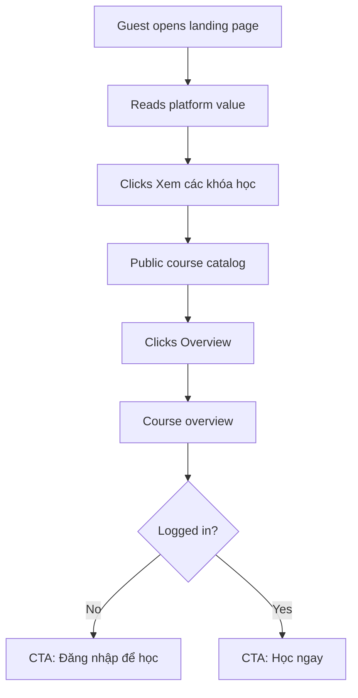
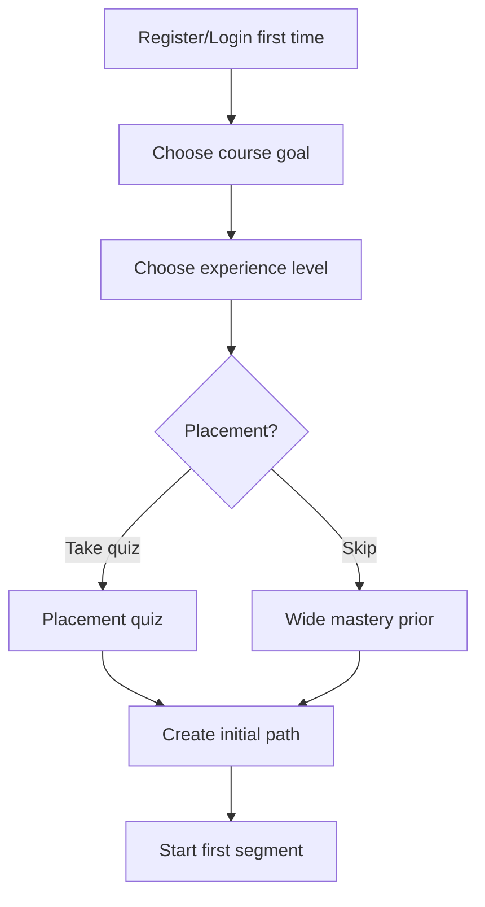
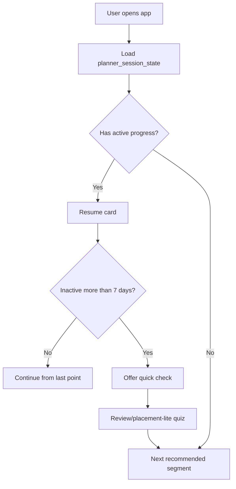
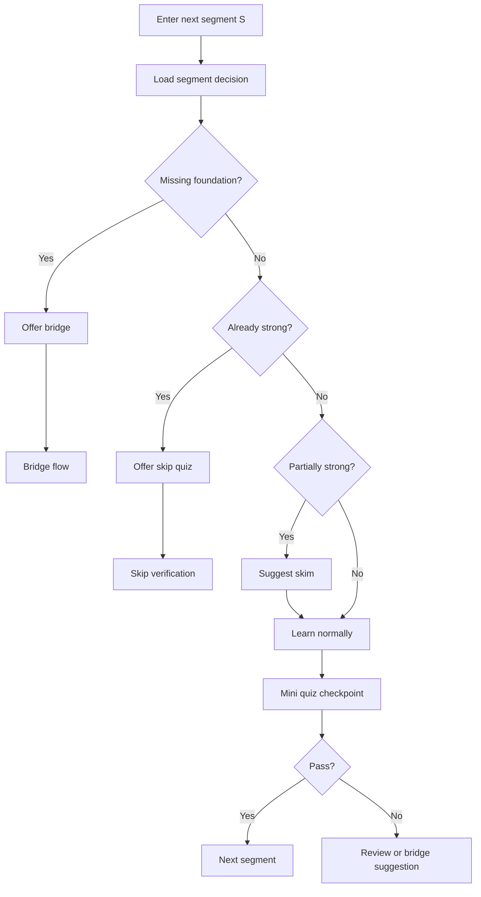
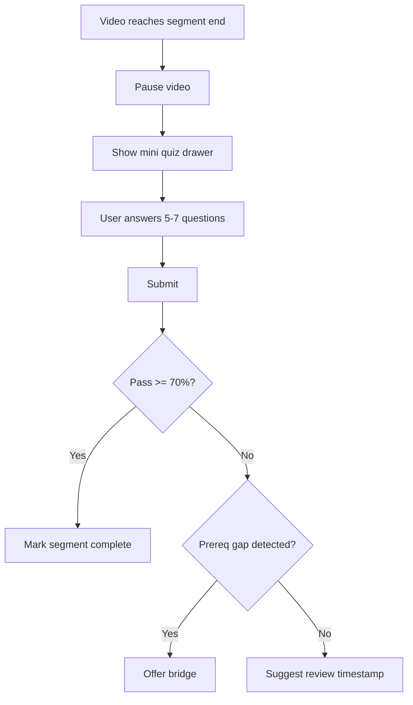
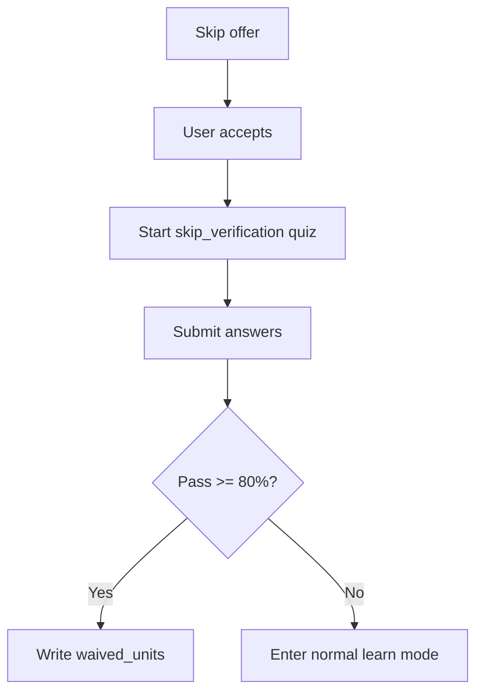
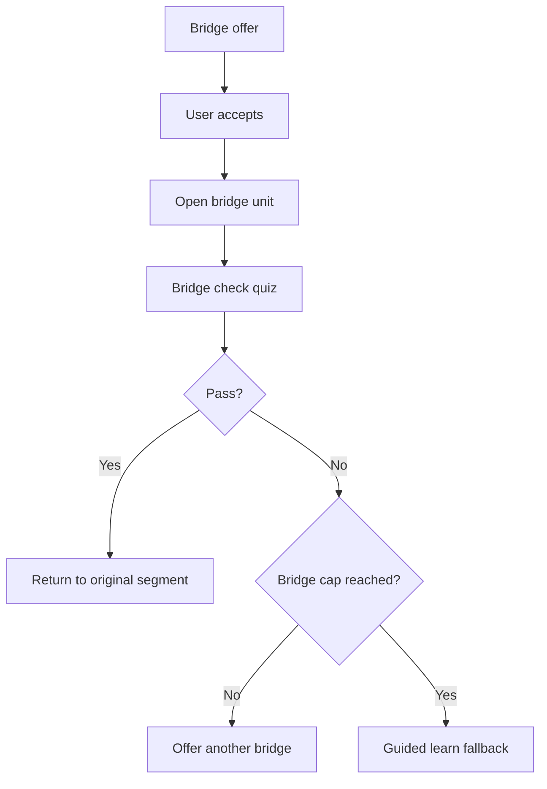
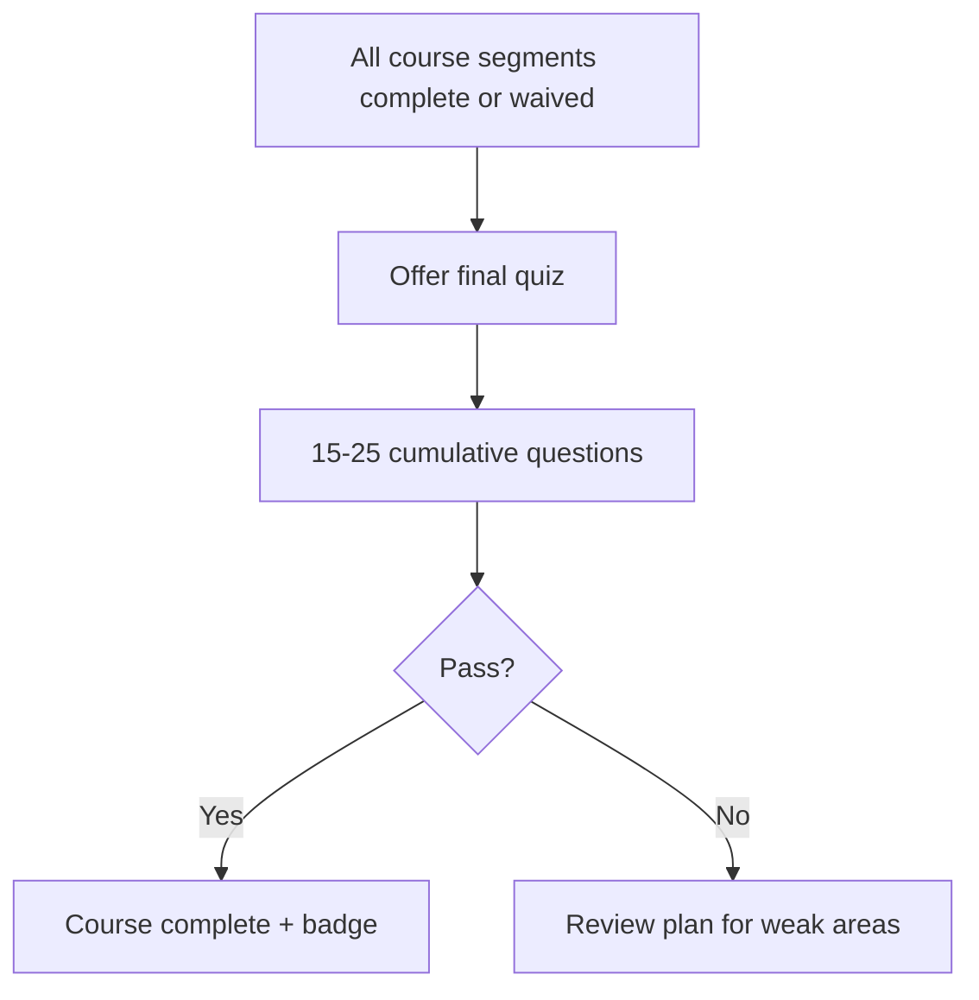

# UI V2 Plan — AI Learning Hub

Status: draft for review
Scope: product UX and frontend interaction plan only
Implementation rule: keep current UI live until UI V2 reaches route-level parity

## 1. Product Goal

UI V2 should turn the app from a technical demo into a learner-facing product.
The user should always understand:

- What course they can take.
- Where they are in the course.
- What they should do next.
- Why the system suggests learning, skipping, reviewing, or bridging.
- How AI Tutor helps inside the lecture context.

The system must not expose internal terms such as KP, prerequisite graph, theta, or mastery LCB. Those concepts should be translated into learner-facing copy such as "kiến thức nền", "đã nắm khá chắc", "nên ôn nhanh", or "kiểm tra xác nhận".

## 2. Non-Goals For This Plan

- Do not replace the current UI immediately.
- Do not redesign backend schema in this plan.
- Do not expose prerequisite graph or KP labels directly to users.
- Do not make standalone AI Tutor the primary product surface.
- Do not require placement assessment for every new user.

## 2.1. Schema Naming Note

This plan uses the current repo database names, not the earlier Notion-only names.

| UX/spec concept | Current repo table or projection |
| --- | --- |
| Canonical course unit | `units` |
| Product learning unit shown in UI | `learning_units` with `canonical_unit_id` |
| Lecture/section grouping shown in UI | `course_sections` |
| Learner mastery per KP | `learner_mastery_kp` |
| Completed unit | `learning_progress_records.status='completed'` |
| Waived/skipped-with-evidence unit | `waived_units` |
| Planner session state | `planner_session_state` |

Implementation should keep this distinction explicit:

- Canonical tables (`units`, `question_bank`, `item_phase_map`, `unit_kp_map`, `prerequisite_edges`) are the grounded content and assessment source.
- Product tables (`courses`, `course_sections`, `learning_units`, `learning_progress_records`) are the UI-facing course shell.
- Runtime learner/planner tables (`learner_mastery_kp`, `goal_preferences`, `waived_units`, `plan_history`, `rationale_log`, `planner_session_state`) drive personalization.
- `learning_units.sort_order` must be imported from the linked canonical `units.ordering_index` for segment rail ordering. If the values drift, canonical order wins.
- `planner_session_state.current_unit_id`, `current_stage`, and `current_progress` already exist in the current repo schema and are the resume-state source for UI V2.
- Item parameter storage should be hidden behind an "effective item parameters" selector. Current repo stores priors in `item_calibration`; if the canonical contract later moves priors to `question_bank`, UI/API contracts should not change.

## 3. Current UX Gaps

### 3.1. Public Entry

Current issue:

- `/` is effectively a catalog page, not a home landing page.
- Guest users do not get a clear explanation of the platform value.
- Course cards jump too quickly into course browsing without a narrative.

Target:

- `/` becomes a landing page.
- `/courses` becomes public catalog.
- `/courses/[courseSlug]` becomes course overview with guest/user-specific CTA.

### 3.2. Onboarding

Current issue:

- New users see too many unit choices too early.
- The flow assumes users understand course structure before understanding the product.
- Placement feels mandatory and heavy.

Target:

- Ask experience first.
- Let user skip placement.
- Explain trade-off clearly: skipping placement means the system will learn from mini quizzes later.
- Only ask detailed section/unit preference after the user has chosen a course and experience level.

### 3.3. Learning Flow

Current issue:

- `/learn` is still a placeholder.
- Course player exists, but does not yet express the real segment loop: learn, mini quiz, skip offer, bridge offer, review.
- Mini quiz timing is not tied to video segment checkpoints.

Target:

- `/learn` becomes "Lộ trình hôm nay".
- Course player becomes the main learning cockpit.
- Segment checkpoints drive mini quiz and review.

### 3.4. AI Tutor

Current issue:

- AI Tutor appears as a top-level route.
- That makes it look like a general chatbot rather than lecture-context support.

Target:

- AI Tutor lives inside the lecture player.
- Standalone Tutor route should either redirect to current lecture or become a non-primary help/demo page.

### 3.5. Planner Visibility

Current issue:

- The app has planner data, but the UI does not show a meaningful route.
- Users cannot see why the system recommends the next step.

Target:

- Show a human-readable path: next segment, optional review, bridge suggestions, completed and waived segments.
- Hide algorithm details.

## 4. Target Information Architecture

```text
Public
  /
    Landing page
  /courses
    Public catalog
  /courses/[courseSlug]
    Course overview
  /login
  /register

Authenticated
  /dashboard
    Next action + active course summary
  /learn
    Today's learning path / planner surface
  /courses
    Catalog, with learning status
  /courses/[courseSlug]
    Course overview, authenticated state
  /courses/[courseSlug]/learn/[unitSlug]
    Course player / segment cockpit
  /assessment
    Placement or placement-lite
  /quiz/[learningUnitId]
    Unit mini quiz fallback route
  /module-test/[sectionId]
    Section/final quiz fallback route
  /history
  /profile
```

Deprecated or demoted:

- `/tutor`: no longer primary navigation. Prefer contextual tutor inside course player.
- Any UI copy using "topic/module" should migrate to "bài học/section" or course-specific terms.

## 5. Core User Flows

### 5.1. Guest Discovery Flow



User sees:

- Clear headline: "AI Learning Hub cá nhân hóa lộ trình học AI theo năng lực thật của bạn."
- Short explanation of adaptive learning, in-lecture tutor, skip verification, and mini quizzes.
- Course catalog without requiring login.

System reads:

- `courses`
- course availability/status
- course overview metadata

System writes:

- None for guest browsing.

### 5.2. New User Onboarding Flow



Experience options set the starting prior, difficulty band, and adaptive cap. They should not be treated as fixed quiz lengths:

- New to this area: start easier, cap around 3-5 questions, allow skip.
- Basic foundation: start near medium difficulty, cap around 8-10 questions.
- Already studied before: start near harder items, cap around 12-15 questions.
- Just want to start: skip placement and rely on mini quizzes.

Placement selection should be adaptive where the backend supports it:

- Select the next item near the current ability estimate using `item_calibration.difficulty_b` when calibrated.
- Fall back through an effective-parameter resolver when `is_calibrated=false`: calibrated `difficulty_b/discrimination_a/guessing_c` first, then available priors, then safe defaults such as guessing `1/n_options` for MCQ.
- Stop by `stop_policy`: fixed cap, standard-error threshold, or hybrid.
- If skipped, initialize broad prior and explain that early mini quizzes will do more calibration work.

Initial prior defaults for placement:

| Experience | Initial `theta_mu` | Initial `theta_sigma` | First item difficulty target |
| --- | --- | --- | --- |
| Skip placement | `0.0` | `1.5` | none |
| New to area | `-0.5` | `1.2` | `-0.3` |
| Basic foundation | `0.0` | `1.0` | `0.0` |
| Already studied | `0.5` | `0.8` | `0.3` |

Important UX copy:

> Làm quiz đầu vào giúp hệ thống bỏ qua phần bạn đã biết. Bạn có thể bỏ qua, nhưng những bài đầu sẽ có nhiều kiểm tra nhanh hơn để hệ thống hiểu năng lực của bạn.

System reads:

- `courses`
- `course_sections`
- `learning_units`
- `question_bank`
- `item_phase_map WHERE phase='placement'`
- `item_calibration`

System writes:

- `goal_preferences`
- `interaction_log` for placement answers
- `learner_mastery_kp`
- `planner_session_state`

### 5.3. Returning User Resume Flow



User sees:

- "Tiếp tục từ Lecture 3, phút 08:42?"
- If stale: "Bạn đã quay lại sau một thời gian. Làm 3-5 câu kiểm tra nhanh để cập nhật lộ trình?"

System reads:

- `planner_session_state.last_activity`
- `planner_session_state.current_unit_id`
- `planner_session_state.current_stage`
- `planner_session_state.current_progress`
- `learner_mastery_kp.updated_at`
- `plan_history`

System writes:

- `planner_session_state`
- optional `interaction_log` for placement-lite/review
- optional `learner_mastery_kp`

### 5.4. Main Segment Loop



User sees:

- Default: video segment.
- Skip: "Có vẻ bạn đã nắm phần này. Làm 5 câu để xác nhận và bỏ qua?"
- Bridge: "Trước khi vào phần này, ôn nhanh một kiến thức nền sẽ giúp bạn học dễ hơn."
- Skim: "Bạn có thể xem nhanh phần này ở 2x."

System reads:

- `learning_units`
- `unit_kp_map`
- `prerequisite_edges`
- `learner_mastery_kp`
- `learning_progress_records`
- `waived_units`

System writes:

- none at decision time unless user acts.

### 5.5. Mini Quiz Flow



If user seeks forward:

- The system should not interrupt every skipped segment immediately.
- Add skipped segment quizzes to a "Review checkpoint" queue.
- At the end of lecture, show: "Bạn đã đi qua 3 đoạn chưa kiểm tra. Làm checkpoint 5 phút để lưu tiến độ."

Content-type fallback:

- If a segment is administrative, anecdotal, historical context, recap-only, or otherwise has no `mini_quiz` items, do not show an empty quiz drawer.
- Auto-advance the segment with a subtle badge such as "Tham khảo" or "Không cần kiểm tra".
- If the segment has critical or gateway content and `item_phase_map phase='mini_quiz'` exists, show the quiz even if the segment looks introductory.

System reads:

- `question_bank`
- `item_phase_map WHERE phase='mini_quiz'`
- `item_calibration`
- `learning_units.content_ref`

System writes:

- `interaction_log`
- `learner_mastery_kp`
- `learning_progress_records.status='completed'` if pass
- `planner_session_state.current_progress`

### 5.6. Skip Flow



UX rules:

- No force skip without quiz.
- "Bỏ qua hẳn" still requires confirmation quiz.
- Prerequisite override "Tôi biết rồi, vào luôn" should route to `skip_verification` for the original segment, not to the bridge unit.
- Default skip verification should use 5 items when the item bank has enough questions.
- Waived segment should appear as "Đã bỏ qua có xác nhận", not "Hoàn thành".

System reads:

- `question_bank`
- `item_phase_map WHERE phase='skip_verification'`
- `item_calibration`

System writes:

- `interaction_log`
- `learner_mastery_kp`
- `waived_units`

### 5.7. Bridge Flow



UX rules:

- Cap both bridge depth and consecutive bridges.
- `bridge_chain_depth` means nested bridge depth: bridge for a bridge.
- `consecutive_bridge_count` means bridge attempts in a row before returning to normal learning.
- Do not trap user in an infinite remedial path.
- If cap reached, continue original segment with annotation.

System reads:

- `prerequisite_edges`
- `unit_kp_map`
- `learning_units`
- `planner_session_state.bridge_chain_depth`
- `planner_session_state.consecutive_bridge_count`

System writes:

- `interaction_log`
- `learner_mastery_kp`
- `learning_progress_records.status='completed'` for bridge unit if pass
- `planner_session_state`

### 5.8. Final Quiz Flow



System reads:

- `item_phase_map WHERE phase='final_quiz'`
- `question_bank`
- `learner_mastery_kp`

System writes:

- `interaction_log`
- `learner_mastery_kp`
- derive course completion from all required `learning_progress_records` and `waived_units`
- `plan_history` review plan

Transfer phase:

- `phase='transfer'` is part of the API enum for future cross-domain generalization checks.
- UI V2 should not fire transfer quizzes in the first implementation unless a concrete product moment is defined.
- Candidate future moment: optional bonus round after final quiz pass.

### 5.9. Content Quality And Beta States

Cold-start item calibration:

- Most early course items may have `item_calibration.is_calibrated=false`.
- UI must not hard-fail when no calibrated item exists.
- Backend should use an effective-parameter resolver: calibrated `difficulty_b/discrimination_a/guessing_c`, then stored priors if present, then safe defaults such as guessing `1/n_options` for MCQ.
- User-facing copy can say: "Kho câu hỏi đang được hiệu chỉnh dần khi có thêm người học."

Review/provenance states:

- If `question_bank.review_status='deferred'`, show a small "Báo lỗi câu hỏi" affordance on result detail.
- If a course has strong human review coverage, course overview may show "Đã review thủ công".
- If content is still mostly auto-generated, show a beta-quality badge rather than hiding uncertainty.

Segment checkpoint eligibility:

- Do not assume every segment has a mini quiz.
- Use `item_phase_map` availability and content salience to decide whether to pause, auto-advance, or queue review.
- Prefer a materialized API field such as `salience_decision: core | tham_khao | skip` and `has_quiz_items: boolean` on learning unit responses so the player does not need to perform heavy runtime joins.

### 5.10. Mastery Display Contract

Never show `theta_mu`, `theta_sigma`, or raw `mastery_lcb` as user-facing percentages.

Use `learner_mastery_kp.mastery_mean_cached` for progress bars and plain-language labels:

| Condition | UI label |
| --- | --- |
| `n_items_observed < 3` | Chưa đủ dữ liệu |
| `mastery_mean_cached >= 0.85` | Đã nắm chắc |
| `0.65 <= mastery_mean_cached < 0.85` | Khá vững |
| `0.40 <= mastery_mean_cached < 0.65` | Đang tiến bộ |
| `< 0.40` | Cần củng cố |

Planner and assessor may compute confidence-sensitive thresholds on read, but UI should request a backend-provided `readiness_label` or `mastery_label` instead of duplicating statistical logic in many components.

### 5.11. Failure And Degradation States

Segment decision failure:

- If `segment-decision` times out or fails, default to normal learn mode.
- Do not block video playback on planner availability.
- Show a non-blocking notice only if the failure affects skip/bridge suggestions.

Empty planner path:

- If `/api/planner/current` returns no next step because all required units are complete or waived, show final quiz or course completion.
- If the user has no active goal, route to course catalog or goal setup.

Empty mastery:

- New users with no placement and no interactions should see "Chưa đủ dữ liệu", not zero mastery.
- Profile should show onboarding/course-start CTAs instead of a flat 0% radar chart.

Video failure:

- If video/CDN fails but canonical content exists, fall back to text-only mode using `units.summary`, `units.key_points`, transcript links, and AI Tutor.
- Keep mini quiz disabled until enough content evidence is available or the user explicitly chooses text-only learning.

## 6. Screen-Level Plan

### 6.1. Landing Page

Route: `/`

Purpose:

- Explain product value before showing raw catalog.

Sections:

- Hero: value proposition, primary CTA, secondary login CTA.
- How it works: placement, adaptive segments, mini quizzes, AI Tutor.
- Course preview: 2-3 course cards.
- Trust/proof area: "built from real lecture content", "question bank grounded in transcript".
- Final CTA.

Primary actions:

- `Xem các khóa học`
- `Đăng nhập`

### 6.2. Public Catalog

Route: `/courses`

Purpose:

- Let guest and user browse courses.

Card fields:

- Course title.
- Short description.
- Status.
- Lecture count.
- Estimated hours.
- Difficulty/target learner.
- CTA: `Overview`.

Guest behavior:

- Can browse and open overview.
- Cannot start learning without login.

Authenticated behavior:

- Can start/resume.
- Shows progress state per course.

### 6.3. Course Overview

Route: `/courses/[courseSlug]`

Purpose:

- Convert interest into learning start.

Required sections:

- Course headline.
- Who this course is for.
- Prerequisites in plain language.
- What you will learn.
- Course structure by lecture/section.
- How adaptive learning works in this course.
- CTA based on auth state.

CTA logic:

- Guest: `Đăng nhập để học`.
- New user: `Thiết lập lộ trình`.
- Returning user: `Tiếp tục học`.
- Course unavailable: `Xem tổng quan`.

### 6.4. Dashboard

Route: `/dashboard`

Purpose:

- Show the next best action, not just stats.

Primary card:

- "Tiếp tục Lecture X: Segment Y".
- Progress.
- Last activity.
- CTA: `Tiếp tục`.

Secondary cards:

- Active courses.
- Review needed.
- Recent quiz result.
- Streak/time only if meaningful.

### 6.5. Learning Path

Route: `/learn`

Purpose:

- Planner surface.

Sections:

- Today's next step.
- Course path timeline.
- Review queue.
- Bridge recommendations.
- Completed and waived segments.

Copy rule:

- Use "nên ôn", "đã nắm", "kiểm tra xác nhận".
- Do not use "KP", "prereq DAG", "theta".

### 6.6. Course Player

Route: `/courses/[courseSlug]/learn/[unitSlug]`

Layout:

- Left: course/lecture segment rail.
- Center: video player, transcript/notes, current segment context.
- Right: AI Tutor panel, collapsible.
- Bottom drawer: mini quiz checkpoint, keeping video context visible.
- Full modal: skip verification, bridge check, final quiz, and other higher-commitment checks.

Player states:

- Normal learn.
- Skip offer.
- Bridge offer.
- Skim hint banner.
- Mini quiz active.
- Review segment.
- Final quiz available.

Center panel should use canonical retrieval surfaces:

- Show `units.summary` as a short "Bạn sẽ học gì" block.
- Show `units.key_points[]` as timestamped key points with click-to-seek.
- Use `units.video_clip_ref` and `question_bank.source_ref` to deep-link quiz mistakes back to the exact lecture segment.
- When `question_bank.source_ref.video_clip_ref.frame_evidence` exists, wrong-answer review can show the visual cue, for example: "Xem lại 00:17, giảng viên viết công thức trên bảng."
- AI Tutor should ground answers with unit summary, key points, transcript slice, and timestamp citation when available.

### 6.7. Assessment

Route: `/assessment`

Purpose:

- Placement only, not generic quiz.

Needed changes:

- Add pre-assessment intro screen.
- Show estimated time.
- Show why the quiz matters.
- Let user skip.
- Label each question with course/segment context if possible.

### 6.8. History

Route: `/history`

Needed changes:

- Rename "Topic / Module" to "Bài học / Section".
- Filter by course and section.
- Show phase: placement, mini quiz, skip verification, bridge check, final quiz, review.
- For each session, show what changed: completed segment, waived segment, review suggested.

### 6.9. Profile

Route: `/profile`

Needed changes:

- Explain skill chart in human terms.
- Avoid clipped radar labels.
- Add "Mạnh ở", "Nên ôn", "Đang theo mục tiêu".
- Show selected course goals from `goal_preferences`.
- Visualize `goal_preferences.goal_weights_json` as an interest mix bar, for example `ML 100% | DL 60% | CV 40%`.
- Editing goal weights should not require the weights to sum to 1.0.
- Use `learner_mastery_kp.mastery_mean_cached`, never raw `theta_mu`.
- Use "Chưa đủ dữ liệu" when `n_items_observed < 3`.

## 7. Data And API Touchpoints

Design rule: UI V2 should be schema-led, not page-led. Every important UI state should come from the new canonical/runtime schema where possible, so the interface demonstrates the actual product intelligence instead of hardcoded demo states.

### 7.1. Existing Useful API Surface

Already useful:

- `courseApi.catalog`
- `courseApi.overview`
- `courseApi.start`
- `courseApi.learningUnit`
- `courseApi.listUnits`
- `assessmentApi.start`
- `canonicalQuizApi.start`
- `moduleTestApi`
- `historyApi`
- `authApi.mySkills`

Needs cleanup:

- `SessionType` still contains generic `assessment`, `quiz`, `module_test`, `practice`.
- UI copy still uses topic/module in history and tests.
- Assessment payload does not yet express experience-level-driven quiz length.

### 7.2. New Or Expanded API Contracts

Segment decision:

```http
POST /api/learning/segment-decision
```

Request:

```json
{
  "course_slug": "cs231n",
  "unit_slug": "lecture-1-introduction-seg1"
}
```

Response:

```json
{
  "decision": "learn | offer_skip | offer_bridge | suggest_skim",
  "reason_code": "foundation_gap | high_mastery | partial_mastery | default",
  "user_copy": "Có vẻ bạn đã nắm phần này. Làm 5 câu để xác nhận và bỏ qua?",
  "target_unit": null,
  "quiz_phase": "skip_verification",
  "confidence_label": "high"
}
```

Unified quiz start:

```http
POST /api/quiz/start
```

Request:

```json
{
  "learning_unit_id": "uuid",
  "phase": "placement | mini_quiz | skip_verification | bridge_check | final_quiz | transfer | review",
  "max_items": 5,
  "stop_policy": "fixed_max | se_threshold | hybrid",
  "target_se": 0.35
}
```

Video progress:

```http
POST /api/learning/progress
```

Request:

```json
{
  "unit_id": "uuid",
  "video_progress_s": 522,
  "video_finished": false,
  "pending_quiz_unit_ids": ["uuid"]
}
```

Planner current path:

```http
GET /api/planner/current
```

Response:

```json
{
  "next_action": {
    "kind": "learn | review | bridge | final_quiz",
    "unit_id": "uuid",
    "title": "Framing CS231n within AI",
    "user_copy": "Tiếp tục bài học đầu tiên của CS231n."
  },
  "path": [],
  "review_queue": [],
  "bridge_queue": []
}
```

Mastery summary:

```http
GET /api/mastery/summary
```

Response:

```json
{
  "domains": [
    {
      "label": "Computer Vision",
      "mastery_mean": 0.72,
      "readiness_label": "Khá vững",
      "n_items_observed": 12
    }
  ],
  "stale": false
}
```

Planner path entries should also include `readiness_label` or `mastery_label` when a recommendation depends on mastery, so the frontend does not duplicate statistical thresholds.

Item feedback:

```http
POST /api/feedback/item
```

Request:

```json
{
  "item_id": "qb_123",
  "reason": "ambiguous | wrong_answer | poor_grounding | typo | other",
  "notes": "The explanation references the wrong timestamp."
}
```

Backend behavior:

- Store a review candidate linked to `question_bank.item_id`.
- If enough users flag the same deferred/auto-accepted item within a time window, queue TA/human review.

### 7.3. Schema Mapping

| UX action | Read | Write |
| --- | --- | --- |
| Browse course | `courses`, `course_sections`, `learning_units` | none |
| Choose goal | `courses` | `goal_preferences` |
| Placement | `question_bank`, `item_phase_map`, `item_calibration` | `interaction_log`, `learner_mastery_kp` |
| Enter segment | `learning_units`, `unit_kp_map`, `prerequisite_edges`, `learner_mastery_kp` | `planner_session_state` |
| Mini quiz | `question_bank`, `item_phase_map phase=mini_quiz` | `interaction_log`, `learner_mastery_kp`, `learning_progress_records` |
| Skip quiz | `question_bank`, `item_phase_map phase=skip_verification` | `interaction_log`, `learner_mastery_kp`, `waived_units` |
| Bridge check | `question_bank`, `item_phase_map phase=bridge_check` | `interaction_log`, `learner_mastery_kp`, `learning_progress_records`, `planner_session_state` |
| Final quiz | `question_bank`, `item_phase_map phase=final_quiz` | `interaction_log`, `learner_mastery_kp`, course completion state |

### 7.4. Schema Capabilities UI V2 Should Exploit

#### Course And Content Layer

Tables:

- `courses`
- `course_sections`
- `learning_units`
- `concepts_kp`
- `unit_kp_map`
- `prerequisite_edges`

UI opportunities:

- Course overview can show real lecture/section structure instead of generic marketing copy.
- Course player can show segment order from `learning_units.sort_order`, backed by canonical `units.ordering_index`.
- Segment rail can show status per unit: not started, current, completed, waived, locked, review suggested.
- Prerequisite logic can drive user-facing bridge suggestions without exposing the graph.
- `unit_kp_map.planner_role` can distinguish main learning content from support/background content.
- `units.summary`, `units.key_points`, and `units.video_clip_ref` can power the lecture overview, timestamped key points, AI Tutor grounding, and quiz review deep-links.
- Learning unit API responses should expose derived `salience_decision` and `has_quiz_items` so the player can decide between checkpoint, auto-advance, or reference-only treatment without expensive joins.

Do not expose:

- `kp_id`
- raw KP names if they sound too technical
- graph edge details
- edge scores

Expose instead:

- "Kiến thức chính"
- "Kiến thức nền nên ôn"
- "Phần này liên quan đến bài trước"
- "Bạn có thể học nhanh phần này"

#### Question And Assessment Layer

Tables:

- `question_bank`
- `item_phase_map`
- `item_calibration`
- `item_kp_map`

UI opportunities:

- Placement uses `phase='placement'`.
- Segment mini quiz uses `phase='mini_quiz'`.
- Skip confirmation uses `phase='skip_verification'`.
- Bridge check uses `phase='bridge_check'`.
- Final course/section test uses `phase='final_quiz'`.
- Cross-domain/generalization checks can use `phase='transfer'`.
- Stale-user quick check uses `phase='review'`.
- Quiz UI can show evidence context such as lecture/segment title from item source refs.
- `question_bank.source_ref.video_clip_ref` can support "Xem lại đoạn này" after wrong answers.
- Difficulty can tune quiz length and ordering without showing IRT parameters.

Required UX guarantee:

- Any quiz screen should make clear why the user is taking this quiz: placement, review, skip confirmation, bridge check, final check.
- The same question renderer can be reused, but the intro/result copy must differ by phase.

#### Learner State Layer

Tables:

- `learner_mastery_kp`
- `interaction_log`
- `learning_progress_records`
- `waived_units`
- `goal_preferences`
- `planner_session_state`

UI opportunities:

- Dashboard next action comes from `planner_session_state` and planner output, not static cards.
- Resume card can use `planner_session_state.current_unit_id`, `current_stage`, and `current_progress`.
- Profile skill chart should use derived mastery, grouped into learner-friendly domains.
- Course progress should count both `learning_progress_records.status='completed'` and `waived_units`, but visually distinguish them.
- Goal settings can read/write `goal_preferences.selected_course_ids`.
- `goal_preferences.goal_weights_json` can show the user's interest mix, not just a single selected course.
- `goal_preferences.derived_from_course_set_hash` can detect goal drift and trigger "Lộ trình đã cập nhật theo mục tiêu mới" banners.
- Returning-after-long-time flow can compare `planner_session_state.last_activity` and `learner_mastery_kp.updated_at`.

Important distinction:

- `learning_progress_records.status='completed'`: user learned and passed.
- `waived_units`: user skipped only after verification.
- Both unblock forward progress, but UI should not label waived units as "completed".

#### Planner Layer

Tables:

- `plan_history`
- `rationale_log`
- `planner_session_state`

UI opportunities:

- `/learn` can show a real plan instead of placeholder content.
- Each recommended step can show a short rationale from `rationale_log`.
- Planner history can explain path changes after quiz fail/pass.
- `plan_history.parent_plan_id` can support "Lộ trình đã thay đổi" banners after quiz events.
- `rationale_log.term_breakdown_json` can power a compact "Vì sao?" explanation.
- Bridge cap and resume flow can use `planner_session_state`.

Recommended user-facing rationale copy:

- "Đề xuất tiếp theo vì đây là bài kế tiếp trong lộ trình."
- "Nên ôn nhanh vì quiz vừa rồi cho thấy bạn chưa chắc phần nền."
- "Có thể bỏ qua nếu vượt qua kiểm tra xác nhận."
- "Đưa vào review vì bạn quay lại sau nhiều ngày."

Term breakdown copy mapping:

| Planner term | UI copy |
| --- | --- |
| `need` | Phần này bạn chưa thành thạo |
| `interest` | Khớp mục tiêu học của bạn |
| `unlock_gain` | Học xong sẽ mở thêm các bài kế |
| `redundancy` | Ẩn nếu chỉ là penalty |
| `prereq_violation_soft` | Còn một phần nền chưa vững |
| `difficulty_jump` | Độ khó tăng đáng kể |

#### Audit And Product Trust

Tables:

- `interaction_log`
- `waived_units.evidence_items`
- `question_bank.source_ref`
- `plan_history`
- `rationale_log`

UI opportunities:

- History page can show exactly which quiz caused completion, waiver, review, or bridge.
- Skip decisions can be audited: score, questions used, timestamp.
- Tutor and quiz explanations can point back to lecture segment/timestamp when available.
- Deferred or flagged questions can be routed to a `review_candidates` queue through `POST /api/feedback/item`.

Do not overdo:

- Audit data should be visible when useful, not dumped in the main learning flow.
- Keep primary flow clean; put details behind "Xem lý do" or history detail.

#### Progress Aggregation

Tables:

- `learning_progress_records`
- `waived_units`
- `learning_units`

UI opportunities:

- Dashboard and course catalog need fast course-level progress.
- Semantics should count completed and waived units as forward progress, but display them separately.

Scaling note:

- Do not require every dashboard load to recompute course progress from all unit rows.
- Add an API-level cached summary or future materialized view such as `user_course_progress(user_id, course_id, completed_count, waived_count, total_required, completion_percent)`.
- Refresh the cache on mini quiz pass, skip verification pass, bridge check pass, and course reset.

## 8. Design System Direction

### 8.1. Visual Language

Recommended style:

- Clean academic product with "learning cockpit" structure.
- Light theme first.
- Stronger hierarchy than current UI.
- More narrative sections on public pages.
- Course player should feel like a focused workspace, not a generic dashboard card grid.

Avoid:

- Too many equal-weight cards.
- Empty placeholder pages.
- Icon-only meaning.
- Color-only state.
- Exposing technical labels.

### 8.2. Navigation Rules

- Public nav: Home, Courses, Login.
- Auth nav: Dashboard, Learn, Courses, History, Profile.
- AI Tutor should not be a primary nav item.
- In learning route, nav should prioritize returning to course and current segment.

### 8.3. Accessibility Rules

- All primary buttons at least 44px height.
- Keyboard navigation for quiz options.
- Visible focus states.
- Color contrast AA.
- Captions/transcript access near video.
- Reduced motion support for checkpoint modals and route transitions.

### 8.4. Motion Rules

- Use motion only for state transitions: quiz drawer, bridge/skip offer, segment completion.
- 150-300ms transitions.
- No blocking animation.
- Respect `prefers-reduced-motion`.

## 9. Implementation Phases

### Phase 0 — Foundation Without UI Swap

Goal:

- Prepare UI V2 while current UI remains live.

Tasks:

- Add feature flag: `NEXT_PUBLIC_UI_V2`.
- Add route group or parallel V2 routes.
- Add V2 type contracts.
- Add mock adapters for missing APIs.
- Add screenshot/e2e baseline for current UI.

Exit criteria:

- Current UI still works.
- V2 routes can be developed without replacing current routes.

### Phase 1 — Public Landing And Catalog

Tasks:

- Build landing page.
- Move current root catalog behavior to `/courses`.
- Improve course overview CTA state.
- Add guest/auth CTA branching.

Exit criteria:

- Guest can understand product and browse courses.
- Guest cannot start learning without login.
- Auth user can enter course from overview.

### Phase 2 — Onboarding Redesign

Tasks:

- Add experience-first onboarding.
- Add placement intro and skip option.
- Map experience level to placement starting prior, difficulty band, and adaptive cap.
- Keep selected course/section data compatible with current backend.

Exit criteria:

- New user can onboard in under 2 minutes.
- New user can skip placement.
- Advanced user can request deeper placement.

### Phase 3 — Learning Cockpit

Tasks:

- Redesign course player shell.
- Keep AI Tutor contextual.
- Add segment state badges.
- Add current segment summary and transcript access.
- Add pending quiz panel placeholder.
- Add non-blocking `skim_hint` banner state.

Exit criteria:

- User can understand current course, lecture, segment, and next action.
- AI Tutor is visible only in lecture context.

### Phase 3.5 — Retrieval Surface Integration

Tasks:

- Show canonical `units.summary` in the player center panel.
- Render `units.key_points[]` as timestamped click-to-seek anchors.
- Use `units.video_clip_ref` for segment-level video context.
- Use `question_bank.source_ref` to deep-link wrong quiz answers back to the lecture timestamp.
- Ensure AI Tutor requests are grounded by unit summary, key points, timestamp, and transcript slice where available.

Exit criteria:

- For units with canonical `summary`, the player renders a summary block.
- For units with `key_points[].timestamp_s`, clicking a key point seeks the video within 1 second in sample tests.
- For quiz items with `source_ref.video_clip_ref` or timestamp fields, wrong-answer review includes a "Xem lại đoạn này" action.
- For canned in-context tutor questions, AI Tutor responses cite at least one timestamp when relevant source context exists.

### Phase 4 — Mini Quiz Checkpoints

Tasks:

- Add video segment boundary tracking.
- Pause at segment end.
- Start mini quiz drawer from `phase='mini_quiz'`.
- Add retry and review timestamp UI.
- Add pending checkpoint queue when user seeks forward.

Exit criteria:

- Completing a segment triggers quiz.
- Passing marks segment complete.
- Skipped checkpoints are not lost.
- Segments with no eligible `mini_quiz` items do not show empty quiz UI.

### Phase 5 — Skip And Bridge UX

Tasks:

- Add skip offer banner.
- Add skip verification quiz.
- Add waived segment UI state.
- Add bridge offer banner.
- Add bridge check flow.
- Add bridge cap UI fallback.

Exit criteria:

- User cannot skip without verification.
- Failed skip returns to learn mode.
- Failed mini quiz can lead to bridge or review.
- After `consecutive_bridge_count >= 2` or `bridge_chain_depth >= 2`, UI must present guided-learn fallback and not offer another bridge in the same session.

### Phase 6 — Planner Page

Tasks:

- Replace `/learn` placeholder with planner path.
- Show next action, current course timeline, review queue, bridge queue.
- Add rationale copy from planner/rationale log.

Exit criteria:

- `/learn` is useful for both new and returning users.
- User can resume from planner page.

### Phase 7 — History And Profile Polish

Tasks:

- Remove remaining topic/module copy.
- Add phase labels.
- Improve skill chart labels.
- Show goal preferences.
- Add clearer empty states.

Exit criteria:

- User can understand what happened in previous sessions.
- Profile reflects course goals and skill state.

### Phase 8 — Cutover

Tasks:

- Run e2e: guest discovery, onboarding, placement skip, placement quiz, course start, mini quiz, skip flow, history.
- Swap routes from V1 to V2.
- Remove or redirect standalone `/tutor`.
- Clean obsolete UI components after parity.

Exit criteria:

- UI V2 is default.
- Current UI can be removed safely.

## 10. Acceptance Criteria

### Guest

- Can open landing page and understand product value.
- Can browse courses.
- Can open course overview.
- Sees login CTA before starting learning.

### New User

- Can register/login.
- Can choose course.
- Can choose experience level.
- Can skip placement or take placement.
- Lands on first recommended segment.

### Active Learner

- Can resume current segment.
- Can see current lecture/segment context.
- Can ask AI Tutor inside lecture.
- Gets mini quiz after segment.
- Can retry/review after quiz fail.

### Advanced Learner

- Receives skip offer when mastery is high.
- Must pass skip verification before waiver.
- Sees waived unit state.

### Struggling Learner

- Receives bridge suggestion when foundation gap is detected.
- Can return to original segment after bridge.
- Is not trapped in infinite bridge loops.

### Returning Learner

- Gets resume card.
- If inactive for more than 7 days, sees quick-check suggestion.
- Does not lose previous completed/waived units.

## 11. Product Decisions And Remaining Questions

Resolved decisions:

1. Placement is optional, with explicit trade-off copy.
2. Mini quiz checkpoints are segment-first, but forward-seek creates a pending checkpoint queue.
3. Skip verification defaults to 5 items when enough items exist.
4. Bridge gate is bypassable only through skip verification for the original segment.
5. CS224n can remain browsable while unavailable; CTA should become "Thông báo khi mở" or equivalent.
6. `/tutor` should redirect to the current active lecture when `planner_session_state.current_unit_id` exists; otherwise show a small explanation page.
7. Planner rationale should show only the top 2-3 user-friendly reasons, never raw planner scores.

Still open:

1. Should gateway/critical prerequisite gaps ever be hard-blocked, or always bypassable by skip verification?
2. Should the default mini-quiz behavior be configurable per user: immediate checkpoint vs lecture-end checkpoint?
3. What quality threshold is required before showing "Đã review thủ công" on a course overview?

## 12. Recommended Next Step

Before implementation, split this plan into:

- UI V2 feature spec.
- API contract checklist.
- Route/component task list.
- E2E journey checklist.

Then implement Phase 0 and Phase 1 first. Do not start the full player redesign until public landing/catalog and onboarding direction are approved.
