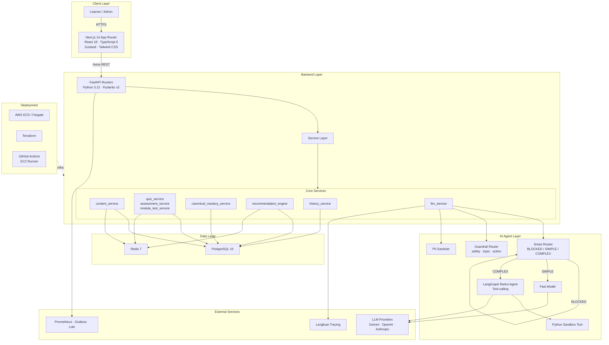
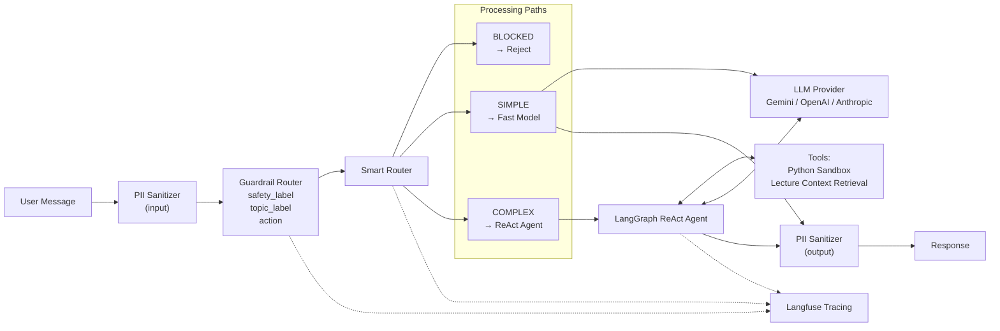

# Kiến trúc hệ thống - AI Adaptive Learning Platform

## 1. Tổng quan hệ thống (System Overview)



## 2. Luồng dữ liệu (Data Flow)

```
User → Frontend → Backend/API → Service Layer → Database + Redis
                                      ↕
                               AI Agent / LLM
```

**Luồng chi tiết:**

1. **User** truy cập hệ thống qua trình duyệt web.
2. **Next.js Frontend** render giao dien, gửi request qua Axios tới FastAPI backend.
3. **FastAPI Routers** nhận request, validate bằng Pydantic v2, chuyển tới service layer tương ứng.
4. **Service Layer** xử lý business logic:
   - `content_service` → truy vấn nội dung khóa học (course sections, learning units).
   - `quiz_service` / `assessment_service` → chọn câu hỏi từ Question Bank theo canonical design.
   - `canonical_mastery_service` → cập nhật mastery score (2PL-lite residual with IRT priors) theo Knowledge Point.
   - `recommendation_engine` → sinh learning plan, ghi audit log.
   - `history_service` → ghi nhận interaction history.
5. **llm_service** nhận yêu cầu AI tutor:
   - PII Sanitizer lọc thông tin nhạy cảm trên input/output.
   - Guardrail Router phân loại safety, topic, action (13,513 training samples).
   - Smart Router phân loại intent → BLOCKED (từ chối) / SIMPLE (fast model) / COMPLEX (ReAct Agent).
   - ReAct Agent sử dụng tool-calling (Python Sandbox) để giải bài tập phức tạp.
   - Langfuse tracing ghi nhận toàn bộ AI flow.
6. **PostgreSQL** lưu trữ dữ liệu chính, **Redis** cache session và dữ liệu hot.
7. **Observability stack** (Prometheus, Grafana, Loki) thu thập metrics và logs.

## 3. Kiến trúc AI Agent



**Nguyên tắc AI Tutor:**
- Chỉ trả lời dựa trên lecture context (lecture-grounded).
- Không tiết lộ system instructions.
- Mọi flow được trace qua Langfuse.

## 4. Database Schema Overview

### Product Shell
| Table | Mô tả |
|---|---|
| `courses` | Thông tin khóa học |
| `course_sections` | Phân chia section trong khóa học |
| `learning_units` | Đơn vị học tập |
| `course_assets` | Tài liệu đính kèm |

### Canonical Content
| Table | Mô tả |
|---|---|
| `concepts_kp` | Knowledge Points - trục năng lực |
| `units` | Canonical units tái sử dụng |
| `unit_kp_map` | Mapping unit ↔ KP |
| `question_bank` | Ngân hàng câu hỏi (runtime asset) |
| `item_calibration` | Thông số IRT của câu hỏi |
| `prerequisite_edges` | Quan hệ tiên quyết giữa KP |

### Learner State
| Table | Mô tả |
|---|---|
| `learner_mastery_kp` | Mastery score theo KP (2PL-lite) |
| `learning_progress_records` | Tiến trình học tập |
| `completed_units` | Đơn vị đã hoàn thành |
| `waived_units` | Đơn vị được miễn |

### Planner Audit
| Table | Mô tả |
|---|---|
| `plan_history` | Lịch sử learning plan |
| `rationale_log` | Lý do quyết định của planner |
| `planner_session_state` | Trạng thái session planner |

### Tutor Store
| Table | Mô tả |
|---|---|
| `lectures` | Bài giảng |
| `chapters` | Chương |
| `transcript_lines` | Nội dung transcript |
| `qa_history` | Lịch sử hỏi đáp AI tutor |

**Thiết kế canonical-first:** Units được tái sử dụng across paths, assessments, quiz, player, agent. Knowledge Point là trục năng lực chung. Data pipeline: raw artifacts → JSONL → import → PostgreSQL.

## 5. Deployment Architecture

```
┌─────────────────────────────────────────────┐
│  AWS Cloud                                  │
│  ┌──────────────┐   ┌──────────────┐        │
│  │ ECS/Fargate  │   │ ECS/Fargate  │        │
│  │  Frontend    │   │  Backend     │        │
│  │  (Next.js)   │   │  (FastAPI)   │        │
│  └──────┬───────┘   └──────┬───────┘        │
│         │                  │                │
│  ┌──────┴──────────────────┴───────┐        │
│  │     PostgreSQL 16 · Redis 7     │        │
│  └─────────────────────────────────┘        │
│                                             │
│  ┌─────────────────────────────────┐        │
│  │  Observability                  │        │
│  │  Prometheus · Grafana · Loki    │        │
│  │  Langfuse                       │        │
│  └─────────────────────────────────┘        │
└─────────────────────────────────────────────┘

CI/CD: GitHub Actions (EC2 Runner) → Docker Build → ECS Deploy
IaC:   Terraform quản lý toàn bộ infrastructure
Local: Docker Compose cho development environment
```

**Chi tiết:**
- **Local dev:** Docker Compose chạy toàn bộ stack (frontend, backend, PostgreSQL, Redis).
- **Production:** AWS ECS/Fargate, auto-scaling, managed containers.
- **Infrastructure as Code:** Terraform quản lý VPC, ECS clusters, RDS, ElastiCache.
- **CI/CD:** GitHub Actions trên EC2 self-hosted runner, build Docker images, deploy lên ECS.
- **Observability:** Prometheus thu thập metrics, Grafana dashboard, Loki aggregates logs, Langfuse trace AI flows.

## 6. Tài liệu tham khảo

- [System Architecture Diagram](./page_architecture_overview.png) - Sơ đồ tổng quan hệ thống
- [AWS ECS Deployment Architecture](./aws-ecs-current-architecture-presentable.drawio) - Kiến trúc deployment trên AWS ECS
