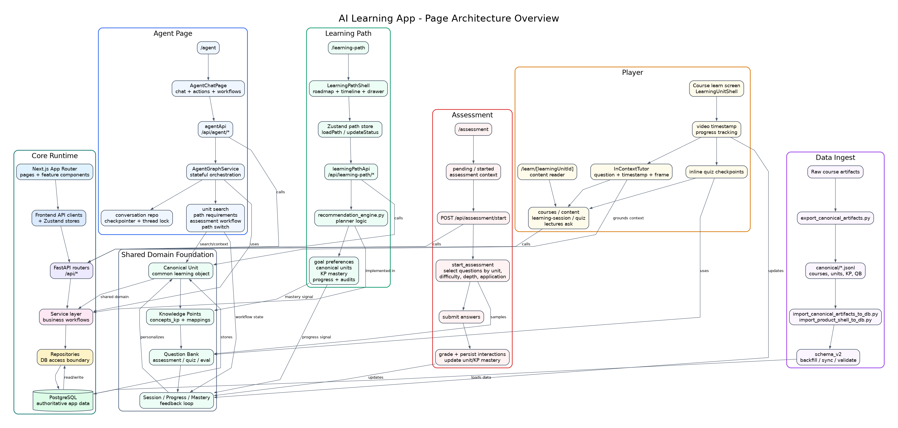
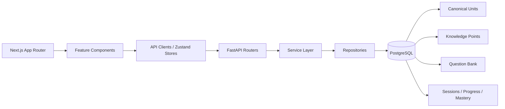
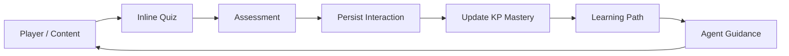
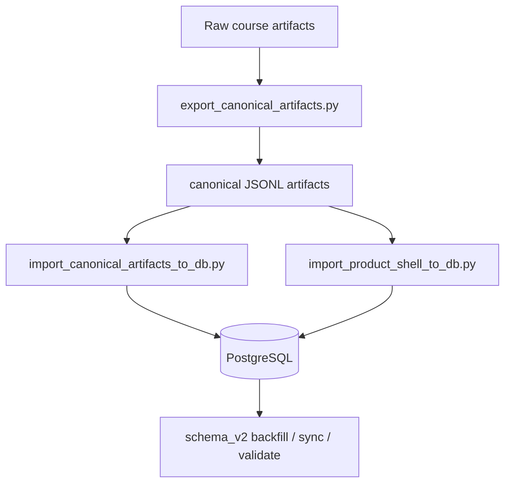
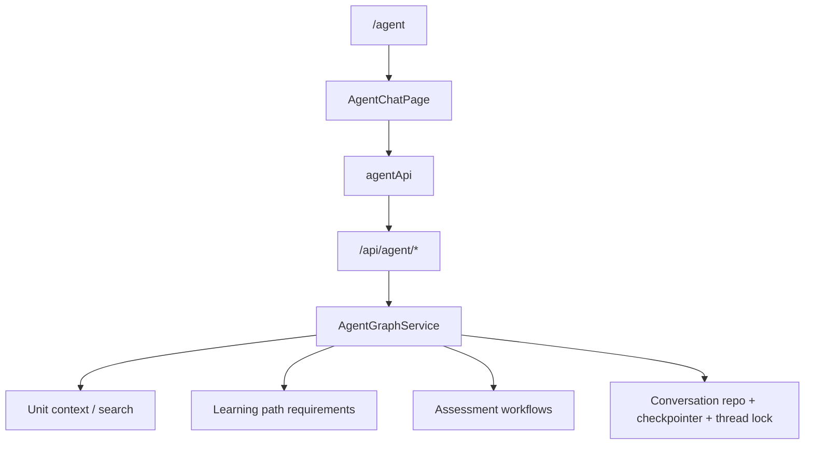
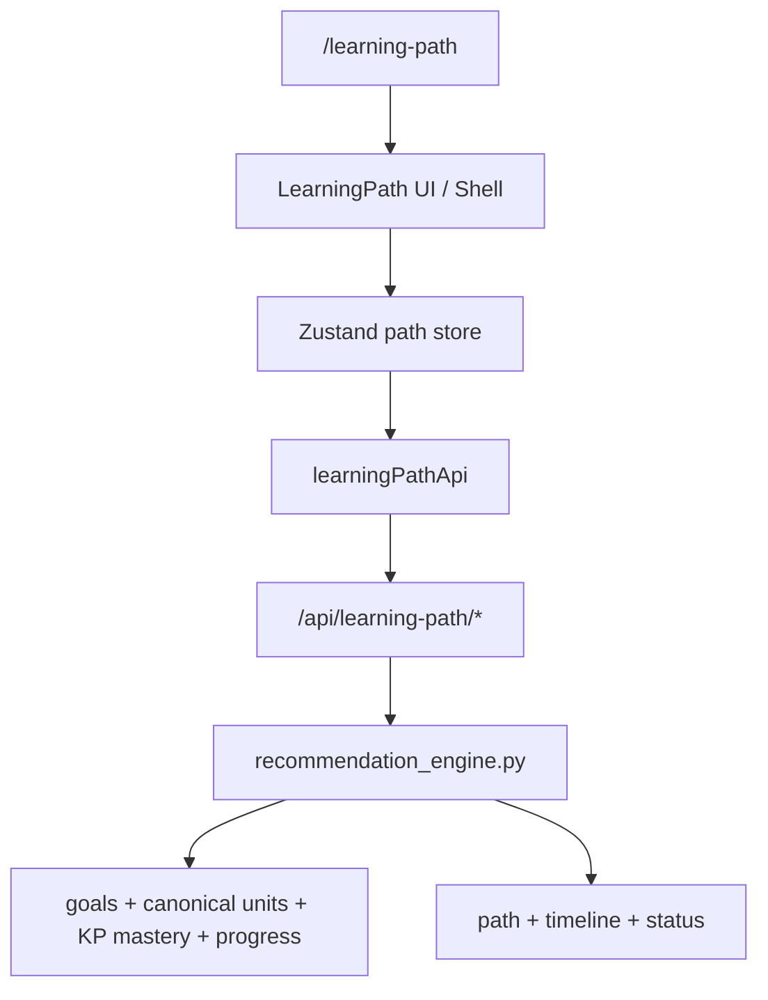
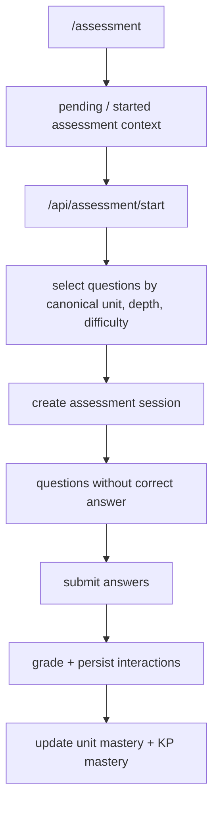
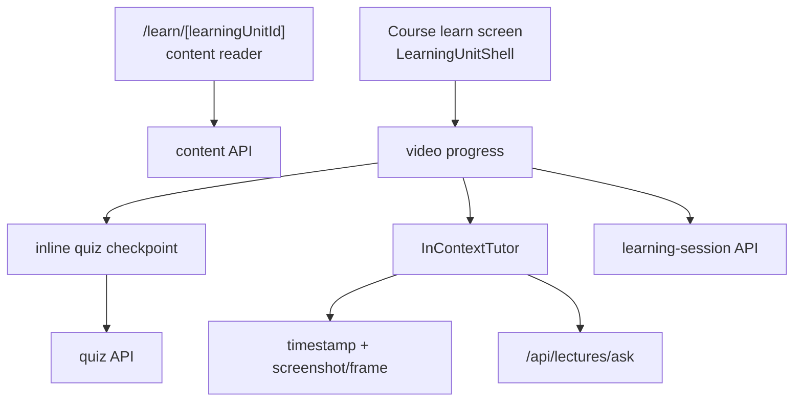

# AI Learning App - Architecture Strengths Report

## 1. Executive Summary

Hệ thống đang được thiết kế theo hướng **canonical-first learning platform**: thay vì để từng video, quiz, assessment, agent và learning path vận hành rời rạc, các luồng chính đều quy về cùng một lõi dữ liệu gồm **canonical unit**, **knowledge point**, **question bank**, **session**, **progress** và **mastery**.

Điểm mạnh lớn nhất của architecture hiện tại là nó không chỉ hiển thị nội dung học, mà tạo được một vòng lặp học tập có trạng thái:

```text
Học nội dung -> làm quiz/assessment -> ghi interaction -> cập nhật mastery
-> cá nhân hóa learning path -> agent dùng context đó để hỗ trợ learner
```

Overview diagram:



## 2. Core Architecture



Architecture tách khá rõ các trách nhiệm:

- **Frontend page** chịu trách nhiệm interaction và state UI.
- **API client / Zustand store** gom logic gọi API và state phía client.
- **FastAPI router** là boundary HTTP.
- **Service layer** giữ business workflow.
- **Repository layer** là boundary truy cập DB.
- **PostgreSQL** là nguồn dữ liệu chính cho runtime app.

Đây là nền tảng tốt để mở rộng vì các page quan trọng không đọc file artifact trực tiếp, mà đi qua service/repository và DB.

## 3. Điểm Mạnh Cốt Lõi

### 3.1. Canonical-first Design

Nhiều hệ thống học online thường bị khóa vào course/video cụ thể. Codebase này đang đi theo hướng tốt hơn: dùng **canonical unit** làm đơn vị học cốt lõi.

Điều này mạnh vì:

- Một unit có thể được dùng lại trong learning path, assessment, quiz, player và agent.
- Learning path có thể cá nhân hóa dựa trên năng lực thay vì chỉ đi tuyến tính theo lecture.
- Assessment có thể target đúng vùng kiến thức.
- Agent có thể nói chuyện theo unit context thay vì context rời rạc.

Các phần liên quan:

- `canonical units`
- `concepts_kp`
- `unit_kp_map`
- `item_kp_map`
- `question_bank`

### 3.2. Knowledge Point Layer Là Trục Đo Năng Lực

Knowledge point là tầng rất quan trọng. Nó biến hệ thống từ "người học đã xem bài nào" thành "người học đang mạnh/yếu ở khái niệm nào".

Điểm mạnh:

- Có thể cập nhật mastery theo từng KP.
- Có thể giải thích vì sao learner nên học unit tiếp theo.
- Có thể dùng làm feature cho recommendation.
- Có thể dùng làm context cho agent khi tư vấn.
- Có thể dùng để phân tích coverage của question bank.

Đây là phần nên nhấn mạnh khi present vì nó tạo khác biệt giữa app học video thông thường và adaptive learning platform.

### 3.3. Question Bank Là Runtime Asset

Question bank không chỉ là data để render quiz. Nó là asset dùng ở nhiều nơi:

- Assessment
- Inline quiz trong player
- Evaluation dataset
- Mastery update
- Grounded QA/evidence workflow

Đặc biệt, question bank có `source_ref` và timestamp, nên có thể trace ngược về transcript/video context. Điều này giúp hệ thống có nền tảng cho **grounded assessment** và **AI evaluation**.

### 3.4. Closed-loop Personalization

Luồng mạnh nhất của app là feedback loop:



Điểm đáng nhấn mạnh:

- Player không chỉ phát video, mà ghi progress.
- Quiz/assessment không chỉ trả điểm, mà cập nhật mastery.
- Learning path không chỉ là checklist, mà có thể phản ứng theo mastery.
- Agent không chỉ chat, mà có thể điều phối học, assessment, context và next action.

## 4. Page Architecture

### 4.1. Data Ingest

Data ingest hiện là pipeline/offline workflow, chưa phải frontend page.



Điểm mạnh:

- Có pipeline rõ để biến artifact thành DB runtime data.
- Artifact JSONL giúp kiểm tra, version và tái import dễ hơn.
- App không phụ thuộc trực tiếp vào file trong `data/` khi chạy runtime.

Điểm nên nói khi present:

> Ingest layer là nền móng dữ liệu. Nó chuẩn hóa course/video/question/concept thành canonical database để các page phía trên dùng chung.

### 4.2. Agent



Điểm mạnh:

- Agent có state qua conversation repository và checkpointer.
- Có workflow/action resume, không chỉ chat một lượt.
- Có thể kết nối assessment workflow.
- Có unit context và learning path context.
- Có thread lock để tránh race condition trong conversation.

Nên nhấn mạnh:

> Agent là orchestration layer. Nó không thay thế service học tập, mà kết nối các capability: context, assessment, path, progress và conversation.

Source chính:

- `frontend/features/agent/components/AgentChatPage.tsx`
- `frontend/features/agent/api.ts`
- `src/routers/agent.py`

### 4.3. Learning Path



Điểm mạnh:

- Learning path dựa trên canonical units.
- Có thể dùng learner mastery và progress để cá nhân hóa.
- Có timeline/status, không chỉ danh sách bài học.
- Store phía frontend gom logic load path, timeline và resume session.

Nên nhấn mạnh:

> Learning path là planner dựa trên năng lực, không phải playlist tĩnh.

Source chính:

- `frontend/app/learning-path/page.tsx`
- `frontend/features/learning-path/components/LearningPathShell.tsx`
- `frontend/features/learning-path/store.ts`
- `src/routers/learning_path.py`
- `src/services/recommendation_engine.py`

### 4.4. Assessment



Điểm mạnh:

- Assessment runtime là canonical-only.
- Có depth policy: quick, standard, deep, budget.
- Question selection có bucket theo difficulty/application.
- Submit không chỉ chấm điểm mà còn update mastery.
- Correct answer không bị gửi ra frontend ở start flow.

Nên nhấn mạnh:

> Assessment là engine đo năng lực và cập nhật mastery, không chỉ là quiz UI.

Source chính:

- `frontend/app/assessment/page.tsx`
- `frontend/lib/api.ts`
- `src/routers/assessment.py`
- `src/services/assessment_service.py`

### 4.5. Player

Player có hai experience chính:



Điểm mạnh:

- Có simple reader cho content/markdown.
- Có rich video player cho course learning.
- Có progress tracking theo video.
- Có inline quiz tại checkpoint.
- Có tutor theo timestamp và frame hiện tại.
- Player tạo dữ liệu runtime cho personalization loop.

Nên nhấn mạnh:

> Player không chỉ là nơi xem video. Nó là data collection point cho progress, quiz interaction và in-context tutoring.

Source chính:

- `frontend/app/learn/[learningUnitId]/page.tsx`
- `frontend/components/learn/LearningUnitShell.tsx`
- `frontend/components/learn/InContextTutor.tsx`
- `src/routers/courses.py`
- `src/routers/content.py`
- `src/routers/learning_session.py`
- `src/routers/quiz.py`

## 5. Strong Product Narrative

Khi present, nên kể theo narrative này:

1. **Data foundation**  
   Hệ thống chuẩn hóa course/video/question/concept thành canonical DB.

2. **Learning object**  
   Canonical unit là đơn vị học trung tâm.

3. **Skill graph**  
   Knowledge point mapping giúp đo năng lực thật, không chỉ completion.

4. **Adaptive loop**  
   Player, quiz và assessment ghi nhận hành vi học.

5. **Personalized planning**  
   Learning path dùng mastery/progress để đề xuất bước tiếp theo.

6. **Agent orchestration**  
   Agent dùng context, workflow và trạng thái học để hỗ trợ learner.

## 6. What Makes This Architecture Strong

### Reusable Learning Core

Một bộ dữ liệu canonical có thể phục vụ nhiều feature: player, assessment, agent, learning path, eval.

### Grounded AI Potential

Question bank có thể nối với `source_ref`, transcript window, unit summary và evidence. Đây là nền tốt cho AI evaluation và tutor grounded answer.

### State-aware Learning

Session, progress và mastery tạo hệ thống có memory về learner. Đây là điều kiện cần để cá nhân hóa thật.

### Separation of Concerns

Frontend, router, service, repository và DB được tách tương đối rõ. Điều này giúp dễ debug và mở rộng.

### Workflow-ready Agent

Agent có checkpointer, thread lock và workflow resume. Đây là kiến trúc phù hợp cho agentic learning assistant hơn là chatbot stateless.

## 7. Current Gaps / Opportunities

Các điểm này không nên nói như điểm yếu lớn, mà nên frame là roadmap:

- Data ingest chưa có admin page để inspect/import/retry pipeline.
- Learning path có cả route đơn giản và shell giàu hơn, có thể cần consolidate UX.
- Assessment/eval có thể bổ sung dashboard để theo dõi coverage theo unit/KP/source_ref.
- Agent có thể mạnh hơn nếu hiển thị rõ "why this recommendation" dựa trên mastery/KP.
- Player/tutor có thể tận dụng transcript window và source_ref sâu hơn để tăng groundedness.

## 8. One-slide Summary

```text
This is a canonical-first adaptive learning platform.

Data ingest builds a shared canonical knowledge base.
Player and assessment collect learning signals.
Mastery turns interactions into learner state.
Learning path uses that state to personalize next steps.
Agent orchestrates context, actions and workflows around the learner.
```

