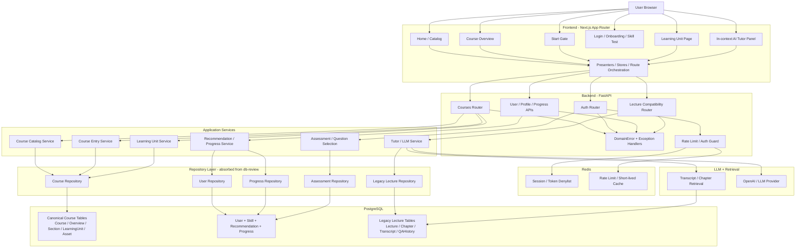
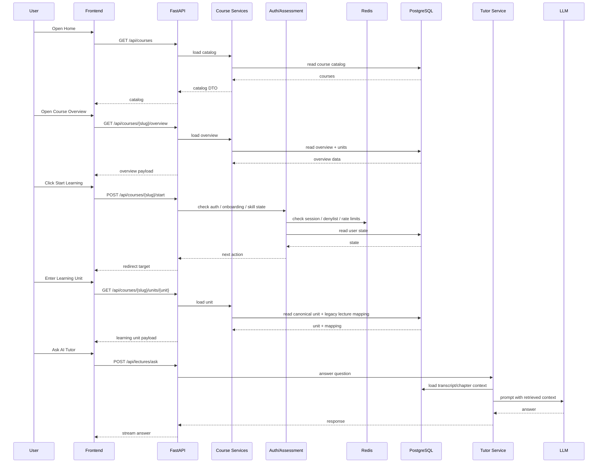
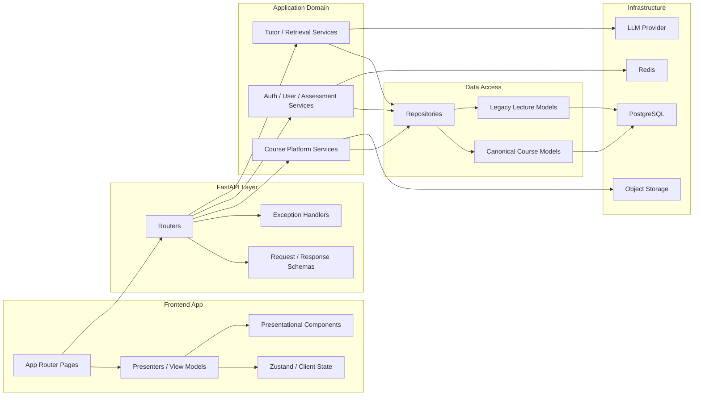
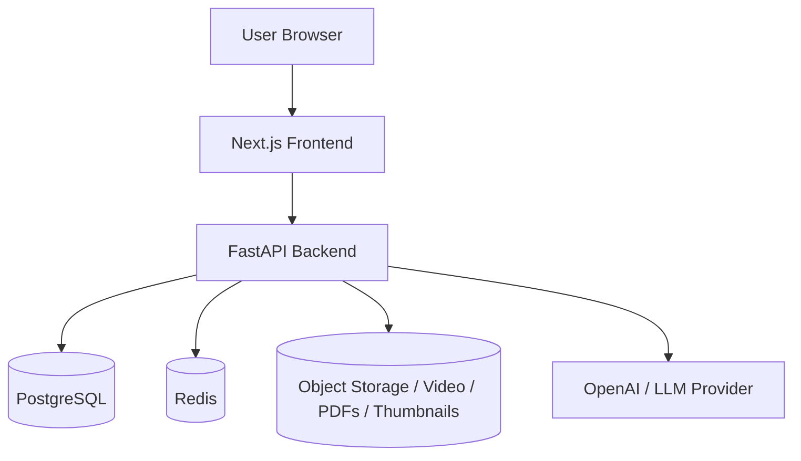

# Hybrid System Design: `001-course-first-refactor` + `db-review`

## Mục tiêu

Thiết kế hybrid này kết hợp:

- `001-course-first-refactor` làm nền cho `product architecture`
- `db-review` làm nguồn cho `backend/database quality patterns`

Mục tiêu không phải trộn hai nhánh theo kiểu ngang hàng. Mục tiêu là giữ `course-first core` làm trục chính, rồi hấp thụ có chọn lọc các điểm mạnh từ `db-review` để hệ thống sạch hơn, production-oriented hơn, nhưng không phá flow sản phẩm đã chốt.

## Trạng thái implementation hiện tại

Các phần đã hiện diện trên `hybrid/integrate-db-review`:

- `course-first core` vẫn là product direction chính
- `DomainError` + exception handlers đã được wire vào app
- Redis lifecycle đã được thêm vào app startup/shutdown theo kiểu fail-soft
- auth đã có:
  - Redis-backed login rate limit fallback
  - token denylist guard
  - `POST /api/auth/logout`
  - frontend logout gọi backend revoke theo kiểu best-effort
- `legacy lecture stack` đã được cô lập thêm qua `src/services/legacy_lecture_adapter.py`

Các phần vẫn còn transitional:

- course catalog/overview/unit runtime chưa được DB-authoritative hoàn toàn
- repository layer mới hấp thụ một phần pattern, chưa rollout rộng
- lecture/tutor stack vẫn còn dựa vào legacy tables cho `CS231n`

## Kiến trúc tổng thể

## Architectural Principles

### 1. Product direction comes from `001-course-first-refactor`

Luồng sản phẩm chuẩn vẫn là:

- `Home`
- `Course Overview`
- `Start learning`
- `login / onboarding / skill test` nếu cần
- `Learning Unit`
- `AI Tutor` nằm trong learning experience

Tầng này không được rollback về tư duy `tutor-first` hay `legacy LMS page-first`.

### 2. Backend quality patterns come from `db-review`

Các điểm nên hấp thụ từ `db-review`:

- `DomainError` và exception handlers rõ ràng
- Redis lifecycle trong app startup/shutdown
- cấu hình `cors_origins` tường minh
- `redis_url`
- repository layer cho các vùng chạm DB thật
- tách service/repository rõ hơn ở auth, assessment, selection logic

### 3. Legacy lecture stack becomes a bounded adapter

Hybrid này chấp nhận giai đoạn chuyển tiếp:

- `canonical course platform` là trục chính
- `legacy lecture/tutor stack` vẫn tồn tại để phục vụ `CS231n`

Nhưng lớp legacy phải được xem là `adapter`, không phải source of truth dài hạn cho toàn product.

Hiện tại boundary này được thể hiện rõ hơn bằng:

- `src/services/legacy_lecture_adapter.py`
- boundary note trong `src/models/store.py`
- boundary note trong `src/services/llm_service.py`

## Data Ownership

### Canonical data

Nên được quản lý trong bảng mới của course platform:

- `Course`
- `CourseOverview`
- `CourseSection`
- `LearningUnit`
- `CourseAsset`
- `TutorContextBinding`
- `LearnerAssessmentProfile`
- `CourseRecommendation`
- `LearningProgressRecord`

### Transitional legacy data

Vẫn cần giữ cho tới khi canonicalization xong:

- `Lecture`
- `Chapter`
- `TranscriptLine`
- `QAHistory`

### Cache / short-lived runtime state

Nên để ở Redis:

- session/token denylist
- rate limit
- cache ngắn hạn cho recommendation hay lookup tốn kém nếu cần

## Request Flow

## Module Boundaries

### Boundary rules

- `Frontend pages` chỉ orchestration, không tự nhúng business rules phức tạp.
- `Presenters / view-models` chịu trách nhiệm map API payload sang UI state.
- `Routers` chỉ validate request, gọi service, trả DTO.
- `Application services` là nơi giữ business flow.
- `Repositories` là lớp duy nhất nên chạm ORM/query trực tiếp khi feature đã thật sự DB-backed.
- `Legacy lecture models` chỉ phục vụ adapter use case, không được lan ngược thành domain trung tâm của product mới.

## Deployment / Runtime Topology

### Runtime responsibilities

- `Next.js` chịu trách nhiệm render UI, route transitions, local interaction state.
- `FastAPI` là server authoritative cho catalog, overview, gating, progress, tutor orchestration.
- `PostgreSQL` giữ dữ liệu sản phẩm chuẩn và dữ liệu legacy chuyển tiếp.
- `Redis` giữ state ngắn hạn và security/runtime controls.
- `Object storage` giữ binary assets, không nên nhét vào database.
- `OpenAI` chỉ được gọi từ backend, không gọi trực tiếp từ client.

## Ownership by Branch

### Giữ từ `001-course-first-refactor`

- `src/models/course.py`
- `src/routers/courses.py`
- `src/schemas/course.py`
- `src/services/course_bootstrap_service.py`
- `src/services/course_catalog_service.py`
- `src/services/course_entry_service.py`
- `src/services/learning_unit_service.py`
- frontend route flow cho `catalog`, `overview`, `start`, `learning unit`
- headless/presenter structure ở frontend

### Hấp thụ từ `db-review`

- explicit config cho `cors_origins`
- `redis_url`
- Redis client lifecycle
- `DomainError` + exception handlers
- repository abstractions
- các service split tốt hơn ở auth/assessment
- rate limit / token revoke patterns đã được áp một phần vào auth flow

### Không nên mang nguyên xi từ `db-review`

- backend root serve static legacy UI
- mọi thay đổi làm mất `course-first runtime API`
- mọi giả định biến lecture stack thành domain trung tâm của product

## File / Package Mapping

Section này dùng để resolve merge theo mức file/package cụ thể, không chỉ ở mức ý tưởng.

### Ưu tiên giữ từ `001-course-first-refactor`

#### Course-first domain và API

| File / Package | Giữ từ nhánh nào | Lý do |
|---|---|---|
| `src/models/course.py` | `001-course-first-refactor` | Canonical product domain mới của platform |
| `src/schemas/course.py` | `001-course-first-refactor` | DTO/schema cho course-first API |
| `src/routers/courses.py` | `001-course-first-refactor` | Runtime API chính cho catalog, overview, start, learning unit |
| `src/services/course_bootstrap_service.py` | `001-course-first-refactor` | Transitional ingest/bootstrap cho course platform |
| `src/services/course_catalog_service.py` | `001-course-first-refactor` | Business flow catalog theo course-first |
| `src/services/course_entry_service.py` | `001-course-first-refactor` | Start gate + auth/onboarding/assessment redirect flow |
| `src/services/learning_unit_service.py` | `001-course-first-refactor` | Canonical learning-unit contract và mapping xuống lecture adapter |
| `tests/contract/test_course_catalog_api.py` | `001-course-first-refactor` | Contract test cho catalog API |
| `tests/contract/test_course_start_api.py` | `001-course-first-refactor` | Contract test cho gating/start flow |
| `tests/contract/test_learning_unit_api.py` | `001-course-first-refactor` | Contract test cho learning unit payload |

#### Frontend course-first shell

| File / Package | Giữ từ nhánh nào | Lý do |
|---|---|---|
| `frontend/app/page.tsx` | `001-course-first-refactor` | Home flow mới đã bám catalog thay vì auth-first redirect |
| `frontend/app/courses/[courseSlug]/page.tsx` | `001-course-first-refactor` | Overview page chuẩn của flow mới |
| `frontend/app/courses/[courseSlug]/start/page.tsx` | `001-course-first-refactor` | Start gate context preservation |
| `frontend/app/(protected)/courses/[courseSlug]/learn/[unitSlug]/page.tsx` | `001-course-first-refactor` | Learning page chuẩn mới |
| `frontend/components/course/*` | `001-course-first-refactor` | Presentation components cho catalog/overview |
| `frontend/components/learn/InContextTutor.tsx` | `001-course-first-refactor` | Tutor nằm trong learning experience |
| `frontend/components/learn/LearningUnitShell.tsx` | `001-course-first-refactor` | Shell cho lecture/learning unit |
| `frontend/features/course-platform/presenters.ts` | `001-course-first-refactor` | Headless/presenter layer đã tách khỏi UI |
| `frontend/lib/course-gate.ts` | `001-course-first-refactor` | Course gating logic ở client |
| `frontend/lib/auth-redirect.ts` | `001-course-first-refactor` | Preserve `next` redirect context |
| `frontend/stores/courseCatalogStore.ts` | `001-course-first-refactor` | State orchestration cho catalog |
| `frontend/tests/routes/course-catalog.test.tsx` | `001-course-first-refactor` | Route test cho catalog flow |
| `frontend/tests/routes/course-start.test.tsx` | `001-course-first-refactor` | Route test cho start flow |
| `frontend/tests/routes/learning-unit.test.tsx` | `001-course-first-refactor` | Route test cho learning unit |
| `frontend/tests/routes/legacy-tutor-redirect.test.tsx` | `001-course-first-refactor` | Guard cho compatibility route |
| `frontend/tests/routes/personalized-catalog.test.tsx` | `001-course-first-refactor` | Route test cho recommended/all flow |

### Ưu tiên hấp thụ từ `db-review`

#### Config / app lifecycle / backend hygiene

| File / Package | Nguồn ưu tiên | Cách dùng trong hybrid |
|---|---|---|
| `db-review:src/config.py` | `db-review` | Hấp thụ `redis_url`, `cors_origins`, config explicit hơn vào `src/config.py` hiện tại |
| `db-review:src/api/app.py` | `db-review` | Chỉ lấy phần lifespan Redis, exception handler, CORS explicit; không lấy root static HTML |
| `db-review:src/exceptions.py` | `db-review` | Mang sang nếu chưa có tương đương |
| `db-review:src/exception_handlers.py` | `db-review` | Mang sang để chuẩn hóa error responses |
| `db-review:src/services/redis_client.py` | `db-review` | Dùng làm Redis integration base nếu package phù hợp |
| `db-review:src/services/rate_limit.py` | `db-review` | Đã hấp thụ một phần pattern vào `src/routers/auth.py`, có fallback local khi Redis unavailable |
| `db-review:src/services/token_denylist.py` | `db-review` | Đã hấp thụ ý tưởng revoke/denylist vào `src/services/token_guard.py` |

#### Repository / service decomposition

| File / Package | Nguồn ưu tiên | Cách dùng trong hybrid |
|---|---|---|
| `db-review:src/repositories/base.py` | `db-review` | Làm mẫu cho repository layer |
| `db-review:src/repositories/question_repo.py` | `db-review` | Tham khảo pattern query-heavy repository |
| `db-review:src/services/question_selector.py` | `db-review` | Hấp thụ nếu muốn dọn assessment selection logic |
| `db-review:src/services/rate_limit.py` | `db-review` | Pattern đã được áp một phần; phần còn lại chỉ mở rộng khi thật sự cần |
| `db-review:src/services/token_denylist.py` | `db-review` | Pattern đã được áp một phần; không cần copy nguyên file nếu `token_guard` hiện tại đủ |

### File cần resolve thủ công, không nên lấy nguyên một bên

| File / Package | Hướng resolve |
|---|---|
| `src/api/app.py` | Giữ routers course-first của nhánh hiện tại, thêm Redis lifecycle + exception handlers + CORS config từ `db-review`, không khôi phục root static HTML |
| `src/config.py` | Giữ config đang dùng cho course-first app, thêm các field tốt từ `db-review` |
| `src/routers/auth.py` | Giữ behavior tương thích flow hiện tại, port dần Redis/rate-limit/denylist theo mức đủ chín |
| `src/models/store.py` | Giữ legacy lecture stack như adapter; không mở rộng nó thành product domain mới |
| `src/services/llm_service.py` | Giữ fix API key và in-context tutor flow hiện tại; chỉ refactor cấu trúc nếu có lợi rõ |
| `src/services/legacy_lecture_adapter.py` | Giữ làm adapter boundary mới; mở rộng tại đây thay vì đẩy logic bridge ngược vào course service hoặc lecture model |
| `src/services/router.py` | Giữ behavior tutor routing hiện tại; chỉ dọn theo hướng service hygiene |
| `src/database.py` | Giữ setup phù hợp branch hiện tại, nhưng có thể hấp thụ cleanup async/session pattern từ `db-review` |

### File/package không nên kéo từ `db-review`

| File / Package | Lý do không kéo |
|---|---|
| `db-review:src/api/static/*` | Gắn với backend-root legacy UI |
| `db-review:src/api/app.py` phần `FileResponse("src/api/static/index.html")` | Trái với backend root API landing hiện tại |
| Mọi route/view không có tương ứng trong flow course-first | Dễ kéo hệ thống quay lại LMS/page-first mental model |

### Package-level merge policy

#### `src/models`

- Giữ `src/models/course.py` của nhánh hiện tại làm domain trung tâm mới.
- Giữ `src/models/store.py` như legacy adapter data model.
- Nếu `db-review` có cleanup cho model imports hoặc metadata setup, chỉ hấp thụ phần không làm mờ ranh giới canonical vs legacy.

#### `src/routers`

- `src/routers/courses.py` luôn lấy từ nhánh hiện tại.
- `src/routers/auth.py` resolve thủ công.
- Các router assessment/content/user có thể hấp thụ hygiene từ `db-review` nếu không phá contract đang dùng bởi frontend hiện tại.

#### `src/services`

- `course_*` và `learning_unit_service.py` lấy từ nhánh hiện tại.
- `redis`, `rate_limit`, `token_denylist`, `question_selector` ưu tiên xem từ `db-review`.
- `llm/tutor` giữ behavior hiện tại, chỉ lấy pattern clean-up nếu không ảnh hưởng flow đang chạy.

#### `frontend/app`

- Luôn giữ structure route của nhánh hiện tại.
- Không dùng bất kỳ thay đổi nào từ `db-review` nếu chúng làm khác flow course-first.

#### `frontend/components`, `frontend/features`, `frontend/stores`

- Giữ từ nhánh hiện tại gần như toàn bộ.
- Đây là vùng `db-review` không phải nguồn quyết định kiến trúc.

#### `tests`

- Giữ toàn bộ test bao phủ course-first flow của nhánh hiện tại.
- Nếu lấy thêm test/unit patterns từ `db-review`, chỉ dùng như bổ sung chứ không thay test contract hiện tại.

### Fast conflict decisions

Khi gặp conflict thật trong merge, có thể dùng bảng sau để quyết định nhanh:

| Nếu conflict nằm ở | Mặc định chọn |
|---|---|
| Course route, course schema, course service | `001-course-first-refactor` |
| Frontend route/course page/presenter/store | `001-course-first-refactor` |
| Redis lifecycle, exception handlers, config hardening | `db-review` pattern |
| Auth internals | Resolve thủ công |
| Legacy lecture/tutor ORM and routes | Resolve thủ công, giữ adapter boundary |
| Backend root `/` behavior | `001-course-first-refactor` |

## Source of Truth Matrix

| Concern | Source of truth | Transitional state | Không nên làm |
|---|---|---|---|
| Course catalog | Canonical course tables | Có thể bootstrap/import từ `data/` | Frontend đọc trực tiếp `data/` ở runtime |
| Course overview | Canonical DB rows | Có thể seed từ mock/bootstrap | Hardcode vĩnh viễn trong component |
| Learning unit structure | Canonical `LearningUnit` + mapping | Có thể map sang legacy lecture | Dùng lecture legacy làm primary product model |
| Tutor context | Legacy lecture adapter trong giai đoạn hiện tại | Ràng buộc qua mapping/binding | Để UI tự quyết định transcript source |
| Recommendation / progress | DB-backed user tables | Có thể chưa hoàn chỉnh hết | Giữ ở local state làm nguồn chuẩn |
| Session / rate limit | Redis | Có thể fallback tạm thời ở local dev | In-memory limiter cho production |
| Video / slide / thumbnails | Object storage | Có thể local file khi dev | Để frontend repo làm runtime asset source |

## Integration Decision Rules

Khi merge hai nhánh, mọi conflict nên được xử lý theo bộ quy tắc này:

### Rule 1: Product flow wins from `001-course-first-refactor`

Nếu một thay đổi của `db-review` làm:

- mất `course-first` routes
- đưa user quay lại flow `page-first`
- kéo `AI Tutor` ra khỏi learning experience

thì giữ cách làm của `001-course-first-refactor`.

### Rule 2: Infra quality wins from `db-review`

Nếu một thay đổi của `db-review`:

- làm config rõ hơn
- chuẩn hóa exception handling
- tách repository tốt hơn
- thêm Redis lifecycle/useful security controls

thì ưu tiên hấp thụ vào branch hybrid.

### Rule 3: Legacy stays behind an adapter boundary

Nếu code conflict giữa:

- canonical course model
- legacy lecture model

thì canonical model phải là public-facing domain, còn legacy model chỉ được giữ như adapter nội bộ.

### Rule 4: Runtime server authority beats client-side data ownership

Nếu có lựa chọn giữa:

- frontend tự đọc data source local
- backend trả dữ liệu authoritative

thì chọn backend authoritative.

### Rule 5: Merge history is preserved, but architecture is curated

Hybrid branch phải:

- preserve commit history của cả hai bên
- nhưng không có nghĩa là preserve mọi quyết định kiến trúc của cả hai bên

Lịch sử được giữ bằng merge strategy. Kiến trúc được giữ bằng conflict resolution có chủ đích.

## Transitional System Boundaries

Hybrid này có ba vùng rõ ràng:

### A. Canonical product core

Đây là vùng cần phát triển tiếp:

- course catalog
- overview
- start gate
- recommendation/progress
- learning unit contract

### B. Backend hardening layer

Đây là vùng nên nhập từ `db-review`:

- config
- Redis
- exceptions
- repository hygiene

### C. Legacy adapter layer

Đây là vùng giữ tạm:

- lecture transcripts
- chapter retrieval
- tutor Q&A compatibility
- mapping từ canonical `LearningUnit` sang legacy `Lecture`

## Recommended Evolution Path

### Phase 1

Giữ course-first flow đang chạy và tích hợp:

- Redis lifecycle
- explicit CORS/config
- exception layer
- repository layer có chọn lọc

### Phase 2

Chuyển dần runtime data của course platform sang canonical DB-backed source, giảm phụ thuộc bootstrap JSON.

### Phase 3

Canonicalize `CS231n` hoàn toàn:

- chapter metadata gắn với `LearningUnit`
- tutor context binding qua canonical model
- progress/history không còn bám lecture legacy

### Phase 4

Chỉ khi Phase 3 xong mới xem xét xóa hoặc thu hẹp mạnh `legacy lecture adapter`.

## Summary

System design hybrid tối ưu nhất là:

- `001-course-first-refactor` giữ vai trò `behavior + product architecture source`
- `db-review` giữ vai trò `backend infrastructure + data quality source`
- `legacy lecture/tutor stack` bị giới hạn thành adapter chuyển tiếp

Đây là cách duy nhất vừa:

- giữ đúng hướng sản phẩm
- nâng chất lượng backend/database
- vẫn cho phép preserve lịch sử commit của cả team khi tích hợp vào `main`

## Review Checklist For Team Discussion

Khi dùng tài liệu này để đối chiếu với member khác, nên hỏi lần lượt:

1. `Product flow source` đã chốt là `course-first` chưa.
2. `db-review` sẽ đóng vai trò `infra/provider of backend quality` hay muốn thay luôn product domain.
3. `Legacy lecture stack` hiện được coi là `adapter tạm` hay vẫn muốn giữ làm domain trung tâm.
4. `Runtime source of truth` đã đồng thuận là backend/DB chưa.
5. Team có chấp nhận preserve history bằng merge commit thay vì squash không.
