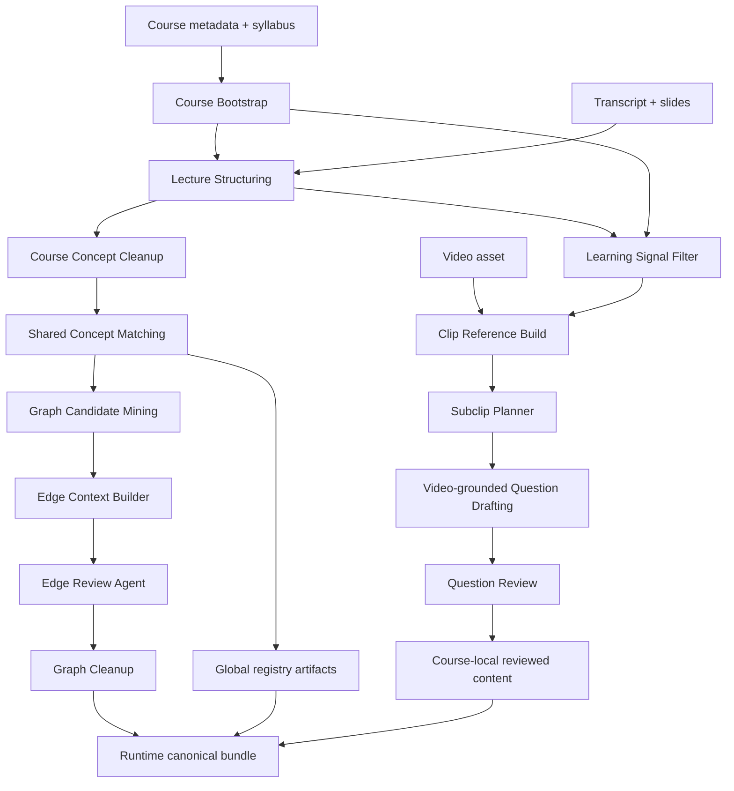
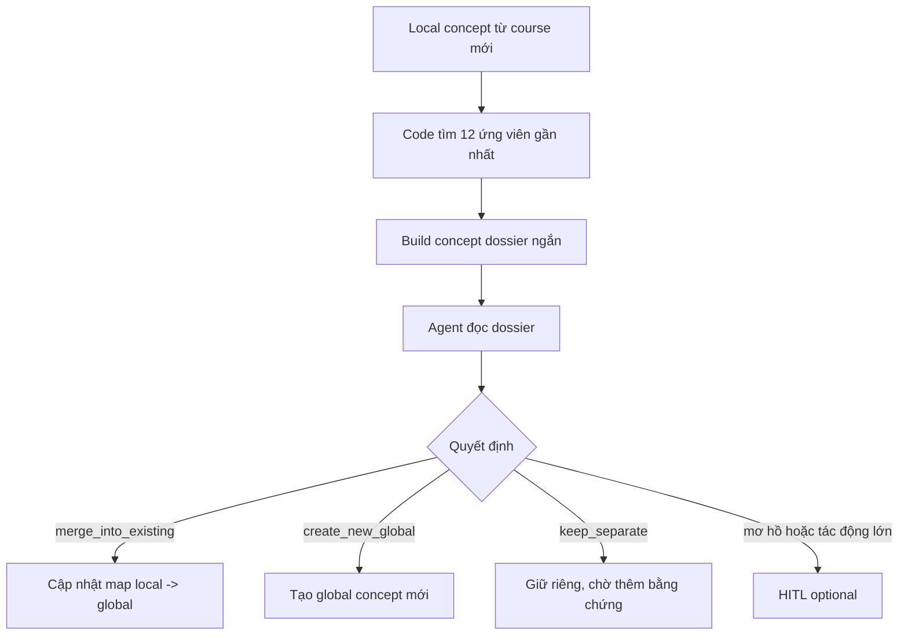
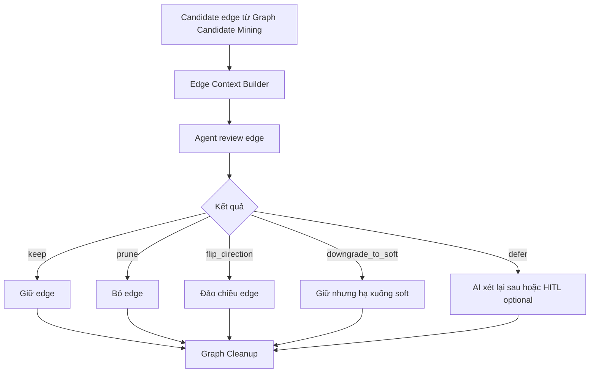
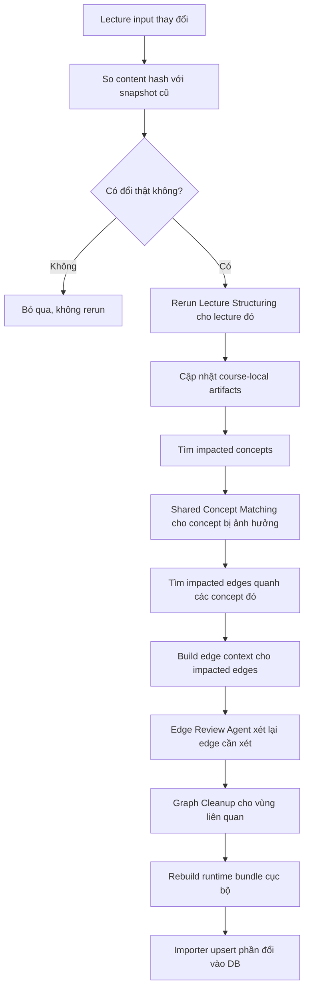

# Kế hoạch ingest mới — bản dễ hiểu

## 1. Mục tiêu

Kế hoạch này giải 1 vấn đề chính:

- thêm 1 course mới mà không phải làm lại gần như cả hệ thống

Hướng đi mới là:

1. việc nào code làm chắc thì để code làm
2. việc nào cần hiểu nghĩa thì cho AI agent làm
3. AI chỉ đọc đúng mẩu context liên quan, không đọc cả kho dữ liệu
4. output cuối vẫn phải ra đúng bundle canonical để importer DB hiện tại dùng lại được
5. chỗ nào AI không chắc hoặc tác động lớn thì luôn mở đường cho người xem lại
6. metadata phải đủ rõ để sau này dựng admin dashboard

Plan này không đụng vào runtime app ở giai đoạn đầu.

---

## 2. Tên bước mới

Từ đây trở đi, plan dùng tên bước mới để đồng bộ hơn:

| Tên mới | Ý nghĩa |
| --- | --- |
| `Lecture Structuring` | Chia lecture thành unit, summary, key points từ transcript timestamp + slide/syllabus |
| `Course Bootstrap` | Tạo config mặc định cho course trước khi ingest |
| `Course Concept Cleanup` | Gom và làm gọn concept trong nội bộ 1 course |
| `Shared Concept Matching` | Nối concept của course mới vào kho concept chung |
| `Learning Signal Filter` | Xác định đoạn nào đáng học, đáng sinh câu hỏi |
| `Clip Reference Build` | Cắt clip hoặc tạo mốc thời gian cho unit; đây mới là bước dùng video nếu cần |
| `Subclip Planner` | Chia segment dài thành subclip nhỏ để sinh câu hỏi chính xác hơn |
| `Question Drafting` | Sinh câu hỏi |
| `Question Review` | Soát lại và sửa câu hỏi |
| `Graph Candidate Mining` | Tìm các quan hệ concept nghi ngờ |
| `Edge Context Builder` | Gom context ngắn cho từng edge |
| `Edge Review Agent` | AI quyết định giữ hay bỏ edge |
| `Graph Cleanup` | Code dọn graph cuối và xuất bundle |

Tên cũ kiểu `P2`, `P5` chỉ còn ý nghĩa tham chiếu lịch sử, không dùng làm tên chính nữa.

---

## 3. Phần nào giữ contract, nhưng chuẩn hóa prompt

Các phần dưới đây vẫn giữ vai trò và output chính vì chưa phải nút thắt chính:

- `Lecture Structuring`
- `Learning Signal Filter`
- `Clip Reference Build`
- `Question Drafting`
- `Question Review`
- importer DB hiện tại
- format canonical cuối:
  - `concepts_kp.jsonl`
  - `units.jsonl`
  - `unit_kp_map.jsonl`
  - `question_bank.jsonl`
  - `item_calibration.jsonl`
  - `item_phase_map.jsonl`
  - `item_kp_map.jsonl`
  - `prerequisite_edges.jsonl`
  - `pruned_edges.jsonl`
  - `manifest.json`
  - `validation_report.json`

Lý do:

- các phần này đang chạy tương đối ổn
- sửa lúc này chỉ tăng rủi ro
- điểm nghẽn thật sự nằm ở nối concept chung và dựng graph

Tuy nhiên, phần prompt cần được chuẩn hóa lại.

Không dùng kiểu:

- AI trả lời `ACK`
- AI chat xác nhận đã hiểu
- AI mô tả chung chung nhưng không trả JSON

Lý do:

- `ACK` không trích xuất được dữ liệu
- khó validate tự động
- khó retry đúng lỗi
- không dùng tốt cho admin dashboard sau này

Quy tắc mới:

- mọi prompt phải trả JSON theo schema rõ
- nếu JSON sai schema thì chạy prompt repair riêng
- prompt repair chỉ nhận JSON lỗi và lỗi validate, không nhận lại toàn bộ context lớn
- mọi quyết định quan trọng phải có `confidence` và `rationale` ngắn
- prompt chỉ nên trả phần cần AI suy luận
- field nào code đã biết thì code chèn sau khi nhận JSON
- ID, timestamp, source ref phải copy từ input nếu prompt thật sự cần trả; nếu thiếu bằng chứng thì dùng `null`, `defer`, hoặc đưa vào `issues`, không được tự bịa

Các field nên để code chèn sau:

- `run_id`
- `course_id`
- `lecture_id`
- `unit_id`
- `source_file`
- `schema_version`
- `video_url`
- `video_clip_ref`
- path asset nội bộ
- `source_ref.unit_id`
- timestamp nếu đã có từ transcript/clip matcher

Lý do:

- giảm token
- giảm lỗi schema strict
- tránh model bịa path hoặc URL
- dễ đổi host server sau này
- `video_url` hiện có thể để `null`, runtime dùng server-hosted asset sau

### 3.1. Prompt contract theo từng bước

| Bước | Prompt làm gì | Output bắt buộc |
| --- | --- | --- |
| `Lecture Structuring` | Đọc transcript timestamp + slide/syllabus của 1 lecture và chia thành unit học được; không feed video | JSON có `lecture`, `table_of_contents`, `units`, `key_points`, `local_concepts` |
| `Course Concept Cleanup` | Chuẩn hóa concept nội bộ course và sinh role/importance/difficulty/tags | JSON có concept metadata canonical-ready |
| `Learning Signal Filter` | Đánh dấu unit nào đáng học, tham khảo, hoặc bỏ qua | JSON có `unit_id`, `salience_decision`, `content_type`, `override_critical_kp`, `target_kp_ids`, `expected_item_count`, `rationale` |
| `Question Drafting` | Sinh câu hỏi từ 1 unit đáng học | JSON array `questions` với `question`, `choices`, `answer_index`, `explanation`, `question_intent`, `evidence_span` |
| `Question Review` | Soát câu hỏi và sửa lỗi | JSON có `item_id`, `review_status`, `qa_gate_passed`, `issues`, `repaired_question` nếu cần |
| `Shared Concept Matching` | Quyết concept mới nên gộp vào concept cũ hay tạo mới | JSON có `local_kp_id`, `decision`, `target_global_kp_id`, `confidence`, `rationale` |
| `Edge Review Agent` | Quyết edge có đáng giữ không | JSON có `source_kp_id`, `target_kp_id`, `verdict`, `edge_type`, `confidence`, `rationale` |

### 3.2. Prompt tối ưu hơn

Mỗi prompt nên được thiết kế theo kiểu:

1. đưa đúng context nhỏ cần thiết
2. yêu cầu JSON duy nhất
3. cấm trả lời ngoài JSON
4. validate bằng code
5. nếu fail thì repair JSON, không rerun full context

Ví dụ prompt không nên dùng:

```text
Hãy đọc dữ liệu sau. Nếu hiểu thì trả lời ACK.
```

Prompt nên dùng:

```text
Return only valid JSON matching this schema:
{
  "units": [
    {
      "title": "string",
      "summary": "string",
      "key_points": []
    }
  ]
}
```

Với cách này, mỗi bước đều có output máy đọc được ngay.

### 3.3. Prompt skeleton nên dùng

Các prompt không cần viết dài kiểu hội thoại. Mỗi prompt nên có cùng khung:

```text
You are running step: <step_name>.
Use only the provided context.
Return only valid JSON.
Do not include markdown, prose, ACK, or explanations outside JSON.
Only return fields that require semantic judgment.
Do not return file paths, video URLs, asset URLs, run metadata, or host-specific fields.
If evidence is missing, use null, defer, or issues instead of inventing values.
```

Sau đó mỗi bước thêm phần context và schema riêng.

#### `Lecture Structuring`

Input tối thiểu:

- lecture metadata
- transcript đã làm sạch
- slide text hoặc slide notes nếu có
- syllabus entry của lecture

Không dùng video ở bước này. Video chỉ dùng sau khi đã có segment/unit, chủ yếu ở `Clip Reference Build` hoặc bước sinh/soát câu hỏi cần grounding bằng hình ảnh.

Output JSON:

```json
{
  "table_of_contents": [
    {
      "section_index": 1,
      "title": "string",
      "start_s": 0,
      "end_s": 0
    }
  ],
  "units": [
    {
      "unit_id": "string",
      "title": "string",
      "summary": "3-6 sentences with at least two [ts=NNNs] citations",
      "start_s": 0,
      "end_s": 0,
      "key_points": [
        {
          "text": "string",
          "timestamp_s": 0,
          "evidence_type": "formula|definition|claim|example|diagnostic_tip"
        }
      ],
      "unit_kp_map": [
        {
          "local_kp_id": "string",
          "planner_role": "main|prereq|support",
          "instruction_role": "intro|main|review|application|support",
          "coverage_level": "dominant|substantial|partial|mention",
          "coverage_confidence": "high|medium|low",
          "coverage_rationale": "string"
        }
      ]
    }
  ],
  "local_concepts": [
    {
      "local_kp_id": "string",
      "name": "string",
      "description": "string"
    }
  ]
}
```

Validator bắt buộc:

- `summary` phải có ít nhất 2 citation dạng `[ts=NNNs]`
- mỗi citation `NNN` phải nằm trong `[unit.start_s, unit.end_s]`
- mỗi `key_points[].timestamp_s` phải nằm trong `[unit.start_s, unit.end_s]`
- `summary` và `key_points[].text` không được bịa ý ngoài transcript/slide
- `unit_kp_map.coverage_weight` không để LLM sinh; code map từ `coverage_level`

Code sẽ chèn sau:

- `run_id`
- `course_id`
- `lecture_id`
- `source_file`
- `schema_version`
- `summary_embedding`

#### `Course Concept Cleanup`

Input tối thiểu:

- `local_concepts` từ `Lecture Structuring`
- các unit summary/key_points liên quan
- course metadata

Output JSON:

```json
{
  "concepts": [
    {
      "local_kp_id": "string",
      "canonical_name": "string",
      "description": "string",
      "importance_level": "critical|high|medium|low",
      "structural_role": "gateway|core|supporting|enrichment",
      "importance_confidence": "high|medium|low",
      "importance_rationale": "string",
      "importance_scope": "course|track|cross_course",
      "difficulty_level": "intro|intermediate|advanced",
      "difficulty_confidence": "high|medium|low",
      "track_tags": [],
      "domain_tags": [],
      "career_path_tags": []
    }
  ],
  "merge_suggestions": [
    {
      "source_local_kp_id": "string",
      "target_local_kp_id": "string",
      "confidence": "high|medium|low",
      "rationale": "string"
    }
  ]
}
```

Rule riêng:

- `importance_level` và `structural_role` là 2 trục khác nhau, không được gộp. Ví dụ một KP có thể là `structural_role=gateway` nhưng `importance_level=medium` trong course đó.
- `description_embedding` không để LLM sinh; code populate sau.
- `importance_source` mặc định do code chèn theo provenance của step, thường là `llm_single_pass` hoặc `llm_consensus`.
- Nếu có split concept cũ thì đưa vào HITL, không auto split trong phase đầu.

#### `Learning Signal Filter`

Input tối thiểu:

- units từ `Lecture Structuring`
- summary
- key points
- local concepts

Output JSON:

```json
{
  "unit_decisions": [
    {
      "unit_id": "string",
      "salience_decision": "core|reference|skip",
      "content_type": "core_theory|worked_example|application_case|motivation|historical_context|anecdote|administrative|recap",
      "content_type_confidence": "high|medium|low",
      "override_critical_kp": false,
      "target_kp_ids": [],
      "expected_item_count": 0,
      "salience_confidence": "high|medium|low",
      "has_quiz_potential": true,
      "rationale": "string"
    }
  ]
}
```

Code sẽ chèn sau:

- `run_id`
- `course_id`
- `lecture_id`
- `source_file`
- `schema_version`

Rule riêng:

- `salience_decision` là quyết định học hay bỏ qua.
- `content_type` là loại nội dung; 2 trục này độc lập.
- nếu `content_type` là `administrative`, `anecdote`, `historical_context`, hoặc `recap` thì mặc định không sinh quiz, trừ khi `override_critical_kp=true`
- `override_critical_kp=true` khi unit có KP `importance_level=critical` và `structural_role=gateway`
- `expected_item_count` là gợi ý; code có thể clamp theo config course

#### `Question Drafting`

Input tối thiểu:

- 1 unit đáng học
- source summary
- key points
- video segment hoặc subclip video bắt buộc cho production question generation
- allowed evidence spans từ transcript window
- target phase list

Output JSON:

```json
{
  "questions": [
    {
      "item_type": "MCQ",
      "question": "string",
      "choices": [],
      "answer_index": 0,
      "explanation": "string",
      "question_intent": "conceptual|application|diagnostic|procedural",
      "difficulty": "easy|medium|hard",
      "evidence_span": "string",
      "frame_evidence": [
        {
          "timestamp": "MM:SS",
          "description": "string"
        }
      ]
    },
    {
      "item_type": "free_response",
      "question": "string",
      "rubric": [
        {
          "criterion": "string",
          "points": 1
        }
      ],
      "max_points": 3,
      "explanation": "string",
      "question_intent": "conceptual|application|diagnostic|procedural",
      "difficulty": "easy|medium|hard",
      "evidence_span": "string",
      "frame_evidence": []
    }
  ]
}
```

Rule riêng:

- `evidence_span` phải copy nguyên văn từ danh sách `allowed_evidence_spans` do code đưa vào prompt
- không cho model tự paraphrase `evidence_span`, vì exporter cần match lại trong transcript
- không để model trả `video_url`, `video_clip_ref`, path asset hoặc full `source_ref`
- code sẽ dựng `source_ref` sau bằng transcript matcher / clip matcher
- code sẽ chèn `course_id`, `lecture_id`, `unit_id`, `source_file`, `item_id`, `primary_kp_id`, `render_mode`, `knowledge_scope`, `qa_gate_passed`, `review_status`, `provenance`
- nếu dùng video segment/subclip thì code set `multimodal_signals_used=["transcript","video","video_frame"]` và provenance có thể là `vlm_grounded`
- nếu chỉ dùng transcript để fallback thì code set `multimodal_signals_used=["transcript"]` và provenance không được claim `vlm_grounded`
- nếu không tìm được timestamp hợp lệ sau khi match thì reject hoặc đưa vào review queue

#### `Question Review`

Input tối thiểu:

- drafted question
- source unit summary
- source timestamp / clip ref
- expected phase

Output JSON:

```json
{
  "item_id": "string",
  "qa_gate_passed": true,
  "review_status": "not_required|auto_accepted|deferred|optional|reviewed",
  "issues": [],
  "repaired_question": null
}
```

Rule riêng:

- nếu không cần sửa thì `repaired_question = null`
- nếu cần sửa thì `review_status` nên là `auto_accepted` sau khi sửa đạt hoặc `deferred` nếu chưa đủ chắc
- nếu có `repaired_question` thì object này phải có schema rõ, không dùng object tự do
- strict JSON schema không nên dùng object lỏng kiểu `additionalProperties: true`
- code sẽ chèn `run_id`, `course_id`, `source_file`, `schema_version`

#### `Shared Concept Matching`

Input tối thiểu:

- local concept
- 12 candidate global concepts
- 1-2 source unit summaries
- previous mapping history nếu có

Output JSON:

```json
{
  "local_kp_id": "string",
  "decision": "merge_into_existing|create_new_global|keep_separate",
  "target_global_kp_id": "string|null",
  "confidence": "high|medium|low",
  "rationale": "string",
  "needs_human_review": false
}
```

Code sẽ chèn sau:

- `run_id`
- `course_id`
- `source_file`
- `schema_version`

#### `Edge Review Agent`

Input tối thiểu:

- source concept
- target concept
- evidence ledger
- related unit summaries
- previous edge decision nếu có
- neighbor edges nhỏ, không phải full graph

Output JSON:

```json
{
  "source_kp_id": "string",
  "target_kp_id": "string",
  "verdict": "keep|prune|flip_direction|defer",
  "edge_kind": "hard|soft",
  "confidence": "high|medium|low",
  "rationale": "string",
  "needs_human_review": false
}
```

Ghi chú schema:

- Phase đầu không dùng `downgrade_to_soft` nếu database/Planner chưa có `edge_kind`.
- Nếu muốn giữ `soft`, cần thêm column `edge_kind ∈ {hard, soft}` và Planner phải đọc field này.
- Nếu chưa sửa Planner, chỉ dùng `keep|prune|flip_direction|defer`, tất cả edge active được coi là hard.
- `flip_direction` phải ghi vào `adjudication_trace.direction_flipped=true`.
- `edge_strength` numeric có thể để nullable nếu bỏ ModernBERT; Planner fallback sang `confidence` + số bằng chứng.

Code sẽ chèn sau:

- `run_id`
- `source_file`
- `schema_version`
- `source_course_ids`
- `target_course_ids`
- `edge_scope`
- provenance fields

### 3.4. Schema-critical code contracts

Các phần dưới đây không nên để LLM tự quyết hoàn toàn.

#### `Course Bootstrap`

Trước khi chạy lecture ingest, code tạo hoặc cập nhật `courses.course_config`:

```json
{
  "included_content_types": [
    "core_theory",
    "worked_example",
    "application_case"
  ],
  "salience_filter_strictness": "normal",
  "default_question_item_types": ["MCQ"],
  "allow_free_response": false
}
```

Course đặc biệt có thể override config:

- history/philosophy course có thể include `historical_context`
- project/case-study course có thể include `application_case`
- ML/DL/CV/NLP course mặc định skip `administrative`, `anecdote`, `recap` nếu không critical

#### `source_ref` enrichment

Code dựng `source_ref` sau khi model trả semantic output:

```json
{
  "unit_id": "string",
  "timestamp_start": 0,
  "timestamp_end": 0,
  "evidence_span": "exact transcript substring",
  "multimodal_signals_used": ["transcript", "video", "video_frame"],
  "video_clip_ref": {
    "local_path": "string|null",
    "start_s": 0,
    "end_s": 0,
    "frame_evidence": []
  },
  "video_url": null
}
```

Rules:

- `multimodal_signals_used` tối thiểu phải có `"transcript"`
- nếu question dùng video segment thì thêm `"video"` và `"video_frame"`
- `video_url` có thể `null` ở artifact trung gian
- path/URL không để model sinh

#### `item_calibration` defaults

Với item mới:

```json
{
  "is_calibrated": false,
  "calibration_method": "prior_only",
  "irt_calibration_n": 0,
  "difficulty_b": null,
  "discrimination_a": null,
  "guessing_c": null
}
```

Assessor dùng `question_bank.difficulty_prior` / `discrimination_prior` cho tới khi có empirical calibration.

#### `item_phase_map` defaults

Code sinh phase map bằng rule:

- `mini_quiz`: mọi item tốt trong segment core
- `placement`: conceptual/application item của KP gateway hoặc early/final coverage
- `skip_verification`: item có difficulty medium/hard và evidence rõ
- `bridge_check`: item của prereq/support KP
- `final_quiz`: item phủ main KP toàn course
- `transfer`: chỉ khi question có application/cross-domain setup

`phase_multiplier` là constant theo config, không để LLM sinh.

#### `item_kp_map`

Code sinh `item_kp_map` từ `primary_kp_id` + optional secondary KP:

- weight sum phải bằng `1.0`
- primary KP mặc định `0.7-1.0`
- secondary KP chỉ thêm nếu question thật sự cần nhiều KP
- validator reject nếu sum lệch quá tolerance

#### Provenance mapping

Mapping mặc định:

| Step | Provenance |
| --- | --- |
| `Lecture Structuring` | `llm_single_pass` |
| `Course Concept Cleanup` | `llm_single_pass` hoặc `llm_consensus` nếu có phản biện |
| `Question Drafting` text-only fallback | `llm_single_pass` |
| `Question Drafting` dùng video segment | `vlm_grounded` |
| `Question Review` deterministic-only | `auto_accepted` / `not_required` tùy row |
| `Edge Review Agent` 1 pass | `llm_single_pass` |
| `Edge Review Agent` phản biện + phân xử | `llm_consensus` |

#### `repair_history`

Mỗi repair lưu:

```json
{
  "iteration": 1,
  "trigger": "schema_error|evidence_mismatch|bad_distractor|alignment_fail",
  "repair_actions": [],
  "before_snapshot": {},
  "after_snapshot": {},
  "repair_confidence": "high|medium|low",
  "repaired_by_model": "string"
}
```

Nếu `qa_gate_passed=false` sau 2 iteration thì reject hoặc đưa vào HITL, không repair vô hạn.

#### Central validators

Cần có validator tập trung trước khi export canonical:

- reject nếu `evidence_span` không substring-match transcript
- reject nếu `source_ref.multimodal_signals_used` rỗng hoặc thiếu `"transcript"`
- reject nếu `primary_kp_id` không tồn tại trong `concepts_kp`
- reject nếu `question_intent`/`review_status`/`phase` ngoài enum
- reject nếu `qa_gate_passed=false` sau repair limit
- reject nếu MCQ không có đúng 4 choices hoặc `answer_index` out of range
- reject nếu distractor quá giống đáp án hoặc quá vô lý theo embedding/rule check
- auto-revise nếu procedural/diagnostic question có video grounding nhưng thiếu `frame_evidence`
- reject duplicate `global_kp_id`
- reject `unit_kp_map` thiếu `planner_role` hoặc `instruction_role`
- reject edge `keep` mà thiếu evidence ledger
- nếu có `edge_strength` và `<0.2` với confidence low thì reject; nếu `edge_strength=null` thì dùng confidence + evidence count fallback

### 3.5. Repair prompt

Repair prompt chỉ dùng khi output sai schema.

Input của repair prompt chỉ gồm:

- JSON lỗi
- lỗi validate cụ thể
- schema cần đạt

Không đưa lại transcript, slide, graph, hoặc context lớn.

Repair prompt phải trả lại đúng JSON đã sửa, không trả lời chat.

### 3.6. Kết quả test API với `gpt-5.4-mini`

Đã test call thật với `gpt-5.4-mini` qua OpenAI API.

Kết quả ban đầu:

- `Lecture Structuring`: pass JSON
- `Learning Signal Filter`: pass JSON nhưng cần input có `lecture_id`
- `Question Drafting`: pass JSON nhưng nếu context thiếu timestamp thì model có xu hướng điền `0`
- `Question Review`: fail schema vì `repaired_question` để object quá lỏng
- `Shared Concept Matching`: pass JSON
- `Edge Review Agent`: pass JSON

Sau khi siết prompt/schema lần đầu:

- `Learning Signal Filter`: pass, có đủ `source_file` và `schema_version`
- `Question Drafting`: pass, copy đúng `source_ref.start_s = 3533` và `end_s = 3720` từ context
- `Question Review`: pass sau khi sửa `repaired_question` thành object/null rõ ràng
- `Shared Concept Matching`: pass, có đủ metadata
- `Edge Review Agent`: pass, có đủ metadata

Sau review lại với canonical schema hiện tại:

- canonical `question_bank` dùng `question`, `choices`, `answer_index`, không dùng `question_text`, `options`, `answer`
- canonical `source_ref` dùng `timestamp_start`, `timestamp_end`, `evidence_span`, `multimodal_signals_used`
- canonical `review_status` hiện là `not_required`, `auto_accepted`, `deferred`, `optional`, `reviewed`
- các field như `video_url`, `video_clip_ref`, path asset nên để code chèn sau, không bắt model trả
- prompt nên trả minimal output, còn canonical enrichment do code làm

Retest với minimal output:

- `Question Drafting`: pass JSON với field canonical `question`, `choices`, `answer_index`, `explanation`, `question_intent`, `difficulty`, `evidence_span`
- `Question Drafting`: không trả field cấm như `video_url`, `video_clip_ref`, `source_file`, `schema_version`
- `Question Drafting`: nội dung tiếng Anh ổn, không có dấu hiệu loạn ngữ
- `Question Review`: pass JSON với `review_status = auto_accepted`, `qa_gate_passed = true`, `repaired_question = null`

Kết luận:

- dùng schema strict được
- không dùng `ACK`
- không dùng object lỏng trong strict JSON schema
- timestamp/source ref không nên bắt model dựng full nếu code có thể dựng sau
- host/path/video fields nên để code chèn sau; `video_url` có thể là `null` ở artifact trung gian
- prompt repair nên là bước riêng, không rerun full context

### 3.7. Kết quả test API với `gemini-3.1-flash-lite-preview`

Đã test call thật bằng `google-genai` với:

```python
thinking_config=types.ThinkingConfig(thinking_level="high")
response_mime_type="application/json"
response_json_schema=<schema của từng prompt>
```

Kết quả với schema tối thiểu:

| Prompt | Kết quả | Nhận xét |
| --- | --- | --- |
| `Lecture Structuring` | Pass schema | Chia lecture hợp lý, không trả metadata dư |
| `Learning Signal Filter` | Pass schema | Phân biệt được admin unit là `skip`, content unit là `core` |
| `Question Drafting` | Pass schema, cần siết prompt | Lần đầu có paraphrase `evidence_span`; sau khi đưa `allowed_evidence_spans` và yêu cầu copy nguyên văn thì pass sạch |
| `Question Review` | Pass schema | Trả `qa_gate_passed`, `review_status`, `issues`, `repaired_question` đúng shape |
| `Shared Concept Matching` | Pass schema | Match đúng `Adam optimizer` vào global concept `kp_adam` |
| `Edge Review Agent` | Pass schema | Giữ edge `gradient_descent -> adam` với rationale hợp lý |

Kết luận riêng cho Gemini Flash-Lite:

- dùng được cho các prompt nhỏ nếu bật thinking high và ép JSON schema
- không thấy loạn ngữ trong sample test; context tiếng Anh trả tiếng Anh
- có thể nhét thêm prose nếu không bật `response_mime_type="application/json"`, nhưng code vẫn nên có JSON extractor để phòng lỗi
- `Question Drafting` phải truyền `allowed_evidence_spans`; nếu chỉ nói "dựa trên context" thì model yếu dễ paraphrase, làm exporter fail
- các field code biết sẵn như path, video URL, `source_file`, `schema_version`, `run_id`, `course_id`, `lecture_id`, `unit_id` không nên đưa vào output schema
- `video_url` có thể để `null` ở artifact trung gian; runtime sẽ resolve theo server-hosted asset sau

---

## 4. Cấu trúc dữ liệu nên đi tới

Thay vì gom mọi thứ vào 1 thư mục final lớn, nên tách rõ 4 lớp.

### 4.1. Artifact theo từng course

Mỗi course có bộ riêng:

- `Lecture Structuring`
- `Course Concept Cleanup`
- `Learning Signal Filter`
- `Clip Reference Build`
- `Question Drafting`
- `Question Review`
- canonical local nếu cần

Ví dụ:

```text
data/final_artifacts/courses/CS230/v1/
data/final_artifacts/courses/CS231n/v1/
data/final_artifacts/courses/CS224n/v1/
```

Mục đích:

- rerun 1 course độc lập
- update 1 course mà không đụng cả hệ thống
- debug dễ hơn

### 4.2. Kho concept chung

Lưu phần dùng chung cho mọi course:

- `concepts_kp_global`
- `local_to_global_map`
- `kp_migration`
- alias hoặc index nếu cần

Ví dụ:

```text
data/final_artifacts/global_registry/v1/
```

### 4.3. Graph chung

Tách riêng phần graph:

- candidate edges
- edge dossiers
- final prerequisite edges
- pruned edges
- graph snapshot

Ví dụ:

```text
data/final_artifacts/graph/v1/
```

### 4.4. Runtime bundle cuối

Đây là thứ importer DB ăn:

```text
data/final_artifacts/runtime_bundle/v1/canonical/
```

Mục đích:

- runtime chỉ nhìn bản sạch cuối
- pipeline bên trong có thể thay đổi mà không làm vỡ app

---

## 5. Chuẩn bị cho admin dashboard sau này

Chưa cần xây admin dashboard ngay, nhưng dữ liệu ingest phải được lưu theo kiểu sau này dựng dashboard được.

Dashboard tương lai nên xem được:

- course nào đang `active`, `inactive`, hoặc cần review
- lần ingest nào đang chạy, đã xong, lỗi, hoặc bị hủy
- lecture nào đổi so với snapshot cũ
- concept nào vừa được tạo mới, gộp, hoặc giữ riêng
- edge nào được giữ, bỏ, đảo chiều, hoặc hạ xuống soft
- item/question nào cần người review
- artifact version nào đang được import vào DB
- run nào có thể rollback

### 5.1. Dữ liệu cần lưu có cấu trúc

Để dashboard không phải đọc log thô, các quyết định quan trọng cần có record riêng:

- `ingest_runs`: mỗi lần chạy ingest
- `ingest_run_steps`: trạng thái từng bước trong run
- `artifact_versions`: version artifact được tạo ra
- `concept_decisions`: quyết định gộp / tạo mới / giữ riêng concept
- `edge_decisions`: quyết định giữ / bỏ / đảo chiều / soft / defer edge
- `review_queue`: các case cần người xem lại
- `import_jobs`: trạng thái import bundle vào DB

### 5.2. Thông tin tối thiểu mỗi record cần có

Mỗi record phục vụ dashboard nên có:

- `id`
- `course_id`
- `run_id`
- `step_name`
- `status`
- `created_at`
- `updated_at`
- `input_hash`
- `output_artifact_path`
- `decision`
- `confidence`
- `rationale`
- `needs_human_review`
- `review_status`
- `reviewed_by`
- `reviewed_at`

Không phải bảng nào cũng cần đủ mọi field, nhưng các field này là contract tư duy để sau này UI không bị thiếu dữ liệu.

### 5.3. Nguyên tắc cho dashboard-ready data

- không chỉ ghi text log, phải có record query được
- mọi quyết định của AI cần có lý do ngắn
- mọi case `HITL optional` phải vào được review queue
- mọi run phải biết input nào tạo ra output nào
- mọi artifact quan trọng phải có version và trạng thái import

---

## 6. Flow tổng thể



Nguyên tắc quan trọng:

- `Lecture Structuring` không dùng video.
- `Question Drafting` production phải dùng video segment hoặc subclip, không chỉ transcript.
- Nếu segment dài, `Subclip Planner` chia thành 90-180 giây theo transcript/slide/key moments rồi mới gọi model.
- Text-only question drafting chỉ là fallback/debug, không được claim `vlm_grounded`.

Ý nghĩa của flow này:

- phần bài giảng và câu hỏi vẫn đi riêng như hiện tại
- phần concept chung và graph được tách ra thành pipeline riêng
- bundle cuối vẫn là điểm nhập vào DB

---

## 7. Đợt 0 — Lát nền

### 7.1. Vấn đề cần giải

Hiện tại còn thiếu 4 thứ quan trọng:

1. không biết lecture nào đã đổi
2. không biết edge nào đang được course nào hỗ trợ
3. không biết khi gộp hoặc đổi tên concept thì các bảng khác phải cập nhật thế nào
4. không biết chính xác vùng nào bị ảnh hưởng sau một thay đổi

### 7.2. Việc phải làm

1. thêm dấu vân tay nội dung cho lecture, unit, concept
2. thêm sổ bằng chứng cho edge
3. thêm cờ `active`, `inactive`, `deprecated_at`
4. thêm bảng log đổi tên hoặc gộp concept
5. lưu snapshot của mỗi lần chạy
6. thêm bảng trạng thái run và step để dashboard theo dõi được
7. thêm review queue cho case AI không chắc hoặc cần người xem lại
8. thêm artifact version state để biết bundle nào đang dùng, bundle nào lỗi

### 7.3. Giải thích dễ hiểu

#### Dấu vân tay nội dung

Mỗi khi lecture hoặc concept đổi nội dung, hệ thống phải biết ngay là nó khác bản cũ.

Nhờ đó:

- update 1 lecture thì chỉ xử lý đúng lecture đó
- không phải đoán mò

#### Sổ bằng chứng cho edge

Mỗi edge cần biết:

- nó đến từ course nào
- unit nào đang hỗ trợ nó
- lần chạy nào đã thêm nó

Nếu sau này bỏ 1 course:

- edge nào không còn bằng chứng thì tự tắt

#### Log đổi tên hoặc gộp concept

Khi AI quyết định:

- concept mới thực ra là concept cũ
- hoặc đổi tên concept cho gọn hơn

thì phải log lại để:

- `question_bank`
- `unit_kp_map`
- `prerequisite_edges`

biết cách cập nhật theo

#### Run log và review queue

Mỗi lần ingest chạy phải để lại record rõ:

- chạy course nào
- chạy bước nào
- input hash là gì
- output artifact nằm ở đâu
- bước nào lỗi
- case nào cần người xem lại

Sau này admin dashboard sẽ dùng chính các record này để hiện:

- lịch sử ingest
- trạng thái hiện tại
- hàng chờ review
- nút retry hoặc rollback

### 7.4. Kết quả cần có sau Đợt 0

Hệ thống phải trả lời được:

- lecture nào đổi
- concept nào bị ảnh hưởng
- edge nào cần xét lại
- course nào đang dùng concept nào
- run nào tạo ra artifact nào
- case nào đang chờ người review

Đây là nền bắt buộc trước khi đưa agent vào bước nối concept và bước review edge.

---

## 8. Đợt 1 — Dựng khung graph bằng code

### 8.1. Vấn đề cần giải

Graph cũ phụ thuộc quá nhiều vào prompt lớn. Phải tách nó thành các bước nhỏ, kiểm được bằng code.

### 8.2. Hai bước làm trước

#### `Graph Candidate Mining`

Code thuần làm.

Nó nhìn vào:

- `unit_kp_map_global`
- role như `main`, `prereq`, `support`
- thứ tự lecture
- thứ tự unit
- provenance course

Rồi sinh ra danh sách:

- edge nào có khả năng là quan hệ trước-sau

Quy tắc ở bước này:

- ưu tiên không bỏ sót
- chưa cần đúng hoàn toàn

#### `Graph Cleanup`

Code thuần làm.

Nó xử lý:

- bỏ cạnh trùng
- tìm vòng lặp vô lý
- bỏ đường vòng thừa
- đánh dấu edge active/inactive
- xuất graph cuối

### 8.3. Đợt 1 chưa cần agent quyết edge thật

Ở đợt này:

- có thể tạm giữ candidate edges
- gắn cờ `draft`
- mục tiêu là test code flow của graph trước

### 8.4. Vì sao làm đợt này trước

Vì:

- code phần này dễ test
- debug rõ ràng
- có khung ổn định rồi mới gắn AI vào đúng chỗ

---

## 9. Đợt 2 — Nối course mới vào kho concept chung

Đây là bước mà trước đây thường bị gọi lẫn là `P2`. Từ giờ coi đây là bước `Shared Concept Matching`.

### 9.1. Vấn đề cần giải

Khi có course mới, làm sao biết:

- concept nào đã tồn tại trong kho chung
- concept nào là mới hoàn toàn
- concept nào gần giống nhưng chưa đủ chắc để gộp

Không thể quăng toàn bộ kho concept cho AI đọc mỗi lần.

### 9.2. Agent trong bước này làm gì

Agent **không** tạo concept từ không khí và **không** đọc cả catalog.

Agent chỉ làm 1 việc:

> quyết định concept mới này có nên nhập vào concept cũ nào không

Nói dễ hiểu:

- đây là bước nhận diện “thằng này là ai”
- không phải bước dựng quan hệ giữa 2 concept

### 9.3. Flow của bước này



### 9.4. Agent được xem gì

Mỗi dossier chỉ nên có:

- concept mới
- mô tả ngắn
- course và lecture gốc
- 1-2 unit summary liên quan
- 12 ứng viên giống nhất trong kho cũ
- alias hoặc tên khác nếu có
- log cũ nếu concept này từng gần với concept đã xử lý trước đó

### 9.5. Agent được phép trả gì

Ở phase đầu chỉ cho phép 3 quyết định:

- `merge_into_existing`
- `create_new_global`
- `keep_separate`

Chưa cho:

- tách 1 concept cũ ra thành 2 concept mới

Lý do:

- tách concept kéo theo cập nhật nhiều bảng khác
- làm quá sớm sẽ tăng nợ kỹ thuật

### 9.6. Khi nào đưa người vào

Nếu:

- concept quá quan trọng
- hoặc gộp nhầm sẽ làm ảnh hưởng nhiều bảng
- hoặc 2-3 ứng viên cũ đều có vẻ đúng

thì cho vào `HITL optional`.

Nếu chưa có người ngay:

- có thể để `keep_separate` tạm thời
- an toàn hơn gộp ẩu

### 9.7. Cách tìm 12 ứng viên

Nên lấy từ nhiều nguồn rồi gộp lại:

- tìm theo nội dung gần giống
- tìm theo tên hoặc alias
- tìm theo cùng thẻ chủ đề
- tìm theo chữ gần giống

Mục tiêu:

- đừng bỏ sót match thật
- nhưng cũng đừng kéo cả kho vào prompt

### 9.8. Kiểm chất lượng

Chuẩn bị một bộ đối chiếu nhỏ do người làm tay, ví dụ `50-100` cặp concept.

Đánh giá:

- đúng `>= 90%` thì cho đi tiếp
- `80-90%` thì xem lại retrieval hoặc prompt
- `< 80%` thì chưa dùng

Không dùng bản cũ làm “đáp án đúng” tuyệt đối. Bản cũ chỉ là baseline tham khảo.

---

## 10. Đợt 3 — Review từng edge bằng agent

Đây là phần thay thế cho cách `P5` cũ từng ôm cả graph vào 1 prompt.

### 10.1. Agent trong bước này làm gì

Agent chỉ làm 1 việc:

> edge này có thật sự là quan hệ học trước - học sau không

Nói dễ hiểu:

- bước nối concept ở Đợt 2 trả lời “concept này là ai”
- bước review edge ở Đợt 3 trả lời “concept A có phải nền của concept B không”

### 10.2. Flow của bước này



### 10.3. `Edge Context Builder` gom gì

Mỗi edge ứng viên có một hồ sơ gồm:

- 2 concept đầu cuối
- mô tả của 2 concept
- course nào đang hỗ trợ edge đó
- unit nào đang hỗ trợ edge đó
- 1-3 summary liên quan nhất
- verdict cũ nếu trước đây từng xét
- vài edge xung quanh để hiểu bối cảnh
- `evidence_ledger`

### 10.4. Agent được phép trả gì

Agent trả 1 trong 5 verdict:

- `keep`
- `prune`
- `flip_direction`
- `downgrade_to_soft`
- `defer`

Agent cũng trả thêm:

- `edge_type = hard | soft`
- `confidence = high | medium | low`
- `rationale`

### 10.5. Giải thích `hard` và `soft`

- `hard`: nên học A trước B
- `soft`: biết A thì học B dễ hơn, nhưng không bắt buộc

Ở phase đầu:

- chỉ dùng `hard` và `soft`
- chưa thêm `bridge`

### 10.6. `defer` nghĩa là gì

`defer` nghĩa là:

- hiện tại chưa đủ chắc để quyết
- edge này được đưa vào hàng chờ xét lại

Nó có thể đi theo 2 hướng:

1. AI xét lại sau khi có thêm bằng chứng
2. người vào xem nếu đây là edge quan trọng hoặc liên course

`defer` không được treo mãi:

- có thời hạn sống
- có điều kiện xét lại
- quá hạn mà vẫn mơ hồ thì mặc định `prune`

### 10.7. Khi nào gọi thêm AI phản biện

Nếu:

- confidence thấp
- hoặc edge có nhiều bằng chứng mà agent vẫn muốn bỏ hoặc đảo chiều

thì gọi thêm:

1. một lượt phản biện
2. nếu còn cãi nhau thì một lượt phân xử

Điều này thay cho nhánh ModernBERT.

### 10.8. Khi nào đưa người vào

Nếu sau 2 lượt AI mà vẫn còn mơ hồ, hoặc edge đó là edge rất quan trọng, thì:

- đưa vào `HITL optional`
- người xem có thể chốt `keep`, `prune`, `soft`, hoặc `đảo chiều`

Như vậy plan không loại bỏ yếu tố con người.

### 10.9. Sau agent còn bước gì nữa

Sau `Edge Review Agent`, code vẫn phải chạy `Graph Cleanup`.

Vai trò được chia rõ:

- agent quyết nghĩa của edge
- code dọn cấu trúc graph

Tức là:

- validate semantic dùng agent
- validate cấu trúc graph dùng code

---

## 11. Đường chạy chính hằng ngày — update lecture

Trong vận hành thật, hệ thống sẽ gặp `update` thường xuyên hơn `add course` hoặc `remove course`.

Ví dụ update thường gặp:

- sửa transcript
- đổi slide
- sửa lại summary hoặc key points
- thêm / sửa question cho một unit
- chỉnh lại concept mapping sau khi review

Vì vậy flow chính cần tối ưu cho trường hợp:

> một lecture đổi, chỉ rebuild đúng vùng bị ảnh hưởng

### 11.1. Flow update lecture



### 11.2. Quy tắc update

Khi update 1 lecture:

- không rerun toàn course nếu chỉ 1 lecture đổi
- không xét lại toàn graph nếu chỉ vài concept bị ảnh hưởng
- không xóa concept cũ ngay, chỉ dùng migration log hoặc inactive state khi cần
- bundle cuối vẫn phải import được bằng importer hiện tại

Metric cần giữ:

- edge đổi phải nằm gần các concept bị ảnh hưởng
- tổng edge đổi ngoài vùng này phải rất nhỏ
- có thể dùng ngưỡng `<= 5%` tổng số edge hoặc giới hạn trong vùng 2 bước từ concept đổi

---

## 12. Đợt 4 — Test thật

### 12.1. Test thêm course

Khi thêm 1 course mới:

- chỉ chạy lại phần của course đó
- chỉ xét lại graph vùng liên quan
- không build lại full graph

### 12.2. Test sửa 1 lecture

Khi sửa 1 lecture:

- chỉ các edge quanh concept bị ảnh hưởng mới được đổi

Metric cứng:

- edge đổi phải nằm trong phạm vi gần các concept bị đổi
- và tổng edge đổi ngoài vùng này phải rất nhỏ
- có thể dùng ngưỡng `<= 5%` tổng số edge hoặc giới hạn trong vùng 2 bước từ concept đổi

### 12.3. Test bỏ 1 course

Đây là case bảo trì phụ, ít gặp hơn update.

Khi bỏ 1 course:

- không xóa thật
- chỉ đánh dấu `inactive`
- edge nào chỉ còn course đó hỗ trợ thì chuyển `inactive`
- concept nào vẫn còn course khác dùng thì giữ

---

## 13. Ước lượng call AI và chi phí

Ước lượng cho 1 course khoảng `20 lecture`.

### 13.1. Khi thêm course mới

- tổng call khoảng `262-404`
- chi phí khoảng `$2.3 - $3.5`

### 13.2. Khi sửa 1 lecture bình thường

- tổng call khoảng `25-40`
- chi phí khoảng `$0.2 - $0.4`

### 13.3. Khi sửa 1 lecture đụng concept rất quan trọng

Ví dụ lecture chạm vào concept kiểu attention hoặc embedding:

- tổng call khoảng `80-120`
- chi phí khoảng `$0.6 - $1.0`

### 13.4. Khi bỏ 1 course

- số call rất ít, thường `< 5`
- chi phí gần như không đáng kể

### 13.5. Chỗ tốn call nhiều nhất

Vẫn là:

- `Question Drafting`
- `Question Review`

Không phải graph.

Graph khó ở reasoning, nhưng nếu làm incremental đúng thì không phải phần đốt token nhiều nhất.

---

## 14. Điều kiện coi như thành công

Plan này chỉ được coi là thành công nếu tất cả các điều sau đều pass:

1. thêm course mới mà không phải chạy lại toàn graph
2. sửa 1 lecture chỉ làm graph đổi trong vùng gần concept đó
3. bỏ course không làm vỡ kho concept dùng chung
4. bước nối concept đủ ổn định:
   - cùng input cho ra gần như cùng output
   - đối chiếu bộ gold nhỏ đạt tối thiểu `90%`
5. bundle cuối vẫn import được bằng importer hiện tại
6. không còn phụ thuộc ModernBERT trong luồng quyết định chính
7. các case mơ hồ hoặc tác động lớn luôn có đường `HITL optional`, không ép AI tự quyết 100%
8. run history, review queue, artifact versions và import status đủ rõ để dựng admin dashboard

---

## 15. Việc nên làm tuần này

Tuần này chỉ nên tập trung vào Đợt 0.

### Checklist

1. thêm `Course Bootstrap` để seed `courses.course_config`
2. thêm hash cho lecture, unit, concept
3. thêm `evidence_ledger` cho edge
4. thêm `active`, `inactive`, `deprecated_at`
5. thêm `kp_migration`
6. thêm bảng log run và snapshot input/output
7. thêm review queue cho case cần người xem lại
8. thêm artifact version state và import job status
9. thêm centralized validators cho hard-fail rules
10. thêm generation logic cho `item_calibration`, `item_phase_map`, `item_kp_map`
11. thêm tool diff để biết:
   - lecture nào đổi
   - concept nào bị ảnh hưởng
   - edge nào cần xét lại
12. giữ cột `edge_strength` cũ ở DB ở trạng thái nullable nếu muốn để dành cho tương lai, nhưng không dùng trong flow mới
13. quyết định rõ schema/Planner có hỗ trợ `edge_kind=soft` chưa; nếu chưa thì bỏ soft edge khỏi production output

Sau khi xong các mục này mới nên sang Đợt 1.

---

## 16. Review decisions sau khi đối chiếu schema

Các chỉnh sửa đã chốt sau review:

- `Learning Signal Filter` phải có `content_type`, `content_type_confidence`, `override_critical_kp`, `target_kp_ids`, `expected_item_count`, `salience_confidence`.
- `Lecture Structuring` phải sinh `summary` có citation `[ts=NNNs]` và `key_points[]` đúng shape `{text,timestamp_s,evidence_type}`.
- `unit_kp_map` sinh cùng `Lecture Structuring`, vì prompt lúc đó có đủ unit + concept context để quyết `planner_role` và `instruction_role`.
- `Course Concept Cleanup` cần prompt contract riêng, không để implicit.
- Question generation production bắt buộc dùng video segment/subclip để được `vlm_grounded`; transcript-only chỉ là fallback/debug.
- `source_ref.multimodal_signals_used` do code chèn và tối thiểu phải có `"transcript"`.
- Nếu chưa sửa Planner/schema để hiểu `edge_kind=soft`, không được xuất soft edge vào production graph như hard edge.
- Không dùng ModernBERT trong luồng chính. Rủi ro là mất `edge_strength` numeric, nên Planner phải fallback sang confidence/evidence-count và cần test output path trước khi commit lâu dài.
- `item_calibration`, `item_phase_map`, `item_kp_map` là deterministic enrichment, không để LLM sinh tự do.
- HITL vẫn giữ là đường cho case mơ hồ/tác động lớn, không loại yếu tố con người.

### 16.1. Cập nhật chi phí/call khi dùng video segment

So với transcript-only, video-grounded question generation tốn hơn và chậm hơn:

- full segment dài có thể upload/processing chậm hoặc gặp 503
- nên chia segment dài thành subclip 90-180 giây
- mỗi subclip sinh 1-2 câu
- sau đó code merge/dedupe/chọn 3-5 câu tốt nhất cho unit

Nếu không cần tốc độ, có thể dùng batch/offline:

1. queue subclip jobs
2. generate questions
3. review questions
4. repair evidence/source refs bằng code
5. merge/dedupe
6. đưa case không chắc vào review queue

Đây là hướng ưu tiên độ chính xác hơn tốc độ.

---

## 17. Kết luận

Plan ingest mới đi theo hướng:

- giữ runtime hiện tại
- chỉ thay engine ingest phía sau
- chia graph thành bước nhỏ
- dùng AI đúng chỗ
- để code xử lý phần chắc chắn
- chuẩn bị hạ tầng incremental trước khi mở rộng course
- tối ưu đường chạy hằng ngày cho update lecture
- lưu metadata đủ sạch để sau này dựng admin dashboard

Tóm gọn:

1. lát nền
2. dựng khung graph bằng code
3. cho AI nối concept
4. cho AI review edge
5. tối ưu update lecture
6. test add course và remove course như case phụ

Đó là đường ngắn nhất để từ pipeline hiện tại đi tới một hệ thống ingest có thể lớn dần mà không phải build lại cả thế giới mỗi lần.
