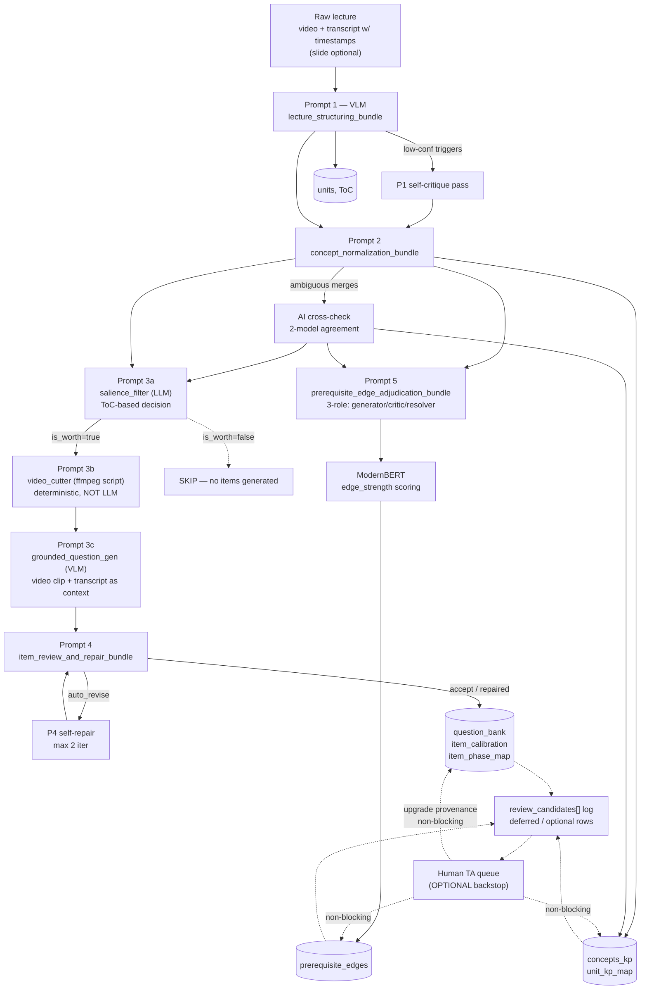

## 0. Mục đích

Tài liệu này định nghĩa **bộ 5 prompt gộp AI-first** để sinh dữ liệu đầu vào cho **Content layer** của Planner (xem [Schema & Data Model — Planner Data Surface](https://www.notion.so/Schema-Data-Model-Planner-Data-Surface-fede66a39d4948cbb000daf0861f6918?pvs=21), đặc biệt schema patch v3 ở §0.3).

Pipeline được thiết kế để **chạy end-to-end không cần human TA**. Chất lượng được đảm bảo bằng ba cơ chế:

- **VLM/LLM judgment** (mỗi prompt sinh ra verdict + confidence + rationale).
- **Rule-based validation** (cosine threshold, schema constraint, transitive prune).
- **Model-consensus repair** (self-critique, cross-check 2-model, 3-role adjudication, self-repair loop).

<aside>
🤖

**Nguyên tắc AI-first**

1. **Human review = optional backstop, KHÔNG block pipeline.** Mội row LLM sinh ra phải có `review_status` ∈ {`not_required`, `auto_accepted`, `deferred`, `optional`}; chỉ hard-fail rule (§10.2) mới block ingest.
2. **Ambiguity/low-confidence → escalate sang AI consensus** (generator → critic → resolver), không sang human.
3. **Item fail QA → self-repair loop tối đa 2 vòng**, chỉ reject khi sửa vẫn fail.
4. Output **JSON strict** theo schema v3 — không prose ngoài JSON.
5. Ưu tiên **enum + rationale** hơn float tự do (vd `coverage_level` + `coverage_confidence` thay vì `coverage_weight` float — mapping bảng bên ngoài LLM).
6. Mỗi row luôn kèm `source_ref` (unit_id + timestamp + evidence_span) và `provenance` chi tiết (`llm_single_pass` / `llm_self_critique` / `llm_cross_check` / `llm_consensus` / `llm_self_repaired` / `vlm_estimate` / ...).
7. LLM **không** chấm `edge_strength` numeric — ModernBERT làm.
8. Phase enum shared taxonomy: `placement` / `mini_quiz` / `skip_verification` / `bridge_check` / `final_quiz` / `transfer` / `review`.
9. **Catalog immutability** (xem §3.6): `global_kp_id` stable qua mọi run; existing global KPs là immutable trong P2 append mode; tag registry frozen; evolution chỉ qua P2 `append_incremental` hoặc migration pass thủ công có bump `kp_version`.
</aside>

---

## 1. Overview — pipeline 5 bundle (AI-first)



Dấu gạch đứt = optional / non-blocking. Pipeline vẫn ingest vào DB dù không có human.

### 1.1. Thứ tự chạy

1. **Raw lecture**: video + transcript có timestamp (slide/note **optional**).
2. **Prompt 1** — `lecture_structuring_bundle` (VLM, per lecture). Auto trigger self-critique subpass nếu output có `*_confidence = low` cho KP `structural_role=gateway`.
3. **Prompt 2** — `concept_normalization_bundle` (cross-lecture). Với mỗi `match_confidence = low` row → AI cross-check 2-model.
4. **Prompt 3 (3 sub-stages)** — per lecture → per salient unit:
    - **P3a salience filter** (LLM, cheap model): đọc ToC + `section_flags` + `unit_kp_map` + catalog → `learning_salience[]` (per-unit verdict `is_worth_learning` + `target_kp_ids` + `question_intent` + `expected_item_count`). Self-critique subpass nếu `salience_confidence=low`.
    - **P3b video segment cutter** (deterministic ffmpeg script, **KHÔNG PHẢI LLM**): cho mỗi unit pass salience, cắt clip từ `content_ref.video_url` với buffer 3s hai đầu; upload object storage; ghi `video_clip_ref` vào unit.
    - **P3c grounded question gen** (VLM, multimodal): đọc video clip + transcript slice + concept metadata + `salience.question_intent` → sinh `question_bank[]` với `source_ref.video_clip_ref` + `multimodal_signals_used[]`.
5. **Prompt 4** — `item_review_and_repair_bundle` (per item batch). Self-repair loop tối đa 2 vòng.
6. **Prompt 5** — `prerequisite_edge_adjudication_bundle` (cross-course, 3-role adjudication).
7. **ModernBERT** chấm `edge_strength` + `bidirectional_score`.
8. **Ingest vào DB**. Row low-confidence → ghi `review_status = deferred/optional` + log sang `review_candidates[]`.
9. **(Optional)** TA pick-up từ queue → upgrade `provenance = human_ta_verified`.

### 1.2. Mapping prompt → schema

| **Prompt** | **Schema tables ghi** | **Default provenance** | **Scope** |
| --- | --- | --- | --- |
| P1 `lecture_structuring` | `units`, `concepts_kp` (local draft), `unit_kp_map` (local draft) | `vlm_estimate` / `llm_single_pass` (bản cơ sở)  • `llm_self_critique` (sau subpass) | Per lecture |
| P2 `concept_normalization` | `concepts_kp` (global), `unit_kp_map` (globalized), candidate `prerequisite_edges` | `llm_single_pass`  • `llm_cross_check` sau AI agreement pass | Cross-course |
| P3a `salience_filter` | Intermediate artifact `learning_salience[]` (log cho audit, không lưu DB row cố định) | `llm_single_pass`  • `llm_self_critique` | Per lecture (batch units) |
| P3b `video_cutter` | `units.video_clip_ref` (patch); clip files upload object storage | `rule_based` (ffmpeg deterministic, không LLM) | Per salient unit |
| P3c `grounded_question_gen` | `question_bank` (w/ extended `source_ref.video_clip_ref`  • `multimodal_signals_used`), `item_kp_map` | `vlm_grounded` (new v3.1)  • fallback `llm_single_pass` | Per salient unit |
| P4 `item_review_and_repair` | `question_bank.qa_gate_passed`, `question_bank.repair_history`, `item_calibration` (bootstrap), `item_phase_map` | `llm_single_pass`  • `llm_self_repaired` sau repair loop | Per item batch |
| P5 `prerequisite_edge_adjudication` | candidate `prerequisite_edges`  • `adjudication_trace` | `llm_cross_check` (agree)  • `llm_consensus` (resolver)  • `llm_direction_repaired` (flip)  • `llm_auto_pruned` (transitive) | Cross-course |
| Post-P5 ModernBERT | `prerequisite_edges.edge_strength`, `bidirectional_score` | `modernbert_pred` | All surviving edges |

### 1.3. Convention naming file

```
01_lecture_structuring_bundle.md
02_concept_normalization_bundle.md
03_question_bank_bundle.md
04_item_review_and_repair_bundle.md
05_prerequisite_edge_adjudication_bundle.md
```

---

## 2. Prompt 1 — `lecture_structuring_bundle` (multimodal VLM)

### 2.1. I/O spec

| **Input** | **Output (JSON)** |
| --- | --- |
| `course_id`, `lecture_id`, **`video_url`** (primary signal), **`transcript_with_timestamps`** (primary signal), `slides` (optional: images hoặc OCR text), `lecture_metadata` | `lecture_title`, `table_of_contents[]`, `units[]`, `concepts_kp_local[]`, `unit_kp_map_local[]`, `section_flags[]`, `self_critique_trace` (nếu triệu hồi) |

<aside>
🎥

**Multimodal strategy**: model được đưa **video + transcript có timestamp** làm 2 nguồn trọng yếu ngang nhau. Model dùng:

- **Video frames** → nhận diện slide boundary, công thức trên bảng, sơ đồ, demo vs theory segment, body language nhấn mạnh.
- **Transcript timestamp** → section alignment, quote evidence, content_ref `start_s` / `end_s` chính xác.
- **Slide OCR/image** (nếu có) → sản phẩm đối chiếu chứ không bắt buộc.

Nếu slide mâu thuẫn video/transcript → **ưu tiên video+transcript** (slide có thể outdated).

</aside>

### 2.2. Schema fields phải sinh

- **`units[]`**: `unit_id` (local), `course_id`, `name`, `description`, **`summary`** (3–6 câu recap grounded — primary retrieval context cho QA bot), **`key_points[]`** (atomic retrieval targets: formula/definition/claim/example/diagnostic_tip + timestamp_s), `content_ref` {video_url, start_s, end_s}, `difficulty` + `difficulty_source` ∈ {`vlm_estimate`, `llm_single_pass`} + `difficulty_confidence`, `duration_min`, `ordering_index`, `is_template=false`.
- **`concepts_kp_local[]`**: `local_kp_id`, `name`, `description`, `track_tags[]`, `domain_tags[]`, `career_path_tags[]`, `difficulty_level` + `difficulty_source`, `difficulty_confidence`, `importance_level`, `structural_role`, `importance_confidence`, `importance_rationale`, `importance_scope`, `importance_source` ∈ {`vlm_estimate`, `llm_single_pass`}.
- **`unit_kp_map_local[]`**: `unit_id`, `local_kp_id`, `planner_role`, `instruction_role`, `coverage_level`, `coverage_confidence`, `coverage_rationale` (phải cite transcript hoặc mô tả visual cue).
- **`section_flags[]`**: `unit_id`, `importance_flag`, `review_worthiness`, `item_generation_worthiness`, `formula_heavy` (bool), `demo_heavy` (bool), `rationale`.
- **`self_critique_trace`**: rỗng nếu không triệu hồi; có cấu trúc nếu có (xem §2.4).

### 2.3. Full prompt text (base pass)

```
SYSTEM:
You are a multimodal curriculum-structuring agent (VLM). You read ONE
lecture from video frames + a timestamped transcript (and optionally slide
images/OCR) and produce structured JSON.

PRIMARY signals: video + transcript. SECONDARY: slides.
If slides contradict transcript, prefer transcript and log it in rationale.

You MUST output valid JSON only, no prose, no markdown fences. All enum
values are case-sensitive. When uncertain, pick the LOWER confidence tier.

Visual cues to watch for:
  - slide transitions → likely section boundary
  - formula-heavy whiteboard/slide → set section_flags.formula_heavy=true
  - live demo, code, terminal → set section_flags.demo_heavy=true
  - instructor emphasis (repetition, slow pace, highlighted text) → bump
    importance_confidence or importance_level

INPUT:
- course_id: <course_id>
- lecture_id: <lecture_id>
- video_url: <video_url>                    // PRIMARY
- transcript_with_timestamps: <transcript>  // PRIMARY, format: [ts_s] text
- slides: <slides_or_null>                  // OPTIONAL: list of {page_idx, image_url, ocr_text}
- lecture_metadata: <metadata_json>

TASK:
Produce:

{
  "lecture_title": string,
  "table_of_contents": [
    { "section_index": int, "title": string, "start_s": int, "end_s": int }
  ],
  "units": [
    {
      "unit_id": "local::<lecture_id>::seg{N}",
      "course_id": "<course_id>",
      "name": string,
      "description": string,
      "summary": string,                      // full important information faithful recap; cite >=2 transcript timestamps [ts=NNNs]
      "key_points": [
        {
          "text": string,
          "timestamp_s": int,
          "evidence_type": "formula" | "definition" | "claim" | "example" | "diagnostic_tip"
        }
      ],
      "content_ref": { "video_url": string, "start_s": int, "end_s": int },
      "difficulty": float,
      "difficulty_source": "vlm_estimate" | "llm_single_pass",
      "difficulty_confidence": "high" | "medium" | "low",
      "duration_min": int,
      "ordering_index": int,
      "is_template": false
    }
  ],
  "concepts_kp_local": [
    {
      "local_kp_id": "local::<lecture_id>::kp{N}",
      "name": string,
      "description": string,
      "track_tags": [string],
      "domain_tags": [string],
      "career_path_tags": [string],
      "difficulty_level": float,
      "difficulty_source": "vlm_estimate" | "llm_single_pass",
      "difficulty_confidence": "high" | "medium" | "low",
      "importance_level": "critical" | "high" | "medium" | "low",
      "structural_role": "gateway" | "supporting" | "optional" | "capstone",
      "importance_confidence": "high" | "medium" | "low",
      "importance_rationale": string,
      "importance_scope": "lecture_local" | "course_global" | "curriculum_global",
      "importance_source": "vlm_estimate" | "llm_single_pass",
      "visual_evidence": string      // 1 sentence citing a frame timestamp if applicable, else ""
    }
  ],
  "unit_kp_map_local": [
    {
      "unit_id": string,
      "local_kp_id": string,
      "planner_role": "main" | "prereq" | "support",
      "instruction_role": "intro" | "main" | "review" | "application" | "support",
      "coverage_level": "dominant" | "substantial" | "partial" | "mention",
      "coverage_confidence": "high" | "medium" | "low",
      "coverage_rationale": string   // cite transcript timestamp OR visual cue
    }
  ],
  "section_flags": [
    {
      "unit_id": string,
      "importance_flag": "high" | "medium" | "low",
      "review_worthiness": "high" | "medium" | "low",
      "item_generation_worthiness": "high" | "medium" | "low",
      "formula_heavy": bool,
      "demo_heavy": bool,
      "rationale": string
    }
  ],
  "self_critique_trace": null
}

RULES:
1. One unit = one coherent pedagogical segment (typically 5-20 min).
2. Every KP in a unit MUST appear in unit_kp_map_local for that unit.
3. At least one KP per unit MUST have planner_role="main".
4. structural_role="gateway" reserved for KPs that unlock many downstream
   topics. Use sparingly.
5. importance_scope="curriculum_global" requires explicit cross-course
   relevance.
6. coverage_rationale MUST cite transcript timestamp like [ts=1240s] OR a
   visual cue description. NO hallucinated content.
7. If visual signal disagrees with transcript, note both and prefer transcript.
8. units[].summary: full important information faithful recap of what the segment teaches
   (key concepts, derivations shown, demos, examples, common-error warnings).
   MUST cite at least 2 transcript timestamps inline in the form [ts=NNNs].
   Do NOT fabricate — recap only what was actually said or shown. This is
   the primary retrieval context for the downstream Q&A bot, so be
   information-dense (no filler like "in this segment we will see...").
9. units[].key_points: atomic retrieval targets — formulas on the board,
   stated definitions, core claims, worked-example snapshots, common-error
   diagnostic tips. Each MUST have timestamp_s within content_ref range.
   evidence_type classifies the point. Target 3-8 per unit; empty array
   only if unit is pure admin/recap (will be P3a-skipped anyway).
10. Output JSON only.
```

### 2.4. Self-critique subpass (auto-triggered)

Trigger condition: bất kỳ KP nào có:

- `structural_role = "gateway"` AND `importance_confidence = "low"`, HOẶC
- `structural_role = "capstone"` AND `importance_confidence = "low"`, HOẶC
- `coverage_level = "dominant"` AND `coverage_confidence = "low"`.

Khi trigger, system gọi prompt thứ hai với nguyên context + output P1 base, yêu cầu LLM tự phản biện:

```
SYSTEM:
You are a self-critique agent. Review the structured output from the base
pass against the original video+transcript. For each flagged row
(listed in flagged_rows), decide:
  - KEEP verdict → provenance becomes "llm_self_critique" and confidence
    stays the same
  - UPGRADE verdict (with clearer evidence) → provenance="llm_self_critique",
    confidence bumped one tier up
  - DOWNGRADE verdict (evidence weaker than thought) → stay confidence=low
    but mark review_status="deferred"

Output JSON:
{
  "self_critique_trace": {
    "flagged_rows": [
      {
        "row_type": "concepts_kp_local" | "unit_kp_map_local",
        "row_id": string,
        "verdict": "keep" | "upgrade" | "downgrade",
        "updated_fields": { ... },     // only fields that changed
        "critique_rationale": string
      }
    ]
  }
}
```

System merge `updated_fields` vào output P1 gốc; set `provenance=llm_self_critique` cho row được sửa.

### 2.5. Post-processing (system-side, không phải LLM)

- Map `coverage_level × coverage_confidence → coverage_weight` bằng bảng mapping.
- Map `importance_level × importance_confidence → importance` float.
- Gán `unit_id` production (thay `local::...`).
- Set `review_status` default: `not_required` nếu mọi confidence ≥ `medium`; `deferred` nếu còn `low` sau self-critique; `optional` nếu KP `structural_role=gateway` + confidence `medium`.

---

## 3. Prompt 2 — `concept_normalization_bundle` (với AI cross-check)

### 3.1. I/O spec

| **Input** | **Output (JSON)** |
| --- | --- |
| Tập hợp `concepts_kp_local`  • `unit_kp_map_local` từ nhiều lecture/course (P1 outputs) | `concepts_kp_global[]`, `local_to_global_map[]`, `unit_kp_map_global[]`, `candidate_prerequisite_edges[]`, `consensus_trace[]` |

### 3.2. Mục tiêu

- **Merge/dedup KP** xuyên lecture (conservative default).
- **AI cross-check pass 2-model** cho mọi `match_confidence = low` row: model A giữ merge decision, model B làm critic "why these should NOT be merged". Nếu agree → `provenance = llm_cross_check`; disagree → fallback **giữ tách** (safe default) + `provenance = llm_consensus_split` + `review_status = optional`.
- **Candidate prerequisite edges** sinh ở pass này (rà lại ở P5).

### 3.3. Full prompt text (base pass)

```
SYSTEM:
You are a knowledge-graph normalization agent. You read KP drafts from many
lectures and produce a globally deduplicated catalog plus candidate
prerequisite edges. You MUST output valid JSON only.

Merge conservatively. When in doubt, KEEP separate and lower match_confidence.
Low-confidence merges will be re-checked by a separate critic pass.

INPUT:
- local_concepts_kp: <all_local_kps>
- local_unit_kp_map: <all_local_map>
- course_registry: <course_metadata>

TASK:
Produce:

{
  "concepts_kp_global": [
    {
      "global_kp_id": "kp_{snake_case_name}",
      "name": string,
      "description": string,
      "track_tags": [string],
      "domain_tags": [string],
      "career_path_tags": [string],
      "difficulty_level": float,
      "difficulty_source": "llm_single_pass",
      "difficulty_confidence": "high"|"medium"|"low",
      "importance_level": "critical"|"high"|"medium"|"low",
      "structural_role": "gateway"|"supporting"|"optional"|"capstone",
      "importance_confidence": "high"|"medium"|"low",
      "importance_rationale": string,
      "importance_scope": "lecture_local"|"course_global"|"curriculum_global",
      "importance_source": "llm_single_pass",
      "source_course_ids": [string],
      "merged_from_local_ids": [string]
    }
  ],
  "local_to_global_map": [
    { "local_kp_id": string, "global_kp_id": string,
      "match_confidence": "high"|"medium"|"low", "match_rationale": string }
  ],
  "unit_kp_map_global": [ ... same shape as local but with global kp_id ... ],
  "candidate_prerequisite_edges": [
    {
      "source_kp_id": string,
      "target_kp_id": string,
      "edge_scope": "intra_course"|"inter_course",
      "candidate_confidence": "high"|"medium"|"low",
      "candidate_rationale": string,
      "co_occurrence_evidence": [
        { "unit_id": string, "source_role": string, "target_role": string }
      ]
    }
  ]
}

RULES:
1. If two KPs have overlapping but not identical descriptions, prefer
   keeping them separate unless names strongly align.
2. When merging, if locals disagree on importance_level or structural_role,
   take the majority and DOWNGRADE importance_confidence by one tier.
3. track/domain/career_path tags are UNIONED across locals.
4. Candidate edges only when A is conceptually REQUIRED for B.
   Co-occurrence alone is insufficient.
5. Do not assign numeric edge_strength — ModernBERT's job.
6. Every local_kp_id MUST appear in local_to_global_map.
7. Output JSON only.
```

### 3.4. AI cross-check subpass

Lọc mọi row `match_confidence = low` từ `local_to_global_map`. Gọi critic prompt:

```
SYSTEM:
You are a conservative critic. For each candidate merge (local_kp -> global_kp)
with match_confidence=low, argue the STRONGEST case for KEEPING THEM SEPARATE.
After arguing, give your final verdict.

Input: list of {local_kp: {name, description}, global_kp: {name, description}, original_rationale}.

Output JSON:
{
  "cross_check_results": [
    {
      "local_kp_id": string,
      "proposed_global_kp_id": string,
      "counter_argument": string,      // why they might not be the same
      "final_verdict": "keep_merged" | "split" | "unsure",
      "verdict_confidence": "high"|"medium"|"low"
    }
  ]
}
```

Resolution rule (system-side):

- Bản gốc `merge` + critic `keep_merged` → accept, `provenance = llm_cross_check`, bump `match_confidence` lên `medium`.
- Bản gốc `merge` + critic `split` → **SPLIT** (safe default), tạo 2 KP riêng, `review_status = optional`, log sang `consensus_trace`.
- Bất kỳ `unsure` → fallback split + `review_status = optional`.
- `consensus_trace[]` ghi toàn bộ decision trên cho audit.

### 3.5. KP `importance_level=critical` + `importance_confidence=low`

Nếu sau cross-check vẫn còn row này → `review_status = optional`, không block. Planner sẽ derate unlock_gain 0.8x cho các KP này.

### 3.6. Incremental / append-only mode (khi thêm course mới vào catalog đã có)

P2 có 2 mode chạy. **Lần chạy đầu tiên** cho batch khởi đầu (vd demo CS224+CS231) dùng `batch_initial`. **Mọi lần chạy sau** khi thêm course mới dùng `append_incremental` để KP catalog + edge catalog evolve được mà không phá vỡ FK từ các batch trước.

#### 3.6.1. Mode flag

`course_registry.p2_mode ∈ {"batch_initial", "append_incremental"}`.

- `batch_initial`: input là toàn bộ local KP từ mọi course của batch khởi đầu. Output là global catalog seed. Chạy đúng **1 lần** trong đời dự án (hoặc 1 lần khi muốn re-seed toàn bộ trong maintenance window).
- `append_incremental`: input là local KP của course MỚI + snapshot `concepts_kp_global` hiện tại (immutable). LLM CHỈ được (a) merge local KP mới vào global hiện có, hoặc (b) tạo global KP mới. KHÔNG được rename, delete, split, hay re-merge existing global.

#### 3.6.2. Immutability rules (bắt buộc trong append mode)

| **Thuộc tính existing global KP** | **Rule** |
| --- | --- |
| `global_kp_id` | **Immutable**. Content-based, deterministic: `kp_{snake_case_name}`. Không bao giờ rename. |
| `name`, `description` | **Immutable**. Muốn update → bump `kp_version` và chạy migration pass thủ công (§3.6.5). |
| `merged_from_local_ids` | **Append-only**. Local ID mới có thể thêm; local ID cũ không bị xoá. |
| `source_course_ids` | **Append-only**. |
| `track_tags` / `domain_tags` / `career_path_tags` | **Union-only**. Thêm tag mới từ registry OK; không xoá tag cũ. |
| `importance_level`, `structural_role` | **Immutable**. Re-eval thủ công khi bump `kp_version`. |

#### 3.6.3. Input/output delta cho append mode

```
INPUT (append_incremental):
- new_local_concepts_kp:   <local KPs của course mới>
- new_local_unit_kp_map:   <unit_kp_map của course mới>
- existing_global_catalog: <snapshot concepts_kp_global đang trong DB>
- existing_edge_catalog:   <snapshot candidate_prerequisite_edges đang trong DB>
- tag_registry:            <allowed_tags frozen, xem §3.6.4>

OUTPUT (append_incremental):
- new_global_kps[]:                    // KP mới phát sinh từ course mới
- new_local_to_global_map[]:           // chỉ local ID của course mới
- attached_to_existing_map[]:          // local mới attach vào global cũ (append-only vào merged_from_local_ids)
- new_unit_kp_map_global[]:            // chỉ unit của course mới
- new_candidate_edges[]:               // intra-course mới + inter-course giữa course mới và existing globals
- retrospective_split_candidates[]:    // LOG ONLY — LLM thấy existing global có dấu hiệu cần split; KHÔNG auto-apply
- retrospective_merge_candidates[]:    // LOG ONLY — tương tự cho merge
```

#### 3.6.4. Tag registry (freeze TRƯỚC lần chạy P2 `batch_initial` đầu tiên)

Registry thống nhất để tránh tag explosion khi add course mới:

```json
{
  "allowed_track_tags": ["nlp", "cv", "rl", "theory", "systems"],
  "allowed_domain_tags": ["language_models", "image_classification", "object_detection", "optimization"],
  "allowed_career_path_tags": ["research", "ml_engineer", "data_scientist"],
  "frozen_at": "2026-04-21",
  "version": "v1.0"
}
```

- Prompt P1 + P2 đều bind vào registry: LLM chỉ gán tag trong `allowed_*_tags`.
- Tag ngoài registry → escape sang field `proposed_tags[]` riêng, log vào `review_candidates[]` với `trigger_reason="tag_out_of_registry"`. KHÔNG vào `track_tags`/`domain_tags`/`career_path_tags` chính thức cho đến khi được accept vào registry.
- Registry chỉ bump version bằng PR có chủ đích, không auto-evolve theo batch.
- **Initial seed path**: chạy `batch_initial` với `allowed_*_tags=[]` → LLM free-gán → người làm review nhanh → promote tags thành registry `v1.0` → từ batch kế đi dùng registry.

#### 3.6.5. Retrospective split/merge (deferred, không auto-apply)

Khi append mode thấy dấu hiệu existing catalog cần tái cấu trúc (vd `kp_attention` đang gộp cả self-attention và cross-attention nhưng course CV mới làm rõ nên tách) → LLM log vào `retrospective_split_candidates[]` với rationale, KHÔNG auto-apply.

Lý do: auto-apply split/merge sẽ phá FK của `unit_kp_map_global`, `item_kp_map`, `prerequisite_edges` đã ingest từ batch trước.

Cách xử lý:

- **Demo / small scale**: bỏ qua candidate; giữ catalog như cũ.
- **Production khi cần thực sự apply**: chạy migration pass thủ công trong maintenance window — bump `kp_version`, build FK rewrite plan, verify, apply atomic trong 1 transaction, log vào `catalog_migrations[]`.

#### 3.6.6. Prompt delta — append_incremental mode

Prompt giống §3.3 nhưng thay INPUT + thêm constraint cứng vào RULES:

```
INPUT (thay vì §3.3 INPUT):
- new_local_concepts_kp:   <new_local_kps>
- new_local_unit_kp_map:   <new_local_map>
- existing_global_catalog: <existing_globals>       // immutable
- existing_edge_catalog:   <existing_edges>         // immutable
- tag_registry:            <frozen_tag_registry>
- course_registry:         <course_metadata>

RULES (thêm vào §3.3 RULES):
8.  APPEND-ONLY: DO NOT modify any entry in existing_global_catalog. You
    may only (a) attach a new local_kp to an existing global (append
    merged_from_local_ids), or (b) create a new global kp for concepts
    not in the catalog.
9.  global_kp_id for new globals: kp_{snake_case_name}. MUST NOT collide
    with any id in existing_global_catalog.
10. All tags MUST come from tag_registry.allowed_*_tags. Propose new tags
    in proposed_tags[]; do NOT add them to track_tags / domain_tags /
    career_path_tags directly.
11. If you believe an existing global SHOULD be split or two existing
    globals SHOULD merge after seeing the new course, LOG into
    retrospective_split_candidates[] / retrospective_merge_candidates[]
    with rationale + affected_global_kp_ids. DO NOT modify the existing
    globals.
12. Output JSON only.
```

#### 3.6.7. Post-processing diff check (system-side safety net)

Sau khi P2 `append_incremental` trả về, chạy diff deterministic giữa `existing_global_catalog` input và `concepts_kp_global` sau merge:

- Bất kỳ immutable field của existing global bị thay đổi → **hard-fail run**, rollback về snapshot, báo prompt drift.
- `global_kp_id` mới collide với existing → hard-fail.
- Tag ngoài registry xuất hiện trong `track_tags`/`domain_tags`/`career_path_tags` của existing (thay vì `proposed_tags[]`) → hard-fail.

Diff check là lưới an toàn cho trường hợp prompt drift — không dựa vào LLM tự tuân thủ rule.

---

## 4. Prompt 3 — `question_bank_bundle` (3 sub-stages AI-first)

### 4.0. Rationale — tại sao tách 3 sub-stage

Thay vì single-pass "cho transcript → sinh câu hỏi", P3 được tách thành 3 sub-stage để **giảm cost + tăng groundedness + minimize human touch**:

- **P3a salience filter (LLM cheap)**: đọc ToC + `section_flags` + concept metadata → quyết định đoạn nào **đáng học** (KP quan trọng, nội dung dense) vs. **filler** (admin, Q&A thuần, tangent, recap dài). Chỉ đoạn pass salience mới đi tiếp → cost gate.
- **P3b video segment cutter (script deterministic, KHÔNG LLM)**: ffmpeg cắt video clip theo timestamp + buffer 3s, upload object storage, ghi `video_clip_ref`.
- **P3c grounded question gen (VLM)**: đọc video clip + transcript slice + concept + `salience.question_intent` → sinh item có evidence grounded **cả transcript + video frame**.

Ưu điểm AI-first:

1. Salience judgment = LLM reasoning, không human decide "đoạn này đáng học".
2. Cắt video = deterministic script → rẻ + reproducible + không hallucination.
3. Item có visual context (slide, formula board, demo) → giảm hallucination + distractor bám lỗi thật người học hay mắc.
4. Salience gate loại ~30–40% unit trivial → tiết kiệm cost P3c VLM (đắt hơn LLM text-only ~5x).
5. `evidence_span` substring-match transcript deterministic → hallucination detection KHÔNG cần LLM judge + KHÔNG cần human.

### 4.1. P3a — Salience filter (LLM)

#### 4.1.1. I/O spec

| **Input** | **Output (JSON)** |
| --- | --- |
| `table_of_contents[]`, `units[]`, `section_flags[]`, `unit_kp_map_local[]` (P1)  • `concepts_kp_global[]` (P2) | `learning_salience[]` — per-unit verdict (intermediate artifact, không lưu DB cố định) |

#### 4.1.2. Schema output

```
{
  "learning_salience": [
    {
      "unit_id": string,
      "is_worth_learning": bool,
      "salience_score": "high" | "medium" | "low" | "skip",
      "rationale": string,
      "target_kp_ids": [string],
      "question_intent": "conceptual" | "procedural" | "diagnostic" | "application",
      "content_type": "core_theory" | "worked_example" | "application_case" | "motivation" | "historical_context" | "anecdote" | "administrative" | "recap",
      "content_type_confidence": "high" | "medium" | "low",
      "override_critical_kp": bool,    // true khi content_type ∈ SKIP set nhưng buộc KEEP do có KP critical+gateway
      "expected_item_count": int,      // 0 if skip, 1 low, 2-3 medium, 4-6 high
      "salience_confidence": "high" | "medium" | "low",
      "provenance": "llm_single_pass"  // or llm_self_critique after subpass
    }
  ]
}
```

#### 4.1.3. Rubric

Đoạn **pass salience** khi ít nhất 1 điều kiện:

- Chứa KP `importance_level ∈ {critical, high}` hoặc `structural_role ∈ {gateway, capstone}`
- `coverage_level ∈ {dominant, substantial}` cho ít nhất 1 KP với `planner_role=main`
- `section_flags.item_generation_worthiness ∈ {high, medium}`
- `section_flags.formula_heavy=true` hoặc `demo_heavy=true`

Đoạn **skip** khi:

- Pure admin / logistics (course intro, syllabus walkthrough, exam logistics)
- Q&A thuần không gắn concept mới
- Recap dài của lecture trước (không có nội dung mới)
- `section_flags.item_generation_worthiness=low` + không có KP important
- **`content_type ∉ course_config.included_content_types`** → auto-skip (xem §0.4.5 schema). Default exclude `historical_context`, `anecdote`, `administrative`, `recap` — các đoạn "biết cho vui" không sinh question.

**Content-type taxonomy** (LLM gán cho mỗi unit):

| **Type** | **Default** | **Mô tả** |
| --- | --- | --- |
| `core_theory` | KEEP | Định nghĩa, định lý, dẫn xuất công thức, khái niệm nền |
| `worked_example` | KEEP | Bài giải mẫu, step-by-step demo, live coding |
| `application_case` | KEEP | Case study thực tế, ứng dụng vào dataset/sản phẩm |
| `motivation` | KEEP | Setup vấn đề, intuition trước khi vào formalism (thường chứa gateway KP) |
| `historical_context` | **SKIP** | "Ai phát minh", timeline nghiên cứu, bối cảnh — biết cho vui, không gen câu hỏi kiến thức/áp dụng |
| `anecdote` | **SKIP** | Kể chuyện, joke, side story giảng viên |
| `administrative` | **SKIP** | Syllabus, deadline, exam logistics |
| `recap` | **SKIP** | Ôn lại lecture trước không có nội dung mới |

**Safety override**: nếu `content_type ∈ SKIP set` NHƯNG unit chứa KP với `importance_level="critical"` AND `structural_role="gateway"` → force KEEP, set `override_critical_kp=true`, rationale prefix `"override_critical_kp: <reason>"`. Tránh phân loại sai bỏ sót nội dung trọng yếu.

**Course override**: course thuộc track history/philosophy có thể set `course_config.included_content_types = ["core_theory", "historical_context", "application_case", "motivation"]` — khi đó lịch sử ≡ core. Default config (ML/CS/engineering) **không** include `historical_context`.

Mapping `salience_score → expected_item_count`:

- `high` → 4–6
- `medium` → 2–3
- `low` → 1
- `skip` → 0

#### 4.1.4. Full prompt text

```
SYSTEM:
You are a salience-filter agent. For each unit in the lecture ToC, decide
whether it is worth generating assessment items for. Be STRICT: skip filler,
admin, pure Q&A, long recaps. Keep conceptual / derivational / demo-heavy
content.

INPUT:
- units: <units_from_P1>
- table_of_contents: <toc>
- section_flags: <section_flags>
- unit_kp_map: <unit_kp_map_local>
- kp_catalog: <concepts_kp_global>
- course_config: {
    "included_content_types": [string]   // e.g. ["core_theory","worked_example","application_case","motivation"]
  }

TASK: produce learning_salience[] as specified.

RULES:
1. salience_score="skip" when unit is admin / Q&A / long recap with no
   new conceptual content, OR when content_type NOT IN
   course_config.included_content_types.
1a. content_type classification — assign ONE of:
    core_theory, worked_example, application_case, motivation  (KEEP path)
    historical_context, anecdote, administrative, recap        (SKIP path)
    Rules of thumb:
      - biographical narration ("Rosenblatt invented the perceptron in
        1958...") → historical_context
      - instructor tells a personal/industry anecdote → anecdote
      - slide walks through formula derivation → core_theory
      - live demo / solved problem → worked_example
      - real dataset / product use case → application_case
      - opens with "why do we care about X" before formalism → motivation
1b. SAFETY OVERRIDE: if content_type is SKIP but unit has ANY KP with
    importance_level="critical" AND structural_role="gateway" → force
    KEEP, set override_critical_kp=true, prefix rationale with
    "override_critical_kp: ...". This prevents misclassification from
    dropping gateway content.
1c. question_intent MUST be one of {conceptual, procedural, diagnostic,
    application}. No "historical" / "trivia" / "memorization" intent is
    allowed — if nothing in the unit supports the 4 allowed intents, set
    salience_score="skip" instead.
2. salience_score="low" when unit has supporting/optional KP only or
   coverage_level="partial"/"mention" for all KPs. expected_item_count <= 1.
3. salience_score="medium" when at least 1 KP with coverage="substantial"
   or structural_role="supporting"+importance="medium". count 2-3.
4. salience_score="high" when dominant coverage of gateway/capstone KP
   or importance="critical"/"high". count 4-6.
5. question_intent="diagnostic" if unit teaches a common-error-prone concept
   (e.g., sign errors, off-by-one, chain rule mistakes).
6. Cite at least one concrete signal in rationale (e.g. "dominant coverage
   of gateway KP kp_gradient_descent" or "formula_heavy derivation segment").
7. If uncertain → salience_score one tier LOWER + salience_confidence="low"
   (self-critique subpass will handle).
8. Output JSON only.
```

#### 4.1.5. Self-critique subpass (auto-triggered)

Trigger khi `salience_confidence=low` cho bất kỳ row có `salience_score ∈ {high, medium}` (không trigger cho `skip` vì sai cũng OK — chỉ bỏ qua).

Pattern giống §2.4 P1: LLM đọc lại rationale + signals, verdict `keep` / `upgrade` / `downgrade`. Merge updates vào base output; set `provenance="llm_self_critique"`.

### 4.2. P3b — Video segment cutter (deterministic script)

**KHÔNG PHẢI LLM.** Đây là Python + ffmpeg worker chạy sau P3a.

#### 4.2.1. Pseudo-code

```
BUFFER_S = 3                      # 3-second buffer each side (avoid mid-sentence cut)
STORAGE_BUCKET = "ingestion-clips"

for unit in units:
    salience = learning_salience[unit.unit_id]
    if not salience.is_worth_learning:
        continue                  # skip — no clip needed

    start_ms = max(0, unit.content_ref.start_s - BUFFER_S) * 1000
    end_ms   = (unit.content_ref.end_s + BUFFER_S) * 1000

    clip_path = f"clips/{unit.course_id}/{unit.lecture_id}/{unit.unit_id}.mp4"

    # ffmpeg stream copy — no re-encode, preserves quality, <5s per clip
    ffmpeg_cmd = [
        "ffmpeg", "-ss", f"{start_ms/1000}",
        "-i", unit.content_ref.video_url,
        "-to", f"{end_ms/1000}",
        "-c", "copy", "-y", local_tmp_path,
    ]
    run(ffmpeg_cmd)
    clip_url = upload(local_tmp_path, STORAGE_BUCKET, clip_path)

    unit.video_clip_ref = {
        "clip_url": clip_url,
        "start_ms": start_ms,
        "end_ms": end_ms,
        "buffer_s": BUFFER_S,
    }
```

#### 4.2.2. Constants committed

- `BUFFER_S = 3` (3-giây hai đầu — tránh cut giữa câu)
- Codec: `-c copy` (stream copy, không re-encode) → < 5s per clip, lossless
- Storage path: `clips/<course_id>/<lecture_id>/<unit_id>.mp4`
- Storage backend: Supabase Storage (prototype) / S3-compat (production)

#### 4.2.3. Metadata ghi vào `units.video_clip_ref`

Field mới `units.video_clip_ref` theo schema patch v3.1 §0.4 — xem [Schema & Data Model — Planner Data Surface](https://www.notion.so/Schema-Data-Model-Planner-Data-Surface-fede66a39d4948cbb000daf0861f6918?pvs=21).

### 4.3. P3c — Grounded question generation (VLM)

#### 4.3.1. I/O spec

| **Input** | **Output (JSON)** |
| --- | --- |
| `unit` (có `video_clip_ref`)  • `unit_kp_map_rows`  • `kp_catalog`  • `transcript_slice`  • `salience.question_intent`  • `salience.expected_item_count`  • `target_difficulty_range` | `question_bank[]` (w/ extended `source_ref`)  • `item_kp_map[]` |

#### 4.3.2. Schema fields phải sinh

Per item giống single-pass cũ **cộng thêm** 2 subfield trong `source_ref`:

- `source_ref.video_clip_ref`: `{ clip_url, start_ms, end_ms, frame_evidence }`
- `source_ref.multimodal_signals_used`: array `["transcript", "video_frame", "slide"]`

`provenance="vlm_grounded"` (new value v3.1, xem schema §0.4) — default confidence +1 tier so với `llm_single_pass` vì có visual evidence.

`frame_evidence` **BẮT BUỘC** khi `question_intent ∈ {procedural, diagnostic}`; optional cho `conceptual`/`application`.

Per `item_kp_map`: giống cũ.

#### 4.3.3. Full prompt text

```
SYSTEM:
You are a multimodal question-generation agent (VLM). You have BOTH:
- a video clip of the salient segment (primary visual signal)
- the aligned transcript slice (primary text signal)
- optionally slides

Use the VIDEO to ground questions in what the instructor actually did on
screen: formulas on the board, specific demo inputs, diagrams, live coding.
Cite the frame timestamp (MM:SS within clip) when relevant.

INPUT:
- unit: <unit_json>
- video_clip_url: <clip_url>              // PRIMARY
- transcript_slice: <transcript>          // PRIMARY
- unit_kp_map_rows: <rows>
- kp_catalog: <kps>
- question_intent: "conceptual" | "procedural" | "diagnostic" | "application"
- target_item_count: <int>
- target_difficulty_range: [<b_min>, <b_max>]

TASK: produce question_bank[] (with extended source_ref) and item_kp_map[].

RULES:
1. Every item MUST have primary_kp_id from unit_kp_map_rows[planner_role="main"].
2. source_ref.evidence_span MUST be substring-matchable to transcript_slice
   (deterministic post-check will reject hallucinations).
3. source_ref.multimodal_signals_used MUST include at least "transcript".
4. If question_intent in {procedural, diagnostic}: source_ref.video_clip_ref
   .frame_evidence REQUIRED with MM:SS timestamp + brief visual description.
5. If section_flags.demo_heavy=true: at least 1 item MUST reference a
   specific visual cue from the clip.

6. DISTRACTOR CONTENT — each distractor MUST encode a plausible
   misconception the video content would actually trigger (e.g. sign
   error from the board derivation, off-by-one from the demo, confusing
   two adjacent KPs, applying a related-but-wrong formula). Banned:
   (a) Distractors that are trivially / nonsensically wrong (straw-man).
   (b) Distractors that are just the correct answer with one word swapped
       to its antonym (gives the correct answer away by pairing).
   (c) Distractors that could themselves be defensibly correct under a
       reasonable reading of the stem (ambiguous key).
   (d) Two distractors that are paraphrases of each other (students
       eliminate the pair — reveals correct).

7. DISTRACTOR SURFACE PARITY — correct answer and distractors MUST be
   indistinguishable by surface features. If any of these cues leak,
   test-wise students score above chance without understanding:
   (a) LENGTH — token count of the correct option must be within ±25% of
       the median distractor length. No option may be <50% or >200% of
       any other option. Do NOT let the correct answer be the longest
       "most complete / most qualified" option.
   (b) SPECIFICITY — if correct contains a number, named entity, or
       qualifier, at least 2 distractors MUST contain a matching-category
       specific (a wrong number, a wrong name, a wrong qualifier). Never
       pair a specific correct answer with vague distractors like "it
       depends" or "varies".
   (c) HEDGING — same modal register across all options. If correct uses
       "usually / often / may / tends to", distractors MUST also hedge.
       If correct is categorical ("is / always / never"), distractors
       are categorical. Do NOT let the correct answer be the only hedged
       option (hedged phrasing is a classic tell for correctness).
   (d) GRAMMATICAL AGREEMENT — every option MUST parse naturally with the
       stem (singular/plural, tense, a/an, prepositions). No option may
       be the only one that reads grammatically.
   (e) TECHNICAL REGISTER — if the correct option uses the KP's jargon
       correctly, at least 1 distractor MUST misuse the same jargon and
       at least 1 MUST use a near-synonym wrong term. Do NOT let the
       correct answer be the only "technical-sounding" option sitting
       next to layman-phrased distractors.
   (f) SYMMETRY — all options share the same structural form (all noun
       phrases, or all full sentences, or all equations). Do NOT mix
       forms (e.g. one full sentence option among fragment options).

8. FORBIDDEN PATTERNS:
   - NO "all of the above" / "none of the above" / "both A and B" options.
   - The correct answer MUST NOT be the only option echoing stem vocabulary
     verbatim — repeated stem words across exactly one option is a giveaway.
   - NO double negatives in the stem or in options.
   - NO option that is a strict superset/subset of another option
     (test-wise students eliminate by containment).
   - Vary the correct answer's position across the batch. Aim for roughly
     uniform distribution over option positions; never always A, never
     always last.
   - NO absolute qualifiers ("always / never / every / only") in
     distractors unless the correct answer also uses them — absolutes are
     a tell for wrong answers.

9. STEM DISCIPLINE — the stem alone (without options) must be
   answerable by a student who knows the KP. If the stem is only
   answerable by elimination among the 4 options, REWRITE the stem to
   be self-contained. No "Which of the following..." when the question
   can be phrased directly.

10. difficulty_prior within target_difficulty_range.
11. Do NOT set qa_gate_passed / cosines / difficulty_b / discrimination_a /
    repair_history — P4 handles those.
12. provenance="vlm_grounded", review_status="not_required".
13. Output JSON only.
```

### 4.4. Hard-fail gate post-P3c (deterministic, pre-P4)

Trước khi hand off sang P4, chạy rule-based validator (**KHÔNG LLM, KHÔNG HUMAN**):

| **Check** | **Action** |
| --- | --- |
| `multimodal_signals_used` empty hoặc không chứa `"transcript"` | **Hard-fail** (reject item, log `review_candidates[]`) |
| `evidence_span` không substring-match transcript_slice (case-insensitive, whitespace-normalized) | **Hard-fail** (hallucination — deterministic detection, không cần LLM judge) |
| `question_intent ∈ {procedural, diagnostic}` AND `frame_evidence` rỗng | → P4 với `recommended_action=auto_revise` (fixable, không reject ngay) |
| `primary_kp_id` không trong `unit_kp_map_rows[planner_role="main"]` | **Hard-fail** (contract violation) |

Hard-fail tại §4.4 KHÔNG đi qua self-repair P4 — reject ngay vì là vi phạm hợp đồng cấu trúc chứ không phải content sửa được. Log sang `review_candidates[]` với `trigger_reason="p3c_contract_violation"` (TA có thể audit nhưng KHÔNG block pipeline; cái này phục vụ prompt tuning tương lai chứ không fix per-item).

---

## 5. Prompt 4 — `item_review_and_repair_bundle` (judge + self-repair)

### 5.1. I/O spec

| **Input** | **Output (JSON)** |
| --- | --- |
| `question_bank[]`  • `item_kp_map[]` từ P3, KP descriptions, `max_repair_iter=2` | `qa_outputs[]`, `repaired_question_bank[]`, `repair_actions[]`, `item_calibration_bootstrap[]`, `item_phase_map[]` |

### 5.2. Mục tiêu

Một pass review + auto-repair cho items:

- **QA gate judgment**: alignment, distractor, rubric, evidence grounding.
- **Self-repair loop**: item fail nhưng fixable → model tự sửa (tối đa 2 iter). Chỉ reject khi sửa 2 vòng vẫn fail.
- **Calibration bootstrap**: priors cho `item_calibration`.
- **Phase map**: `item_phase_map` rows với suitability.

### 5.3. Self-repair policy

| **Judge verdict** | **Action** | **Final provenance** |
| --- | --- | --- |
| `accept` | Ingest item as-is | `llm_single_pass` |
| `auto_revise` (iter 1) | Gọi repair sub-pass với `revise_hints` → tạo version mới → judge lại | `llm_self_repaired` (iter=1) nếu pass |
| `auto_revise` (iter 2) | Repair lần 2 với critique mới | `llm_self_repaired` (iter=2) nếu pass |
| `auto_revise` (iter 3+) | **Reject** — đưa vào hard-fail list | N/A (không ingest) |
| `reject` | Reject ngay, không sửa | N/A |

**Không có `human_review` trong critical path.** Nếu judge quá do dự → fallback `accept` với `review_status = optional` (TA có thể check sau, non-blocking).

### 5.4. Full prompt text — judge pass

```
SYSTEM:
You are an item-review agent. For each item, judge 4 criteria, set
calibration priors, and map to phases. If an item fails but is fixable,
mark it auto_revise — a separate repair pass will try to fix it.

QA criteria (qualitative; numeric cosines computed separately):
  - alignment: stem unambiguously assesses primary_kp_id?
  - distractor: distractors plausible, not too obvious or too similar?
  - rubric: for free_response, rubric unambiguous? (n_a for MCQ)
  - evidence: source_ref.evidence_span actually supports the item?

INPUT:
- items: <question_bank_json>
- item_kp_map: <item_kp_map_json>
- kp_descriptions: <relevant_concepts_kp_json>

TASK: produce qa_outputs[], item_calibration_bootstrap[], item_phase_map[].

{
  "qa_outputs": [
    {
      "item_id": string,
      "qa_gate_passed": bool,
      "alignment_verdict": "pass"|"borderline"|"fail",
      "distractor_verdict": "pass"|"borderline"|"fail",
      "rubric_verdict": "pass"|"borderline"|"fail"|"n_a",
      "evidence_verdict": "pass"|"borderline"|"fail",
      "qa_rationale": string,
      "recommended_action": "accept" | "auto_revise" | "reject",
      "repairable": bool,                  // true if auto_revise could reasonably fix it
      "revise_hints": [string]             // actionable fixes if repairable
    }
  ],
  "item_calibration_bootstrap": [
    { ... same as before, is_calibrated=false, calibration_method="prior_only" ... }
  ],
  "item_phase_map": [
    { ... same as before ... }
  ]
}

RULES:
1. qa_gate_passed=true requires all 4 verdicts "pass" (rubric can be "n_a").
2. recommended_action="accept" REQUIRES qa_gate_passed=true.
3. recommended_action="auto_revise" requires repairable=true AND at least one
   actionable hint in revise_hints.
4. recommended_action="reject" for fundamentally broken items (e.g., wrong
   KP, no valid answer key, evidence span hallucinated).
5. DO NOT emit "human_review" — the pipeline uses auto-repair, not human.
6. Use canonical phase_multiplier: placement=1.0, mini_quiz=0.8,
   skip_verification=1.0, bridge_check=1.0, final_quiz=1.2, transfer=1.1,
   review=0.7.
7. Output JSON only.
```

### 5.5. Full prompt text — repair pass (gated bởi ***\\\\\\\*`recommended_action="auto_revise"`****)

```
SYSTEM:
You are an item-repair agent. Given an item flagged auto_revise with
specific revise_hints, produce a CORRECTED version of the item that
addresses each hint. The corrected item will be re-judged.

Constraints:
  - Keep primary_kp_id the SAME.
  - Keep source_ref.unit_id the SAME (evidence span can be refined).
  - item_type can change only if absolutely necessary.
  - Do NOT invent content not in the transcript segment.

INPUT:
- original_item: <question_bank_item>
- qa_output: <qa_output_for_this_item>      // contains revise_hints
- kp_description: <primary_kp.description>
- transcript_segment: <transcript_slice>
- iteration: <int>                           // 1 or 2

TASK:

{
  "repaired_item": { ... full question_bank item shape ... },
  "repair_actions": [
    {
      "field": string,                   // e.g. "content.stem", "distractors[2].text"
      "change_type": "rewrite" | "add" | "remove" | "adjust",
      "rationale": string,               // references which revise_hint
      "addressed_hint_index": int
    }
  ],
  "repair_confidence": "high" | "medium" | "low"
}

RULES:
1. Every hint in revise_hints MUST be addressed by at least one repair_action
   (or explicitly marked unaddressable in rationale).
2. If a hint cannot be addressed without violating constraints, emit
   repair_confidence="low" and explain.
3. Output JSON only.
```

### 5.6. Orchestration (system-side)

```
for item in items:
    iter = 0
    while iter < MAX_REPAIR_ITER (=2):
        qa_output = judge(item)
        if qa_output.recommended_action == "accept":
            ingest(item, provenance = "llm_self_repaired" if iter > 0 else "llm_single_pass",
                   repair_history = accumulated_history)
            break
        elif qa_output.recommended_action == "auto_revise":
            if iter == MAX_REPAIR_ITER - 1:
                # last attempt was also auto_revise → give up
                mark_hard_fail(item)
                break
            repair_output = repair(item, qa_output, iter=iter+1)
            accumulated_history.append({iter: iter+1, ...})
            item = repair_output.repaired_item
            iter += 1
        elif qa_output.recommended_action == "reject":
            mark_hard_fail(item)
            break
```

---

## 6. Prompt 5 — `prerequisite_edge_adjudication_bundle` (3-role consensus)

### 6.1. I/O spec

| **Input** | **Output (JSON)** |
| --- | --- |
| `concepts_kp_global[]`, `candidate_prerequisite_edges[]` từ P2, `unit_kp_map_global[]`, course ordering | `clean_candidate_edges[]`, `pruned_edges[]`, `adjudication_trace[]` |

### 6.2. Mục tiêu (AI-first, không human)

- **3-role adjudication** cho mỗi candidate edge có `candidate_confidence` ≤ `medium`:
    - **Generator**: quyết định keep/prune + lý do (giống P5 v1).
    - **Critic**: phản biện quyết định của generator — đặc biệt tìm edge sai chiều (B đáng lẽ là prereq của A).
    - **Resolver**: đọc 2 vị đi ở trên, giải mâu thuẫn + đưa verdict cuối.
- **Transitive pruning** (rule-based, không cần LLM): nếu A→X→B đã keep thì A→B bị prune tự động.
- **Direction repair**: nếu critic/resolver nhất trí "wrong_direction" → flip cặp (B→A) thay vì prune, `provenance = llm_direction_repaired`.
- **ModernBERT** chấm `edge_strength` + `bidirectional_score` ở bước sau.

### 6.3. Full prompt text — 3-role trong 1 call (efficient)

Với candidate có `candidate_confidence = high` → skip adjudication, dùng single pass với `provenance = llm_single_pass`. Chỉ `medium`/`low` đi vào adjudication.

```
SYSTEM:
You are a multi-role prerequisite-edge adjudicator. For each candidate edge,
you will reason through 3 explicit roles in sequence:

  ROLE A (Generator): decide KEEP vs PRUNE vs FLIP based on conceptual
    dependency. Give a clear rationale.
  ROLE B (Critic): adversarial review. Look for: (a) transitive redundancy,
    (b) wrong direction (target is actually prereq of source), (c) weak
    co-occurrence masquerading as dependency, (d) same-concept that should
    have been merged upstream.
  ROLE C (Resolver): given A and B, produce the FINAL verdict. Break ties
    conservatively: if A says KEEP but B says PRUNE with a compelling reason,
    lean toward PRUNE. If direction is ambiguous, prefer FLIP if critic has
    a semantic argument.

You do NOT assign numeric edge_strength. ModernBERT scores final strength.

INPUT:
- global_kps: <concepts_kp_global>
- candidate_edges: <edges_needing_adjudication>       // candidate_confidence <= medium
- course_ordering: <course_ordering>
- unit_kp_map_global: <unit_kp_map_global>

TASK:

{
  "clean_candidate_edges": [
    {
      "source_kp_id": string,
      "target_kp_id": string,
      "edge_scope": "intra_course" | "inter_course",
      "provenance": "llm_cross_check" | "llm_consensus" | "llm_direction_repaired",
      "keep_confidence": "high" | "medium" | "low",
      "keep_rationale": string,
      "expected_directionality": "strong" | "moderate" | "ambiguous",
      "review_status": "not_required" | "optional" | "deferred",
      "ready_for_modernbert": true
    }
  ],
  "pruned_edges": [
    {
      "source_kp_id": string,
      "target_kp_id": string,
      "prune_reason": "transitive_redundant"|"wrong_direction"|"weak_cooccurrence"|"same_concept"|"out_of_scope",
      "prune_rationale": string,
      "provenance": "llm_consensus" | "llm_auto_pruned"
    }
  ],
  "adjudication_trace": [
    {
      "source_kp_id": string,
      "target_kp_id": string,
      "generator_verdict": "keep"|"prune"|"flip",
      "generator_rationale": string,
      "critic_verdict": "agree_keep"|"agree_prune"|"suggest_flip"|"suggest_prune"|"suggest_keep",
      "critic_rationale": string,
      "resolver_verdict": "keep"|"prune"|"flip",
      "resolver_rationale": string,
      "consensus_type": "llm_cross_check"|"llm_consensus"|"llm_direction_repaired"
    }
  ]
}

RULES:
1. consensus_type = "llm_cross_check" when generator and critic AGREE.
2. consensus_type = "llm_consensus" when they disagree and resolver picks one.
3. consensus_type = "llm_direction_repaired" when resolver picks FLIP.
4. resolver_verdict = "prune" with reason="same_concept" → also add
   keep_confidence=low on the kept side if needed.
5. Every input candidate_edge MUST appear in exactly one of
   clean_candidate_edges or pruned_edges.
6. NEVER output numeric edge_strength. ModernBERT handles that.
7. Output JSON only.
```

### 6.4. Post-processing (system-side)

- **Transitive prune pass** (after adjudication, before ModernBERT): BFS trên `clean_candidate_edges`; nếu A→X→B với cả hai edges đã keep, move A→B sang `pruned_edges` với `provenance=llm_auto_pruned`, `prune_reason=transitive_redundant`.
- **ModernBERT scoring** cho mọi edge trong `clean_candidate_edges`:
    - `edge_strength ≥ 0.5` AND `bidirectional_score ≤ 0.3` → `pruned=false`, ingest.
    - `edge_strength ∈ [0.3, 0.5)` → `pruned=false`, `review_status=optional` (ingest nhưng Planner derate 0.8x).
    - `edge_strength < 0.3` AND `keep_confidence=low` → hard-fail (§10.2 schema), reject.
    - `edge_strength < 0.3` AND `keep_confidence ≥ medium` → `pruned=false`, `review_status=deferred`.

### 6.5. Re-run policy khi thêm course mới vào catalog đã có

Khi thêm course C3 vào catalog đã có sau `batch_initial` (C1+C2), mỗi pipeline stage xử lý khác nhau:

| **Stage** | **Chạy lại trên** | **Mode** | **Đụng data cũ?** |
| --- | --- | --- | --- |
| P1 (per lecture) | Chỉ lecture của course mới | Standalone | Không |
| P2 concept normalization | Full pass | `append_incremental` (§3.6) | Không (immutable existing globals) |
| P3a salience | Chỉ unit của course mới | Standalone, `kp_catalog` = catalog mới sau P2 | Không |
| P3b video cutter | Chỉ unit mới pass salience | Deterministic | Không |
| P3c grounded gen | Chỉ unit mới | Standalone | Không |
| P4 review + repair | Chỉ item mới | Standalone | Không |
| P5 3-role adjudication | Chỉ candidate edge mới | Input = `new_candidate_edges` từ P2 append | Không (existing edges giữ verdict + provenance cũ) |
| Transitive prune BFS (§6.4) | **Full re-run** trên union edge set | Deterministic | **Có thể** — edge cũ có thể bị prune thêm (§6.5.2) |
| ModernBERT edge scoring | Chỉ edge mới | Pairwise, stable | Không |
| Cosine batch (§7.2) | Chỉ item/kp/unit mới | Embedding stable | Không |
| Item calibration (IRT) | Full re-fit khi đủ response data | Theo lịch riêng | Có — update `difficulty_b`, `discrimination_a` |

#### 6.5.1. Snapshot discipline

Trước mỗi lần chạy `append_incremental`:

1. Export snapshot `concepts_kp_global.jsonl` + `prerequisite_edges.jsonl` với `snapshot_id = snap_<YYYYMMDD_HHMMSS>`.
2. Ghi `snapshot_id` + `p2_mode` vào run metadata (§11) để trace.
3. Sau khi chạy xong, chạy **immutability diff check** (§3.6.7) giữa snapshot trước và `concepts_kp_global` sau run. Nếu phát hiện modify → rollback về snapshot, debug prompt.
4. Giữ ≥ 5 snapshot gần nhất để rollback nhanh.

#### 6.5.2. Transitive prune churn handling

Sau khi thêm course mới, transitive prune BFS chạy lại trên union edge set có thể ra kết quả khác với một số edge cũ:

- Edge A→B **mới bị prune** (vì có path A→X→B qua KP X của course mới) → move từ `prerequisite_edges` sang `pruned_edges`, ghi `prune_reason=transitive_redundant`, `pruned_in_run=<run_id>`.
- Edge A→B **mới được un-prune**: KHÔNG được xảy ra trong append-only mode (vì không delete KP từ existing catalog). Nếu xảy ra → flag prompt drift.
- Tất cả delta ghi vào audit log `prune_delta[]`:

```json
{
  "run_id": "run_cs229_20260601_...",
  "newly_pruned": [{"source": "kp_...", "target": "kp_...", "reason": "transitive_redundant"}],
  "newly_unpruned": []
}
```

#### 6.5.3. Rollback plan

Nếu append run ra kết quả sai (prompt drift, registry inconsistency, FK violation…):

1. Restore catalog về snapshot tương ứng `snapshot_id` trước run.
2. Xoá mọi row mới insert trong run: `WHERE created_in_run = <run_id>`.
3. Điều tra root cause, sửa, re-run với snapshot cũ làm input.

Rollback an toàn vì append mode không bao giờ update existing row — mọi thay đổi đều là insert mới, xoá insert là đủ.

---

## 7. Downstream post-pipeline

### 7.1. ModernBERT edge scoring

Như §6.4. `provenance` ghi `modernbert_pred` sau scoring, kèm `edge_strength` + `bidirectional_score`.

### 7.2. Post-processing cosine batch

Chạy sau P3/P4:

- `concept_alignment_cosine` = cosine(embed(stem), embed(primary_kp.description))
- `distractor_cosine_upper` / `_lower` = max/min cosine(embed(distractor_i), embed(correct_answer))
- `unit.topic_embedding` = ModernBERT embed `name + description`
- `concepts_kp.description_embedding` = ModernBERT embed `description`
- `courses.summary_embedding` = ModernBERT embed `summary`

Sau khi có cosines:

- `concept_alignment_cosine ≥ 0.75` → OK.
- `concept_alignment_cosine ∈ [0.5, 0.75)` → `review_status=deferred` (ingest, Planner derate).
- `concept_alignment_cosine < 0.5` → **hard-fail** (§0.3.2 schema doc).
- `distractor_cosine_upper > 0.9` hoặc `distractor_cosine_lower < 0.3` → auto-flag cho P4 repair pass nếu còn budget iter; else `review_status=optional`.

### 7.3. Final ingest decision matrix

| **Case** | **Action** | **`review_status`** |
| --- | --- | --- |
| Mọi confidence `high`, cosine OK, edge_strength OK | Ingest | `not_required` |
| Confidence `medium`, cosine OK | Ingest | `auto_accepted` |
| Confidence `low` after consensus, cosine borderline | Ingest + Planner derate | `deferred` |
| Gateway/critical KP + low confidence | Ingest + log | `optional` |
| Hard-fail rule trigger (§0.3.2 schema) | **Reject** | N/A (không vào DB) |

---

## 8. AI consensus / adjudication pattern (reusable)

### 8.1. Khi nào trigger

- `match_confidence = low` trong P2 merge → 2-model cross-check.
- `candidate_confidence ≤ medium` trong P2 edge → 3-role adjudication tại P5.
- `recommended_action = auto_revise` trong P4 → self-repair loop.
- `*_confidence = low` cho gateway/critical KP ở P1 → self-critique subpass.

### 8.2. 3-role pattern

```
ROLE A (Generator): propose verdict + rationale.
ROLE B (Critic):    adversarial review; strongest case against A.
ROLE C (Resolver):  tie-break; conservative default khi vẫn t-ambiguous.
```

**Implementation options**:

- **Single call, 3-role reasoning trace**: 1 prompt yêu cầu model reasoning qua 3 vai trò tuần tự (rẻ, cần model mạnh như Gemini 2.0 / GPT-4o).
- **3 calls 3 model (expensive)**: model A sinh, model B critique, model C resolve. Dùng khi demo cần provenance rõ ràng.
- **2 calls same model, diff temperature**: cheap compromise; tmp=0.2 cho generator, tmp=0.7 cho critic.

### 8.3. Provenance mapping

- Generator + Critic agree → `llm_cross_check`
- Disagree, Resolver picks → `llm_consensus`
- Resolver picks FLIP (for edges) → `llm_direction_repaired`
- Self-critique re-read → `llm_self_critique`
- Self-repair loop pass → `llm_self_repaired`

### 8.4. Tie-break fallback (conservative default)

- Merge ambiguous → **split** (không merge).
- Edge direction ambiguous → **prune** (safer hơn flip sai).
- QA borderline → **accept** với `review_status=optional` (chấp nhận ingest, Planner derate).

### 8.5. Cost budget

- Self-critique P1: ~30% batch cần trigger → +0.3x tokens.
- Cross-check P2: ~20% merges → +0.2x.
- **P3a salience filter** (new): LLM cheap model (Gemini Flash), ~0.1x so với P3c. Self-critique subpass ~10% rows → +0.01x.
- **P3b video cutter**: ffmpeg deterministic, **$0 LLM cost**, chỉ storage + compute (negligible).
- **P3c grounded gen** (new, replaces single-pass P3): VLM (Gemini Pro) đắt hơn text-only LLM ~5x per call, NHƯNG chỉ chạy trên ~60% unit (phần pass salience). Net effect: cost P3c < cost P3 single-pass trên 100% unit nếu salience strict đủ.
- Self-repair P4: ~30% items fail lần đầu, 80% fix được sau 1 iter → +0.3–0.5x.
- Adjudication P5: ~40% edges có confidence ≤ medium → +0.4x.

→ **Tổng overhead ~1.4–1.7x** so với single-pass naïve (giảm một chút so với v3.0 nhờ salience gate). Vẫn rẻ hơn human TA ~100x.

---

## 9. Provenance taxonomy (reference)

Xem đầy đủ ở [Schema & Data Model — Planner Data Surface](https://www.notion.so/Schema-Data-Model-Planner-Data-Surface-fede66a39d4948cbb000daf0861f6918?pvs=21). Bảng ngắn:

| **Provenance** | **Nguồn** | **Confidence level ý nghĩa** |
| --- | --- | --- |
| `llm_single_pass` | 1 call LLM | Theo LLM self-report |
| `vlm_estimate` | VLM có dùng frame video | Theo VLM self-report |
| `llm_self_critique` | LLM re-read + tự phản biện | +1 tier nếu agree |
| `llm_cross_check` | 2 model/role đồng thuận | +1 tier |
| `llm_consensus` | 3-role resolver | +1 tier |
| `llm_self_repaired` | Self-repair loop pass | Theo iter cuối cùng, có `repair_history` |
| `llm_auto_pruned` | Rule-based transitive prune | N/A (edge bị loại) |
| `llm_direction_repaired` | Edge flip sau adjudication | +1 tier |
| `modernbert_pred` | ModernBERT score | Trực tiếp từ confidence score |
| `rule_based` | Mapping deterministic | `high` |
| `human_ta_verified` | **Optional**. TA pick-up từ queue | Force `high` |

---

## 10. Human review là optional backstop

### 10.1. Thiết kế non-blocking

Pipeline mang thiết kế AI-first triệt để:

- Mọi LLM-sinh row **được ingest vào DB** miễn không trigger hard-fail rule (§10.2 / §0.3.2 schema doc).
- Row confidence thấp → ghi `review_status ∈ \{deferred, optional\}` và log sang bucket `review_candidates[]`.
- TA có thể pick-up từ queue, upgrade `provenance = human_ta_verified`, confidence → `high`. Đây là **read-write upgrade path**, không block.
- Nếu không có TA → hệ vẫn sống; Planner chỉ derate weight cho row `deferred`.

### 10.2. Hard-fail rules (chỉ trường hợp này mới block)

- `question_bank`: `qa_gate_passed=false` SAU 2 vòng self-repair.
- `question_bank`: `concept_alignment_cosine < 0.5`.
- `question_bank`: `source_ref.evidence_span` rỗng hoặc hallucinated (substring match fail).
- `question_bank`: `primary_kp_id` không trong catalog.
- `prerequisite_edges`: `edge_strength < 0.2` AND `keep_confidence=low`.
- `concepts_kp`: duplicate `global_kp_id`.

Đồng bộ với §0.3.2 trong schema doc.

### 10.3. `review_candidates[]` log schema

```json
{
  "batch_id": "run_<course>_<ts>",
  "generated_at": "2026-04-21T09:30:00Z",
  "entries": [
    {
      "table": "question_bank" | "prerequisite_edges" | "concepts_kp" | "unit_kp_map",
      "row_id": string,
      "review_status": "deferred" | "optional",
      "trigger_reason": "low_confidence_after_consensus" | "gateway_critical_low_conf" | "borderline_cosine" | "borderline_edge_strength",
      "provenance": string,
      "suggested_check": string        // 1 sentence hint for TA
    }
  ]
}
```

### 10.4. SLA

- **Demo**: không có SLA; queue để cho nhóm nghiên cứu spot-check khi có thời gian.
- **Prod tương lai**: soft budget (vd 5% batch / tuần), không bắt buộc. Nếu queue phu ì > 1000 entries → alert, không block.

---

## 11. Versioning & audit

Mỗi prompt output phải lưu metadata:

```json
{
  "prompt_version": "lecture_structuring_bundle_v3.0",
  "model": "gemini-2.0-flash" | "gpt-4o-2026-03" | ...,
  "prompt_hash": "sha256:...",
  "run_id": "run_<course_id>_<YYYYMMDD>_<HHMMSS>",
  "input_hash": "sha256:...",
  "ran_at": "ISO-8601",
  "consensus_triggered": bool,
  "self_repair_iterations": int,
  "total_tokens_input": int,
  "total_tokens_output": int,
  "total_tokens_consensus_overhead": int,
  "p2_mode": "batch_initial" | "append_incremental" | "n_a",
  "snapshot_id": "snap_<YYYYMMDD_HHMMSS>" | null,
  "tag_registry_version": "v1.0" | null
}
```

P5 outputs phải ghi thêm `adjudication_trace` ra bảng `prerequisite_edges.adjudication_trace` (JSON column, xem schema §0.3).

Version bump:

- Thêm field output mới → minor (v3.0 → v3.1).
- Đổi enum hoặc rule cốt lõi → major + re-run toàn bộ lecture batch.
- Đổi model → ghi `model` không bump prompt_version.

---

## 12. Checklist trước khi chạy production demo

- [ ]  Schema v3 đã freeze (reference: [Schema & Data Model — Planner Data Surface](https://www.notion.so/Schema-Data-Model-Planner-Data-Surface-fede66a39d4948cbb000daf0861f6918?pvs=21) §0.3).
- [ ]  VLM model endpoint (Gemini 2.0 hoặc tương đương) đã test với video input.
- [ ]  Mapping bảng `coverage_level × coverage_confidence → coverage_weight` committed.
- [ ]  Mapping bảng `importance_level × importance_confidence → importance` committed.
- [ ]  Canonical `phase_multiplier` table thống nhất (P4 dùng).
- [ ]  `MAX_REPAIR_ITER = 2` đã set cứng trong orchestrator.
- [ ]  **P3a salience rubric** committed (pass/skip thresholds + `expected_item_count` mapping).
- [ ]  **P3b video cutter**: ffmpeg script + `BUFFER_S=3` constant + storage bucket ready (Supabase Storage / S3-compat).
- [ ]  **P3c grounded gen**: VLM endpoint (Gemini 2.5 Pro hoặc tương đương) đã test với video clip input.
- [ ]  **P3c hard-fail validator** (§4.4): deterministic substring check cho `evidence_span` + `multimodal_signals_used` + `frame_evidence` required cho procedural/diagnostic intent.
- [ ]  Self-critique trigger rules committed (P1).
- [ ]  2-model cross-check logic committed (P2).
- [ ]  3-role adjudication logic committed (P5).
- [ ]  ModernBERT checkpoint ready cho `edge_strength` + `bidirectional_score`.
- [ ]  Transitive prune rule (BFS) committed.
- [ ]  Hard-fail rules (§10.2) committed trong ingest layer.
- [ ]  `review_candidates[]` bucket ready (S3 / DB table / JSON file — demo OK).
- [ ]  Token budget monitoring: overhead consensus ~1.5–1.8x so với single-pass.
- [ ]  Run_id naming (`run_<course_id>_<YYYYMMDD>_<HHMMSS>`).
- [ ]  Monitoring mỗi batch: `qa_gate_passed` ≥ 0.6 (trước repair), self-repair success rate ≥ 50%, hard-fail rate &lt; 10%. Nếu vượt → review prompt trước khi chạy tiếp.
- [ ]  Human TA queue **optional**: không block pipeline; chỉ dashboard xem.
- [ ]  **Tag registry** (`allowed_track_tags` / `allowed_domain_tags` / `allowed_career_path_tags`) committed + `frozen_at` date TRƯỚC khi chạy P2 `batch_initial` đầu tiên (§3.6.4). Demo có thể seed tags từ free-gán của batch đầu rồi freeze.
- [ ]  P2 mode flag (`course_registry.p2_mode ∈ {batch_initial, append_incremental}`) wired trong orchestrator; default `append_incremental` cho course thứ 3 trở đi (§3.6.1).
- [ ]  Snapshot export routine (`concepts_kp_global.jsonl` + `prerequisite_edges.jsonl` → `snap_<YYYYMMDD_HHMMSS>`) chạy TRƯỚC mỗi lần `append_incremental`; giữ ≥ 5 snapshot gần nhất (§6.5.1).
- [ ]  Immutability diff check (§3.6.7) chạy SAU mỗi append run — hard-fail + rollback nếu existing global bị modify.
- [ ]  `prune_delta[]` audit log ghi sau mỗi transitive prune re-run (§6.5.2); `newly_unpruned` phải rỗng trong append mode.
- [ ]  `global_kp_id` naming: content-based deterministic `kp_{snake_case_name}`; never rename after first commit.