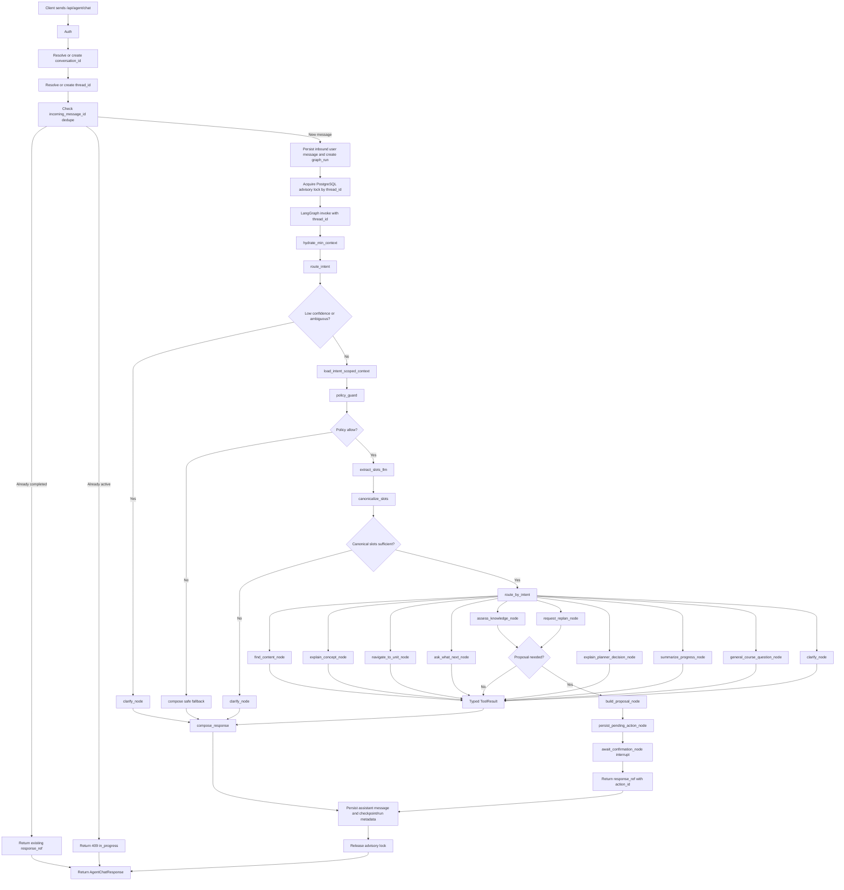
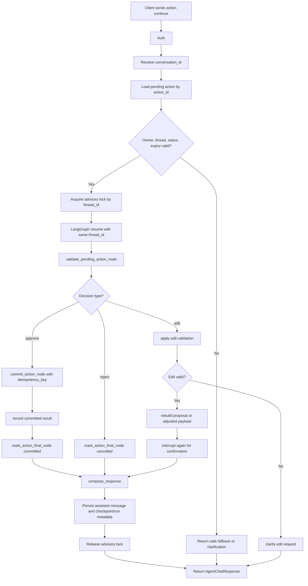
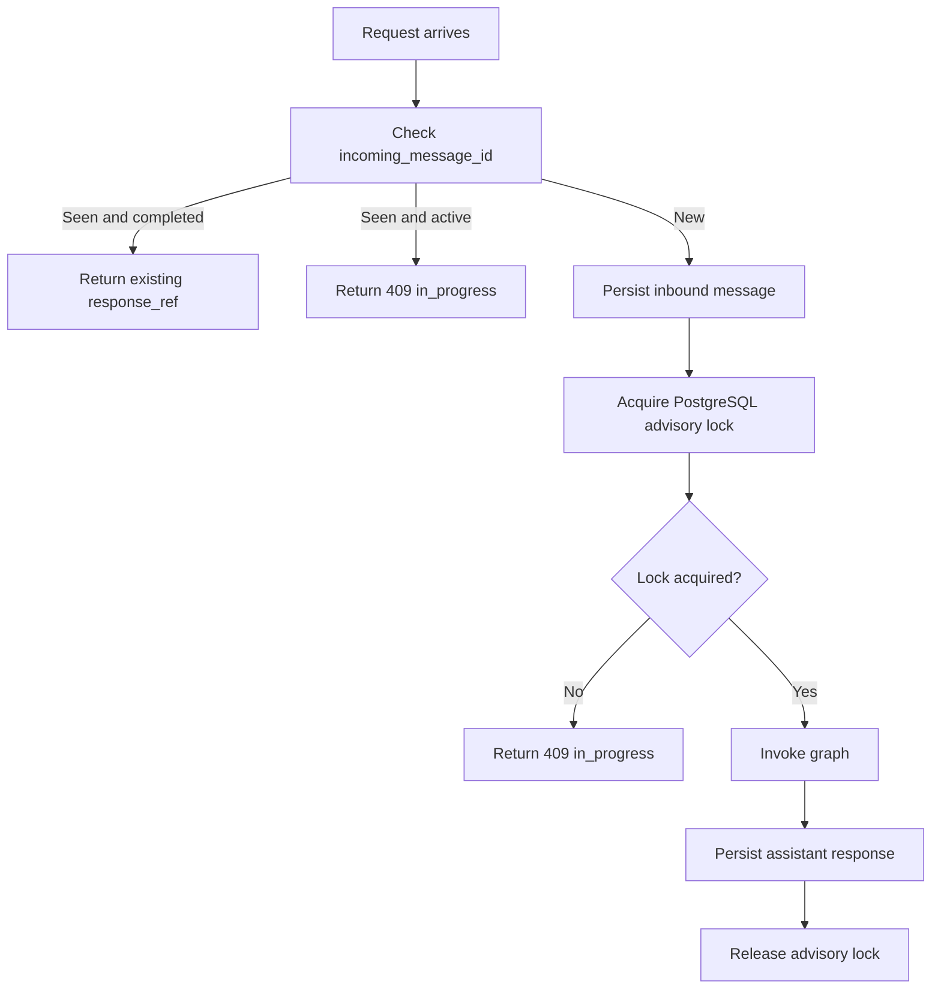

# LangGraph Path Agent Redesign

Date: 2026-05-01
Status: Design approved for implementation planning
Scope: Production redesign of the `/agent` Path Agent orchestration flow. This does not apply to the lecture-scoped AI Tutor.

## Summary

The current `/agent` backend routes chat requests through deterministic keyword checks inside `AgentChatService`. That is too brittle for production because routing, slot extraction, tool dispatch, response composition, and action proposal logic are mixed in one service. The redesigned system uses LangGraph as the primary orchestration layer for `/api/agent/chat`.

The graph must classify intent, load only intent-scoped context, enforce policy, canonicalize slots, dispatch typed tool nodes, compose grounded responses, and handle interrupt-based user confirmations for assessment and replan actions. LLM output may help classify and extract slots, but it must not mutate planner, mastery, assessment, or navigation state. All state-changing operations must be performed by backend services with ownership checks, policy checks, idempotency keys, and durable pending-action state.

## Goals

- Replace keyword-based intent routing with a LangGraph router node using structured output.
- Keep `/agent` separate from the lecture/player scoped AI Tutor.
- Keep graph checkpoint state small, durable, resumable, and versioned.
- Use typed tool nodes for content search, concept explanation, navigation, planner decisions, next-step recommendations, progress summaries, assessment proposals, and replan proposals.
- Support production-grade confirmation flow for assessment and replan actions using pending actions, interrupts, idempotency, expiry, and replay safety.
- Prevent duplicate processing from retries, double clicks, multiple tabs, and checkpoint replay.
- Enforce "no evidence, no grounded answer" in the response composer.

## Non-Goals

- Do not let LLM text directly update mastery, planner state, assessment state, or user progress.
- Do not merge Path Agent behavior into AI Tutor.
- Do not introduce external web browsing for `/agent`.
- Do not make full conversation memory or telemetry part of LangGraph checkpoint state.
- Do not replace existing deterministic services where they already provide authoritative data.

## Current Problems

The current web `/agent` request path does not use the existing `src/agent.py` tool loop. The frontend calls `/api/agent/chat`, the router calls `AgentChatService.chat`, and `AgentChatService` classifies intent with hard-coded phrase matching. The service then branches with `if intent == ...` and returns templated responses/actions.

This has several production risks:

- Intent classification is coupled to English keyword order and domain-specific phrases.
- Router behavior and tool behavior are mixed in the same service.
- Some schema intents have no explicit graph/node handler.
- Target path extraction is hard-coded to a small set of course/path keywords.
- Long-running actions are represented as UI action lists rather than durable pending confirmations.
- There is no thread/checkpoint semantics for resuming the same business flow.
- Replay, retries, concurrent requests, and stale action confirmations are not clearly safe.

## Architecture

The new architecture introduces `AgentGraphService` as the orchestration boundary for `/api/agent/chat`.

```text
POST /api/agent/chat
  -> Auth
  -> Resolve/create conversation
  -> Resolve/create thread_id
  -> Persist inbound user message
  -> Dedupe by incoming_message_id
  -> Return previous response if incoming_message_id already has response_ref
  -> Return 409 in_progress if incoming_message_id/thread_id is already active
  -> Acquire PostgreSQL advisory lock keyed by thread_id
  -> LangGraph.invoke(input, config={configurable: {thread_id}})
      -> hydrate_min_context
      -> route_intent
      -> load_intent_scoped_context
      -> policy_guard
      -> extract_slots_llm
      -> canonicalize_slots
      -> conditional intent node
      -> maybe build/persist pending action
      -> maybe interrupt for confirmation
      -> compose_response
  -> Persist assistant response from response_ref
  -> Store graph run/checkpoint metadata
  -> Release PostgreSQL advisory lock
  -> AgentChatResponse
```

`AgentChatService` should become a thin compatibility wrapper or be replaced by `AgentGraphService`. Existing deterministic services stay focused:

- `AgentContextResolver`
- `AgentUnitSearchService`
- `AgentPathRequirementService`
- `AgentNavigationService`
- `AgentUnitContextService`
- assessment workflow/action services
- planner/progress services, when wired
- conversation repository/service

### End-To-End Flow Diagram



### Resume Flow Diagram



### Dedupe And Concurrency Diagram



## Identity And Persistence Semantics

The system must keep these identifiers distinct:

| Identifier | Meaning |
| --- | --- |
| `conversation_id` | Product/business chat conversation id. |
| `thread_id` | LangGraph runtime thread id used for checkpoint resume. |
| `checkpoint_id` | Specific graph snapshot used for audit/debug/replay. |
| `graph_run_id` | One invocation attempt for a user message or resume. |
| `incoming_message_id` | Client/server idempotency key for a user message. |
| `response_ref` | Stable pointer to the composed response payload. |
| `action_id` | Durable id for a pending/committed user action. |

The database must store `thread_id` on the conversation record. Every graph response should log `graph_run_id`, `checkpoint_id`, `incoming_message_id`, and `response_ref`.

Continuations from UI buttons must send `conversationId` and `actionId`. Backend resolves the associated `thread_id`, checks ownership and pending-action status, then resumes the same graph thread.

## Checkpoint State

LangGraph checkpoint state must stay small and durable. It should not contain full response payloads, full memory windows, full traces, or large tool outputs.

```python
class AgentCheckpointState(TypedDict, total=False):
    state_version: int
    thread_id: str
    conversation_id: str
    user_id: str

    incoming_message_id: str
    route_context: RouteContext | None

    intent: AgentIntent | None
    intent_confidence: float
    slots: AgentSlots
    policy: PolicyDecision

    pending_action: PendingAction | None
    last_committed_action_id: str | None
    last_committed_action_type: str | None

    learning_context_ref: str | None
    memory_ref: str | None
    tool_result_ref: str | None
    response_ref: str | None

    trace_id: str
    checkpoint_id: str | None
```

Large data is held outside checkpoint state:

```text
AgentRuntimeEnvelope
  incoming message text
  resolved context payload
  typed tool result payload
  citations/actions
  answer/warning/fallback
  node timing/debug events
```

The graph stores references to runtime payloads only when durable replay or audit needs them.

## State Version Migration

The graph state must include `state_version`. On checkpoint load:

1. If the checkpoint version is current, load normally.
2. If the checkpoint version is older and a migrator exists, migrate in memory and persist upgraded checkpoint metadata.
3. If the checkpoint version is older and no migrator exists, fail safely: close or archive the old thread, create a new thread, and attach a migration note to the conversation.

No old checkpoint should be silently loaded into a newer graph schema. Every state version change needs a migration test.

## Graph Topology

```text
START
  -> hydrate_min_context
  -> route_intent
  -> load_intent_scoped_context
  -> policy_guard
  -> extract_slots_llm
  -> canonicalize_slots
  -> route_by_intent
      -> explain_concept_node
      -> find_content_node
      -> navigate_to_unit_node
      -> ask_what_next_node
      -> assess_knowledge_node
      -> request_replan_node
      -> explain_planner_decision_node
      -> summarize_progress_node
      -> general_course_question_node
      -> clarify_node
  -> compose_response
  -> END
```

Action-producing branches use this sub-flow:

```text
intent node
  -> build_proposal_node
  -> persist_pending_action_node
  -> await_confirmation_node

resume approve/edit/reject
  -> validate_pending_action_node
  -> commit_action_node
  -> mark_action_final_node
  -> compose_response
```

The `await_confirmation_node` must call `interrupt()` before doing any side effect in that node. Any side effect before an interrupt must be in a separate node and idempotent. `persist_pending_action_node` uses idempotent upsert by `action_id` or `idempotency_key`, so replay does not create duplicate pending actions.

## Router Contract

The router uses structured output. It may use an LLM, but the output is only a classification and extraction hint.

```python
class AgentRoute(BaseModel):
    intent: AgentIntent
    confidence: float
    extracted_slots: ExtractedSlots
    rationale: str
```

`rationale` is debug-only:

- do not return it raw to the user
- do not use it to bypass policy
- do not treat it as evidence
- do not treat it as source of truth for tool payloads

Low-confidence routing must go to `clarify_node`. The system must not silently guess an intent when confidence is below threshold or required slots are missing.

Intent routing and slot extraction must be context-aware. Raw lexical matches or keyword heuristics must not be used as the primary or fallback source of truth for user intent. Lexical features may be used only as weak signals for ranking, retrieval, or canonicalization, never to override structured intent classification.

If route confidence is low, context is insufficient, or multiple plausible intents exist, the graph must route to clarification rather than guess. The UI is English-first, but user messages may still be Vietnamese or mixed-language; router behavior must not rely on exact English-only keyword matches.

## Intent Registry

Intent enum, graph conditional edges, and node registry must stay in sync.

| Intent | Node |
| --- | --- |
| `explain_concept` | `explain_concept_node` |
| `find_content` | `find_content_node` |
| `navigate_to_unit` | `navigate_to_unit_node` |
| `ask_what_next` | `ask_what_next_node` |
| `assess_knowledge` | `assess_knowledge_node` |
| `request_replan` | `request_replan_node` |
| `explain_planner_decision` | `explain_planner_decision_node` |
| `summarize_progress` | `summarize_progress_node` |
| `general_course_question` | `general_course_question_node` |
| `clarify` | `clarify_node` |

CI must include a parity test asserting every intent has a handler and edge.

## Context And Memory Loading

The graph should not load full memory before intent routing.

`hydrate_min_context` loads only:

- authenticated user id
- selected/allowed course ids
- selected path/course scope
- route context from request, if present
- conversation/thread identity

`load_intent_scoped_context` loads only what the chosen intent needs:

| Intent | Context |
| --- | --- |
| `find_content` | catalog/search scope |
| `explain_concept` | candidate units and unit context |
| `navigate_to_unit` | candidate unit and runtime navigation context |
| `ask_what_next` | planner/progress summary |
| `assess_knowledge` | candidate units and quiz eligibility |
| `request_replan` | assessment result and planner state |
| `explain_planner_decision` | path/prerequisite graph and mastery overlay |
| `summarize_progress` | mastery, progress, stale review state |
| `general_course_question` | bounded catalog context |

Memory is split:

- Thread memory: current conversation summary/window.
- Learner profile memory: cross-thread profile, preferences, mastery, plan history.

Graph checkpoint state stores `memory_ref`, not full memory.

Checkpoint state may contain only small durable identifiers, routing state, canonicalized slots, policy decision, pending action metadata, and refs. Cross-thread learner memory must live in a profile/store layer, not in thread checkpoint state. Thread checkpoint data is for resuming one conversation thread; learner/profile data is for reuse across threads.

## New Chat And Reset Semantics

Creating a new chat/session creates a new `conversation_id` and a new `thread_id`.

Reset for the new thread:

- thread checkpoint history
- thread conversation summary/window
- pending clarification state
- local conversational state
- pending actions from the previous thread

Do not reset:

- learner profile
- preferences/profile data scoped to the user
- progress/mastery
- completed assessments
- committed planner state
- committed action audit records

Pending actions are thread-bound. If an old thread has `pending_action.status="awaiting_confirmation"` and the user opens a new chat, the new chat must not inherit or auto-confirm that pending action. To continue it, the user must return to the original conversation/thread. This is safer than carrying stale confirmations across threads.

## Slot Processing

Slot processing is two-step:

1. LLM extraction: raw topic, target path, requested action, assessment phase, references from the message.
2. Deterministic canonicalization: canonical unit ids, course ids, planner context id, assessment session id, runtime navigation ids.

Example:

```text
User: "test me on attention mechanism"
LLM extraction: topic="attention mechanism", intent="assess_knowledge"
Canonicalization: canonical_unit_ids=[...], course_ids=[...], quiz eligibility=[...]
```

Business logic must use canonicalized slots, not raw LLM extraction.

Intent confidence is not enough. Canonical entity/context resolution must also be sufficient. If the user asks "test me on attention" and the current scope has multiple plausible units such as attention, self-attention, visual attention, and attention masks, the graph must clarify which entity the user means before proposing an assessment.

Slot ambiguity must route to clarification even when intent is high confidence.

## Policy Guard

Policy runs after intent-scoped context is available and before tool execution or action proposal.

```python
class PolicyDecision(BaseModel):
    allow: bool
    codes: list[str]
    user_safe_message: str | None
    audit_context: dict | None
```

Policy must cover:

- course scope intersection
- hidden/logistics/reference content restrictions
- ownership checks for conversations, assessments, plans, and pending actions
- phase/action validity
- no external web browsing
- no LLM-based mastery/planner mutation
- trace mode restrictions for non-reviewers

If policy denies a request, the composer returns `user_safe_message` and safe fallback. `codes` and `audit_context` go to audit/trace stores.

## Typed Tool Results

Tool results must be a typed union, not a generic blob.

```python
ToolResult = (
    FindContentResult
    | ExplainConceptResult
    | NavigationResult
    | PlannerDecisionResult
    | WhatNextResult
    | AssessmentProposalResult
    | ReplanProposalResult
    | ProgressSummaryResult
    | ClarificationResult
)
```

Each result type defines:

- `kind`
- normalized payload
- citations/evidence
- allowed action proposals
- fallback reason, if any
- trace/audit refs

The response composer should branch by typed result kind and should not parse arbitrary blobs.

## Grounded Response Composer

The composer must enforce:

```text
If a result kind requires evidence and citations are empty,
do not produce confidence="grounded".
Return clarification or fallback instead.
```

Evidence-required kinds include:

- `FindContentResult`
- `ExplainConceptResult`
- `PlannerDecisionResult`
- `WhatNextResult`
- `ProgressSummaryResult`

Assessment/replan proposal results may return actions without content citations, but they still need backend validation evidence such as eligible units, assessment ownership, or planner session ownership.

The composer may summarize tool output, but it must not invent citations, actions, mastery state, or planner reasons.

## Pending Actions

Production actions are durable proposals.

```python
class PendingAction(BaseModel):
    action_id: str
    type: Literal[
        "propose_assessment",
        "start_assessment",
        "request_replan",
    ]
    status: Literal[
        "proposed",
        "awaiting_confirmation",
        "confirmed",
        "cancelled",
        "committed",
        "expired",
    ]
    payload_ref: str
    idempotency_key: str
    expires_at: datetime
```

Pending action rules:

- `action_id` is required in frontend action payloads.
- resume request must verify owner, thread, status, expiry, and payload hash/version.
- commit node must use `idempotency_key`.
- stale action confirmation must not commit.
- expired actions return safe fallback and may offer regeneration.
- janitor/cron expires stale pending actions and emits audit events.

## Interrupt And Confirmation Flow

Assessment and replan flows should use LangGraph interrupt/resume:

```text
build_proposal_node
  -> build proposal payload only

persist_pending_action_node
  -> idempotent upsert pending action

await_confirmation_node
  -> interrupt({action_id, summary, allowed_decisions})

validate_pending_action_node
  -> verify status, ownership, expiry, payload version

commit_action_node
  -> perform side effect with idempotency_key

mark_action_final_node
  -> mark committed/cancelled/expired
```

If the user says "ok", the graph should resolve "ok" against `pending_action`. If there is no active pending action or there are multiple ambiguous actions, return clarification instead of committing.

`decision="edit"` requires strict validation:

- validate the edit payload against a typed schema for that action type
- verify pending action owner, status, expiry, payload version, and payload hash
- allow only explicitly editable fields
- re-run policy and canonicalization for edited fields
- if the edit changes the proposal materially, create an updated proposal and interrupt again instead of committing directly

Edit resume must not become a bypass around ownership, policy, or eligibility checks.

## Task And Replay Boundaries

All nodes that perform side effects or non-deterministic work must have an explicit task boundary. Side effects include database writes, external API calls, assessment session creation, replan commits, pending action writes, response payload writes, and audit event writes. Non-deterministic work includes LLM calls, time-dependent generation, random selection, and any call whose output may differ on retry.

Replay rule:

```text
Any node after a checkpoint that can re-execute and has a side effect must be idempotent.
Otherwise, the side effect must be moved into commit_action_node and guarded by idempotency_key.
```

For action flows, only `commit_action_node` may perform the business side effect that changes assessment/planner state. Proposal persistence must be idempotent. `await_confirmation_node` must call `interrupt()` before any side effect in that node.

## Dedupe And Retry Safety

`incoming_message_id` is the idempotency key for user messages.

If the same `incoming_message_id` is received again for the same `conversation_id` and `thread_id`:

- if `response_ref` exists, return the exact existing response payload
- if a run is active, return HTTP `409` with machine-readable status `in_progress`
- if the previous run failed before a checkpoint-safe response, retry/resume according to failure classification
- do not persist duplicate user messages
- do not invoke a new graph run unless explicitly classified as retryable

Assistant responses are upserted by `incoming_message_id` or `graph_run_id`, not blindly inserted.

V1 does not join active runs and does not queue duplicate active requests. The client may retry after the suggested retry interval or poll the conversation.

## Transaction Boundaries

Inbound message persistence:

```text
transaction:
  create/get conversation
  create/get thread_id
  upsert inbound user message by incoming_message_id
  create graph_run record
```

Graph response persistence:

```text
compose_response_node:
  write response payload by deterministic response_ref
  return response_ref

after graph success:
  transaction:
    upsert assistant message by incoming_message_id/graph_run_id
    attach response_ref
    attach checkpoint_id
    attach graph_run_id
    mark graph_run succeeded
```

If assistant message persistence fails after graph success, retry must reuse the existing `response_ref` and upsert the missing assistant message.

`response_ref` must be stable for the same completed turn. It should be derived from either `graph_run_id` or from the tuple `(thread_id, incoming_message_id, checkpoint_id)`. A retry for the same completed turn must not create a second response payload with different wording or actions.

Commit side effects:

```text
commit_action_node:
  validate pending action
  execute side effect with idempotency_key
  record committed result
```

Replay from checkpoint must not duplicate assessments, replans, messages, or pending actions.

## Concurrency Control

There must be only one active graph run per `thread_id`.

V1 uses PostgreSQL advisory locks keyed by `thread_id`. This matches the current Postgres-backed stack and avoids introducing Redis solely for agent locking.

Concurrent requests for the same thread are rejected with HTTP `409` and machine-readable status `in_progress`. The response should include a retry hint. Later versions may add queueing or run joining, but V1 must not allow concurrent graph execution for the same thread.

## API Changes

`AgentChatRequest` should add:

```python
incoming_message_id: str
route_context: RouteContext | None
conversation_id: str | None
trace_mode: Literal["none", "summary", "full"]
```

Action continuation endpoint should accept:

```python
class AgentActionResumeRequest(BaseModel):
    conversation_id: str
    action_id: str
    decision: Literal["approve", "reject", "edit"]
    edit_payload: dict | None = None
    incoming_message_id: str
```

`AgentAction` should include:

```python
action_id: str | None
expires_at: datetime | None
status: str | None
```

The frontend must not infer commit semantics from button label or action type alone.

## Storage Additions

Add or extend tables for:

- conversation `thread_id`
- graph run records
- response payload refs
- pending actions
- action commit idempotency records
- optional trace/audit events

Suggested logical tables:

```text
agent_graph_runs
  id
  conversation_id
  thread_id
  incoming_message_id
  checkpoint_id
  response_ref
  status
  error_code
  created_at
  completed_at

agent_pending_actions
  action_id
  conversation_id
  thread_id
  user_id
  type
  status
  payload_ref
  idempotency_key
  expires_at
  committed_at
  cancelled_at

agent_response_payloads
  response_ref
  payload_json
  created_at

agent_trace_events
  trace_id
  graph_run_id
  node_name
  event_type
  event_json
  created_at
```

Trace storage can be trimmed or sampled separately from business state.

## Error Handling

- Router low confidence: clarify.
- Missing canonical slot: clarify with options.
- Policy denied: safe fallback using `PolicyDecision.user_safe_message`.
- Tool no result: no-source fallback.
- Tool failure: retryable or safe fallback depending on tool type.
- Pending action expired: mark expired and ask user to regenerate.
- Concurrent run: HTTP `409` with status `in_progress`.
- State migration failure: fail safe and start a new thread with migration note.

## Streaming And Observability

The initial production path may remain non-streaming, but the design must leave room for streaming. Useful stream events include:

- routing started/completed
- clarification required
- search/tool work started
- pending action proposal created
- safe partial answer or progress update

Streaming must not expose full graph state, raw policy audit context, raw router rationale, or debug-only traces to normal users. Debug stream modes are internal/reviewer-only.

Trace hygiene:

- trace by graph run or user turn, not by unbounded conversation
- include `conversation_id`, `thread_id`, `graph_run_id`, `incoming_message_id`, and `checkpoint_id` as metadata
- keep large state snapshots out of trace payloads
- sample or trim verbose node events separately from business state

## Evaluation Lane

In addition to unit and contract tests, the project needs an offline evaluation dataset before rollout. The dataset should include golden-path prompts and adversarial routing/context traps.

Required evaluation groups:

- lexical traps such as `skip connection` vs skip/replan actions
- `quiz eligibility` as a concept vs "make me a quiz" as assessment intent
- ambiguous entity resolution across multiple units/courses
- missing route/path context
- stale pending actions
- expired pending confirmations
- Vietnamese and mixed-language queries
- no-source retrieval cases

After deploy, online evaluation should monitor route distribution, clarification rate, no-source rate, policy denial rate, pending-action expiry rate, and duplicate/retry behavior.

## Operational Runbook

Production operations need explicit playbooks for stuck or partially completed runs:

- pending action stuck in `awaiting_confirmation`
- action committed but assistant message persistence failed
- graph run failed after `response_ref` was created
- graph run failed before safe checkpoint
- duplicate active run conflict rate spikes
- state migration failed and new thread was created
- janitor expired pending actions

Ops views or queries should expose graph runs, pending actions, response refs, last checkpoint id, error code, and action status by `conversation_id` and `thread_id`.

## Timeout And Degradation Policy

Each node type must have a timeout budget and safe degradation path.

Suggested V1 behavior:

- router and slot extraction: short timeout, clarify/fallback on failure
- unit search and navigation: short timeout, no-source fallback on failure
- planner decision and progress summary: medium timeout, safe fallback or partial context response
- assessment/replan proposal: medium timeout, no commit if proposal cannot be validated
- commit nodes: bounded timeout with idempotent retry

Requests must not hang indefinitely. Timeout fallback must not invent grounded answers or create actions without validation.

## Rollout Strategy

Ship in phases:

1. Shadow mode: run LangGraph in parallel for `/agent`, record traces/evals, keep current response path serving users.
2. Canary: serve LangGraph responses to a small internal or low-risk traffic slice.
3. Gradual rollout: increase traffic while monitoring route quality, retry conflicts, action proposals, and fallback rates.
4. Cutover: make LangGraph the primary `/agent` path.
5. Deprecation: remove or quarantine keyword-based routing after parity and regression gates pass.

## Test Requirements

Required production tests:

- Intent enum and node registry parity.
- Every intent has a conditional edge and handler.
- Low-confidence routing returns clarification.
- Router rationale never appears in user response.
- Policy denial returns safe fallback and audit codes.
- No evidence/no citation result cannot produce `confidence="grounded"`.
- Slot extraction and deterministic canonicalization are separated.
- `incoming_message_id` retry with existing `response_ref` returns the exact same response.
- Duplicate active `incoming_message_id` or active same-thread run returns HTTP `409` with status `in_progress`.
- Same `thread_id` resumes the same checkpoint thread.
- Interrupt approve/reject/edit validates the correct pending action.
- Edit-resume validates schema, payload version/hash, ownership, and editable fields.
- Expired pending action cannot commit.
- Janitor marks stale pending actions expired.
- Replay from checkpoint does not duplicate assessment, replan, assistant message, or pending action.
- Nodes with side effects after checkpoints are idempotent or move side effects into `commit_action_node`.
- Concurrent requests for one thread are rejected with HTTP `409` and status `in_progress`.
- State version migration succeeds for supported older versions.
- Unsupported old state version fails safely.
- Frontend action continuation sends `actionId`.
- Ambiguous lexical overlap: `Giải thích skip connection` routes to `explain_concept` or `general_course_question`, not `request_replan`.
- Action word inside concept phrase: `Cho tôi quiz về attention mechanism` may route to `assess_knowledge`, but `Quiz eligibility của unit này tính thế nào?` routes to `general_course_question` or `explain_concept` and must not auto-create an assessment proposal.
- Ambiguous slots: `test me on attention` with multiple plausible attention units routes to clarification.
- New chat/session creates a new thread and does not inherit pending actions from the previous thread.

## Implementation Phases

1. Data model and persistence primitives: thread ids, run logs, response refs, pending actions, idempotency records.
2. Graph state, state versioning, and checkpoint configuration.
3. Router structured output and intent registry parity tests.
4. Minimal graph with content search and grounded composer.
5. Intent-scoped context loading and slot canonicalization.
6. Assessment pending-action interrupt/resume flow.
7. Replan pending-action interrupt/resume flow.
8. Dedupe, concurrency lock, replay safety tests.
9. Frontend action id and retry/idempotency wiring.
10. Streaming-safe event contract and reviewer-only debug stream gating.
11. Offline evaluation dataset and adversarial routing suite.
12. Ops runbook, janitor, timeout/degradation policy.
13. Shadow/canary rollout.
14. Replace or deprecate keyword-based `AgentChatService` path.

## Acceptance Criteria

- `/api/agent/chat` runs through LangGraph for production `/agent` requests.
- No keyword table is used as the primary intent router.
- Every intent has a registered graph node and CI parity coverage.
- Graph checkpoint state is reference-based and versioned.
- Conversation id, thread id, checkpoint id, graph run id, incoming message id, response ref, and action id are persisted and distinct.
- User retries do not duplicate messages or graph side effects.
- Duplicate active requests return HTTP `409` with status `in_progress`.
- Assessment and replan confirmations use pending actions plus interrupt/resume semantics.
- Expired pending actions cannot commit.
- Concurrent active runs on one thread cannot corrupt state.
- Composer never returns grounded answers without evidence where evidence is required.
- Lexical keyword traps do not override context-aware intent and slot classification.
- New chats do not inherit thread-local pending actions or clarifications.
- AI Tutor behavior remains separate and unchanged.
