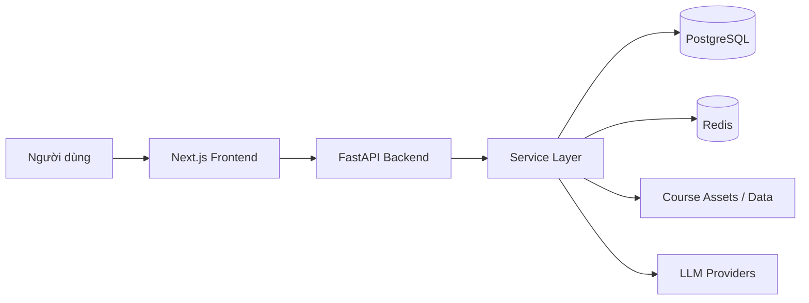
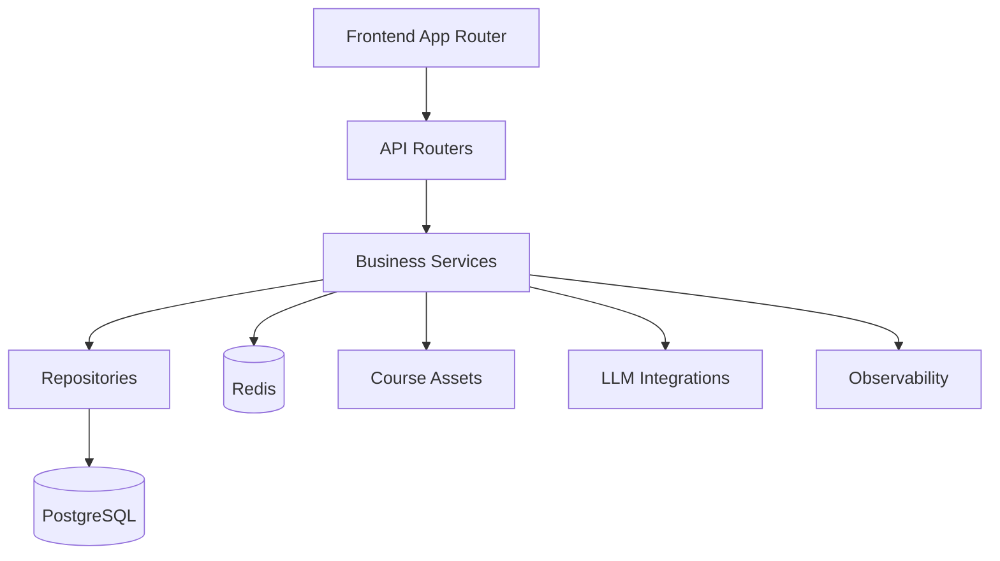
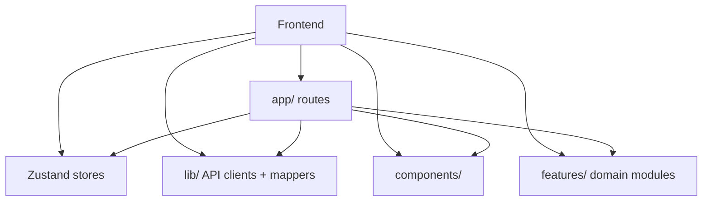
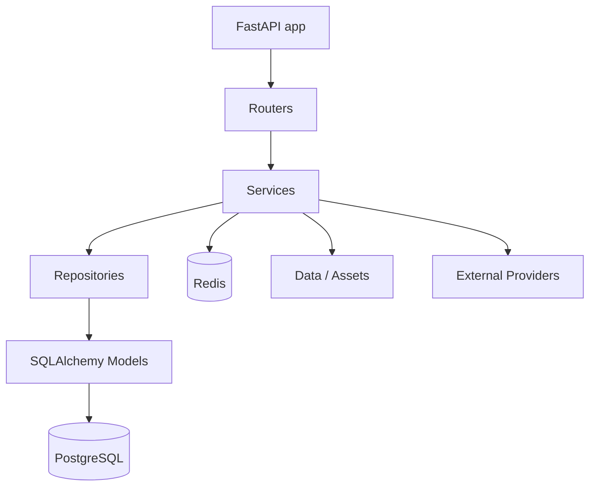
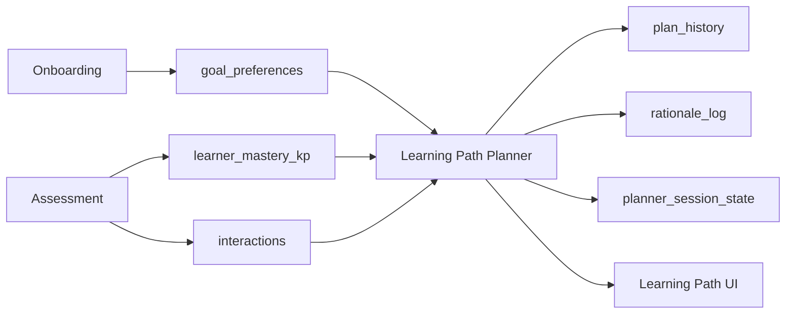
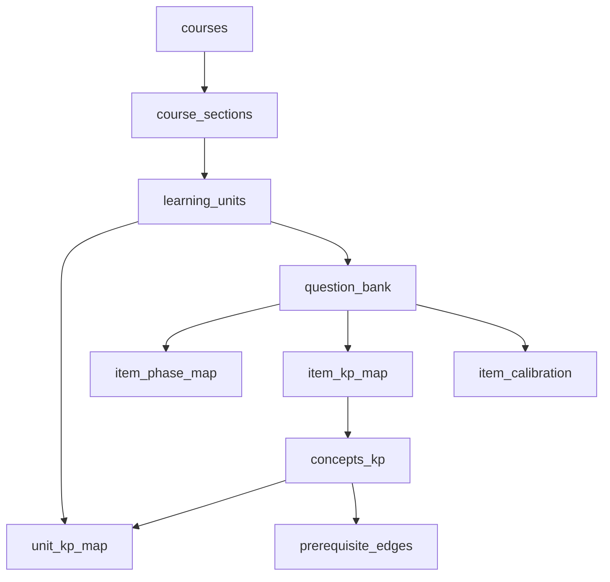
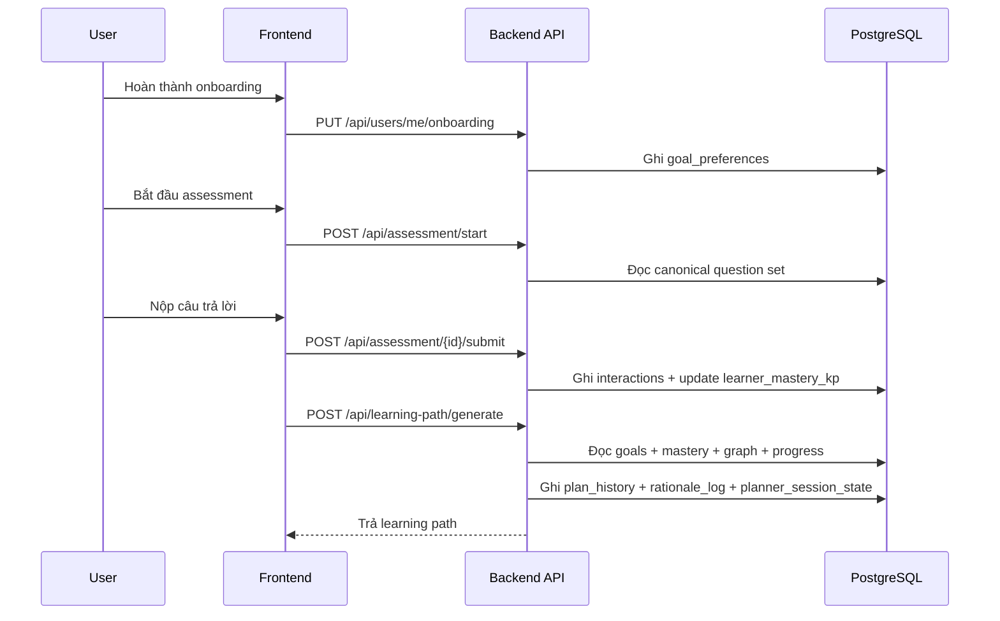
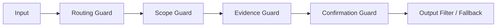
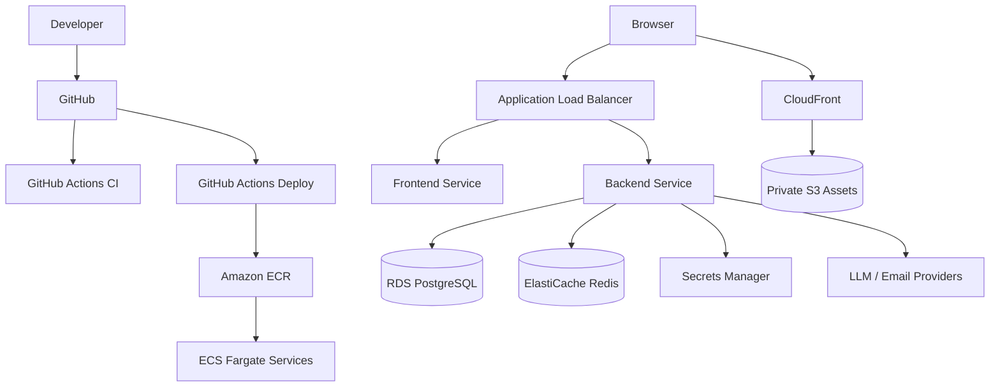

# System Architecture

## Feature map

- [Onboarding](./onboarding.md)
- [Assessment](./assessment.md)
- [Learning Path Planner](./learning-path-planner.md)
- [Replan](./replan.md)
- [Agent Tutor](./agent-tutor.md)
- [Guardrails](./guardrails.md)
- [Auth Password Reset](./auth-password-reset.md)
- [Admin Observability](./admin-observability.md)
- [Canonical Runtime Cutover](./canonical-runtime-cutover.md)
- [Deployment ECS](./deployment-ecs.md)

## 1. Tổng quan hệ thống

Liên quan:
- [Canonical Runtime Cutover](./canonical-runtime-cutover.md)
- [Deployment ECS](./deployment-ecs.md)
- [Admin Observability](./admin-observability.md)



## 2. Kiến trúc ứng dụng

Liên quan:
- [Canonical Runtime Cutover](./canonical-runtime-cutover.md)
- [Agent Tutor](./agent-tutor.md)
- [Guardrails](./guardrails.md)



## 3. Frontend architecture

Liên quan:
- [Onboarding](./onboarding.md)
- [Learning Path Planner](./learning-path-planner.md)
- [Replan](./replan.md)
- [Agent Tutor](./agent-tutor.md)



## 4. Backend architecture

Liên quan:
- [Assessment](./assessment.md)
- [Canonical Runtime Cutover](./canonical-runtime-cutover.md)
- [Admin Observability](./admin-observability.md)



## 5. Dòng dữ liệu học tập thích ứng

Liên quan:
- [Onboarding](./onboarding.md)
- [Assessment](./assessment.md)
- [Learning Path Planner](./learning-path-planner.md)
- [Replan](./replan.md)



## 6. Canonical data model

Liên quan:
- [Canonical Runtime Cutover](./canonical-runtime-cutover.md)
- [Assessment](./assessment.md)
- [Learning Path Planner](./learning-path-planner.md)



## 7. Onboarding -> Assessment -> Planner flow

Liên quan:
- [Onboarding](./onboarding.md)
- [Assessment](./assessment.md)
- [Learning Path Planner](./learning-path-planner.md)



## 8. Replan flow

Liên quan:
- [Replan](./replan.md)
- [Assessment](./assessment.md)
- [Learning Path Planner](./learning-path-planner.md)

```mermaid
flowchart TD
    U[User claim kiến thức đã biết] --> RP[/replan]
    RP --> ANA[POST /api/replan/analyze]
    ANA --> KW[Keyword planner]
    KW --> DISC[Current path unit discovery]
    DISC --> PRE[Prerequisite suggestion]
    PRE --> SCOPE[Scope review]
    SCOPE --> START[POST /api/replan/assessment/start]
    START --> ASM[Assessment engine]
    ASM --> MKP[Update mastery]
    MKP --> PLAN[Planner cập nhật path]
```

## 9. Agent Tutor architecture

Liên quan:
- [Agent Tutor](./agent-tutor.md)
- [Guardrails](./guardrails.md)
- [Admin Observability](./admin-observability.md)

```mermaid
flowchart TD
    USER[User] --> AG[/agent hoặc /lectures/ask]
    AG --> ROUTE[Structured Router]
    ROUTE --> POLICY[Policy Guard]
    POLICY --> RAG[Agentic RAG / Tutor Context]
    RAG --> TOOL[Tool execution]
    TOOL --> COMP[Response Composer]
    COMP --> RESP[Grounded response]

    POLICY --> PA[Pending Action]
    PA --> CONFIRM[User confirm/reject]
    CONFIRM --> COMMIT[Commit service]
```

## 10. Guardrails architecture

Liên quan:
- [Guardrails](./guardrails.md)
- [Agent Tutor](./agent-tutor.md)
- [Replan](./replan.md)



## 11. Observability architecture

Liên quan:
- [Admin Observability](./admin-observability.md)
- [Agent Tutor](./agent-tutor.md)
- [Deployment ECS](./deployment-ecs.md)

```mermaid
flowchart TD
    API[FastAPI App] --> METRICS[/metrics]
    API --> LOGS[AccessLogMiddleware]
    API --> LF[LangFuse Tracing]

    METRICS --> PROM[Prometheus]
    LOGS --> LOKI[Loki / JSON logs]
    LF --> LANGFUSE[LangFuse Cloud]

    PROM --> GRAF[Grafana]
    LOKI --> GRAF
```

## 12. Deployment architecture

Liên quan:
- [Deployment ECS](./deployment-ecs.md)
- [Admin Observability](./admin-observability.md)
- [Canonical Runtime Cutover](./canonical-runtime-cutover.md)



## 13. Gợi ý dùng trong technical report

Bạn có thể tách file này thành 3 lớp trình bày:

- **Architecture overview**: mục 1, 2, 12
- **Core product intelligence**: mục 5, 6, 7, 8
- **AI and production safety**: mục 9, 10, 11

Nếu cần rút gọn cho slide hoặc report ngắn, nên giữ lại 4 sơ đồ chính:
- Tổng quan hệ thống
- Canonical data model
- Onboarding -> Assessment -> Planner
- Deployment architecture
