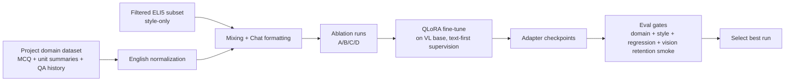

# Fine-tune Pipeline — English AI/ML Tutor with Qwen2.5-VL-3B-Instruct

> Source of truth: [PROPOSAL.md](./PROPOSAL.md). This pipeline keeps the current dataset research, but updates the model/runtime choice to a vision-capable Qwen VL stack.

## Overview

Fine-tune `Qwen/Qwen2.5-VL-3B-Instruct` as an English tutor for AI/ML/NLP/CV. In v1, supervision remains text-first so the existing dataset research does not change, while the deployed model still supports vision inputs.



## 1. Goal

- Preserve and improve domain correctness on AI/ML/NLP/CV course material.
- Improve long-form English explanation quality.
- Avoid domain drift from generic external data.

## 2. Data roles

| Source | Role | Train use |
|---|---|---|
| Project dataset | Primary domain knowledge anchor | Yes |
| Filtered ELI5 | Auxiliary long-form explanation style | Yes |
| Held-out internal split | Main shipping gate | Eval only |
| MMLU selected / MMLU-Pro / TheoremQA | Regression and academic reporting | Eval only |
| Filtered ELI5 dev/test | Style-only evaluation | Eval only |

## 3. Data preparation

### 3a. Domain dataset

Use the existing project dataset as the main source:

- `question_bank.jsonl`
- `units.jsonl`
- `qa_history.jsonl` if quality-screened

Recommended metadata to preserve per sample:

- `course_id`
- `lecture_id`
- `unit_id`
- `source_ref`
- `difficulty`
- `question_intent`

### 3b. English normalization

All training samples must be English-only before mixing.

Normalization rules:

- Convert any Vietnamese or mixed-language content to English.
- Preserve technical terms such as `gradient descent`, `backpropagation`, `attention`, `batch normalization`.
- Reject translated samples that lose technical meaning or context.
- Keep tutor tone academic, clear, and step-by-step.

### 3c. ELI5 filtering

Do not use raw ELI5. Keep only a filtered subset that matches explanation-style needs.

| Filter group | Rule |
|---|---|
| Question type | Prefer `why`, `how`, `difference`, `what happens`, `how does` |
| Answer length | ~120-450 words |
| Topic | science, math, computing, probability, optimization, ML, NLP, CV |
| Quality | coherent, explanatory, low-noise |
| Exclude | politics, sports, celebrity, entertainment, anecdotal or sarcasm-heavy answers |

## 4. Training format

Use chat-format SFT so the fine-tuned model matches deployment behavior.

In v1, keep the training samples text-only unless the project later adds vetted multimodal supervision. This preserves the current dataset thesis instead of inventing a new image corpus requirement.

Example sample:

```json
{
  "messages": [
    {
      "role": "system",
      "content": "You are an AI/ML/NLP/CV tutor. Explain concepts clearly, accurately, and step by step in English."
    },
    {
      "role": "user",
      "content": "Why does dropout reduce overfitting?"
    },
    {
      "role": "assistant",
      "content": "Dropout reduces overfitting by randomly disabling a subset of neurons during training..."
    }
  ]
}
```

Training remains single-turn in v1 unless multi-turn domain data is later added explicitly.

## 5. Split strategy

Split the project dataset by `lecture_id`, not by random sample, to avoid leakage between variants from the same lecture.

- Train: 80%
- Val: 10%
- Test: 10%

Keep ELI5 dev/test separate from training.

## 6. Ablation runs

| Run | Mix |
|---|---|
| A | 100% project dataset |
| B | project dataset + 10% filtered ELI5 |
| C | project dataset + 20% filtered ELI5 |
| D | project dataset + 30% filtered ELI5 |

Decision rule:

- `30%` is an upper-bound stress test, not the default target.
- Choose the best run by evaluation, not by lowest training loss.

## 7. Model and QLoRA setup

| Item | Value |
|---|---|
| Base model | `Qwen/Qwen2.5-VL-3B-Instruct` |
| Fine-tune method | QLoRA 4-bit |
| Target type | Vision-capable model, text-first SFT in v1 |
| Max sequence length | 2048 or 4096 depending on GPU |
| Suggested LoRA rank | `r=16` or `r=32` |
| Suggested target modules | `q_proj`, `k_proj`, `v_proj`, `o_proj`, `gate_proj`, `up_proj`, `down_proj` |
| Vision tower policy | Freeze in v1 unless later multimodal data is added deliberately |

## 8. Evaluation stack

### Primary

- Held-out internal domain set
- Manual vision-retention smoke prompts on representative course images, diagrams, or screenshots

### Secondary

- MMLU selected subjects
- MMLU-Pro
- TheoremQA

### Style-only

- Filtered ELI5 dev/test

## 9. Success and failure rules

### Accept a run if

- Internal domain correctness improves.
- Explanation quality in English improves clearly.
- General benchmark regression is small and acceptable.

### Reject a run if

- Fluency improves but domain correctness drops.
- Hallucination rate increases materially.
- Responses become longer but less precise.

## 10. Artifacts

| Path | Purpose |
|---|---|
| `data/sft/train.jsonl` | Mixed training set |
| `data/sft/val.jsonl` | Validation set |
| `data/sft/test.jsonl` | Internal held-out test set |
| `eval/domain_eval.jsonl` | Internal domain evaluation |
| `eval/eli5_style_eval.jsonl` | Style evaluation |
| `checkpoints/` | Adapter checkpoints |
| `eval/run_summary.md` | Final comparison across runs |

## 11. Current status

- `PROPOSAL.md` is aligned with this pipeline.
- Older Vietnamese-specific assumptions should be considered deprecated.
- Vision capability is active again at the model and serving layers, but the dataset research remains unchanged.
- `FinetuneLoRA-2.ipynb` is a legacy notebook and is not the source of truth for v1 of the English-only plan.
