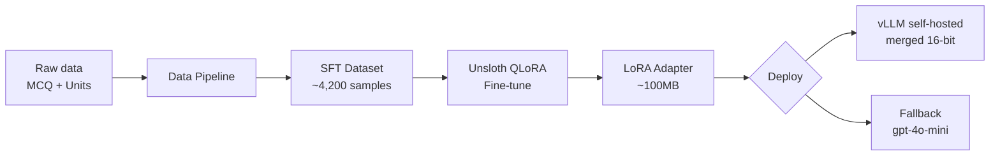
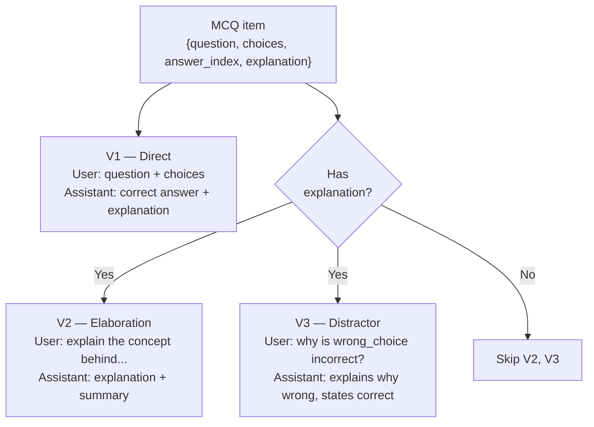
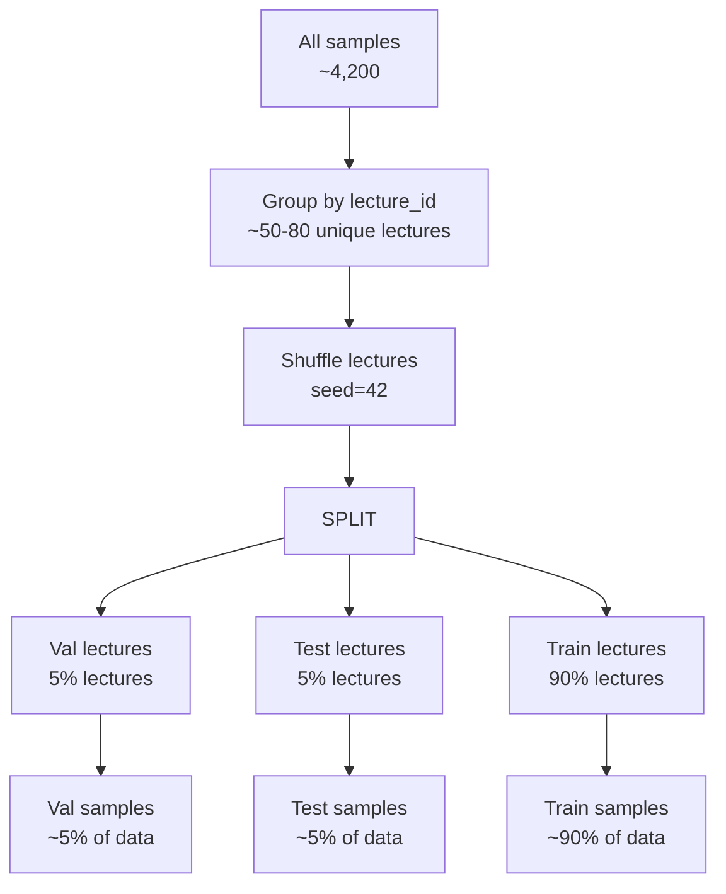
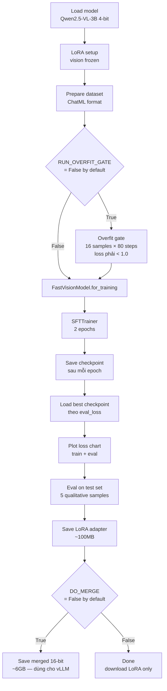

# Fine-tune Pipeline — Qwen2.5-VL-3B-Instruct với Unsloth QLoRA

## Overview

Fine-tune nhẹ Qwen2.5-VL-3B-Instruct trên domain data của 3 khóa học ML (CS224n, CS231n, CS230), sau đó self-host với fallback về gpt-4o-mini.



---

## 1. Data Sources

| File | Nội dung | Số lượng |
|---|---|---|
| `question_bank.jsonl` | MCQs có explanation | 1,276 items |
| `units.jsonl` | Learning unit summaries | 376 units |
| `qa_history.jsonl` | Production Q&A logs | 58 entries (optional) |

---

## 2. Data Pipeline

### 2a. MCQ → ChatML Variants

Mỗi MCQ được chuyển thành **tối đa 3 variants** tùy theo có `explanation` hay không:



**System prompt chung:**
```
You are an expert AI tutor for graduate-level ML courses
(CS224n NLP, CS231n Computer Vision, CS230 Deep Learning).
Answer concisely and educationally.
```

### 2b. Unit Summaries

Units có `title` + `summary` dài ≥50 ký tự được convert thành Q&A:
- User: `Summarize the key concepts in '{title}'`
- Assistant: `{summary}`

### 2c. Sample counts (ước tính)

| Variant | Samples |
|---|---|
| v1 (direct) | ~1,276 |
| v2 (elaboration) | ~1,200 (items có explanation) |
| v3 (distractor) | ~1,200 (items có explanation) |
| unit_summary | ~200-376 |
| **Total** | **~3,800–4,200** |

---

## 3. Train/Val/Test Split

Split theo `lecture_id` (không split random theo sample) để tránh data leakage giữa các variants cùng lecture.



> **Lý do split theo lecture:** 3 variants của cùng 1 MCQ có nội dung rất gần nhau. Nếu split theo sample, cùng MCQ có thể xuất hiện ở cả train và val → eval loss không phản ánh thực tế.

---

## 4. Model & Training Setup

### 4a. Model

| Config | Giá trị |
|---|---|
| Base model | `unsloth/Qwen2.5-VL-3B-Instruct` |
| Quantization load | 4-bit (QLoRA) |
| Vision tower | **Frozen** — chỉ train language layers |
| Max seq length | 2048 tokens |

> **Tại sao giữ VLM?** Pipeline production gửi `image_base64` (JPEG video frame) vào model. Giữ `FastVisionModel` đảm bảo image support không bị mất sau fine-tune.

### 4b. LoRA Config

| Param | Giá trị |
|---|---|
| `r` | 16 |
| `lora_alpha` | 16 |
| `lora_dropout` | 0.05 |
| `bias` | none |
| Target modules | attention + MLP (language layers only) |
| Gradient checkpointing | unsloth mode |

### 4c. Training Config

| Param | Giá trị |
|---|---|
| `per_device_train_batch_size` | 2 |
| `gradient_accumulation_steps` | 8 |
| **Effective batch size** | **16** |
| Epochs | 2 |
| Learning rate | 2e-4 |
| LR scheduler | cosine |
| Warmup ratio | 0.05 |
| Optimizer | adamw_8bit |
| Precision | fp16 (T4) / bf16 (A100+) — auto detect |

### 4d. Loss masking

Dùng `train_on_responses_only` — chỉ tính loss trên **assistant tokens**, không tính system/user prompt.

```
<|im_start|>system\n...     ← masked (không tính loss)
<|im_start|>user\n...       ← masked (không tính loss)
<|im_start|>assistant\n...  ← tính loss ở đây
```

---

## 5. Training Flow



---

## 6. Output

| File | Size | Dùng cho |
|---|---|---|
| `checkpoints/tutor-vl3b-v1/` | ~100MB | Resume training, inference với PEFT |
| `checkpoints/tutor-vl3b-v1/checkpoint-1/` | ~100MB | Epoch 1 checkpoint |
| `checkpoints/tutor-vl3b-v1/checkpoint-2/` | ~100MB | Epoch 2 checkpoint (best) |
| `models/tutor-vl3b-v1-merged/` | ~6GB | vLLM serving (chỉ khi `DO_MERGE=True`) |
| `loss_curve.png` | <1MB | Visual confirm training OK |

---

## 7. Giới hạn của dataset này

| Khía cạnh | Đánh giá |
|---|---|
| Giải thích khái niệm ML | ✅ Đủ (~4,200 samples) |
| Tutor style / ngữ điệu giải thích | ✅ V2/V3 variants |
| Image/frame support | ✅ Vision tower giữ nguyên |
| Visual grounding | ⚠️ Không cải thiện — SFT data text-only |
| Multi-turn conversation | ❌ Không có |
| Tiếng Việt | ❌ Toàn bộ data là tiếng Anh |
| Tool calling | ❌ Không có samples |

**Kết luận:** Phù hợp cho **v1** với Gemini/OpenAI fallback. Visual grounding và tool calling cần bổ sung data ở v2.

---

## 8. Kaggle Runbook

```
1. Upload 3 files lên Kaggle Dataset tên "a20-finetune-data"
   - question_bank.jsonl
   - units.jsonl
   - qa_history.jsonl (optional)

2. New Notebook → Import finetune_qwen_unsloth.ipynb
   → Add Data: a20-finetune-data
   → Accelerator: GPU T4 x1
   → Internet: On

3. Run All (~1.5-2h)

4. Output tab → download checkpoints/tutor-vl3b-v1/

5. Nếu cần vLLM: set DO_MERGE=True, chạy lại cell cuối
```
