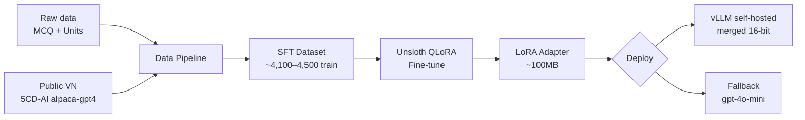
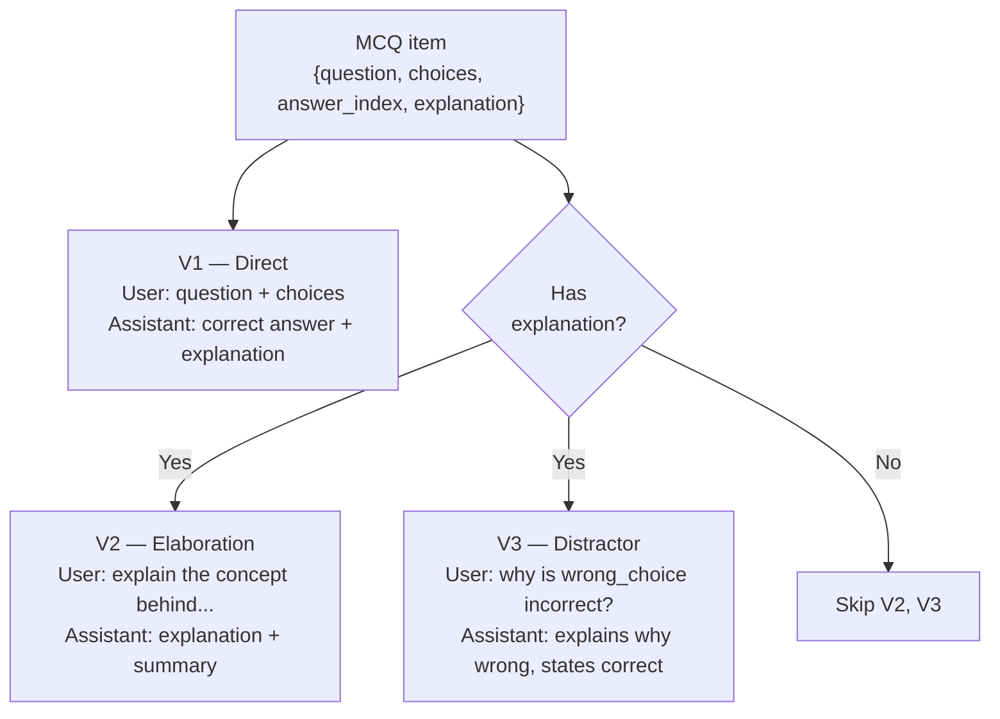
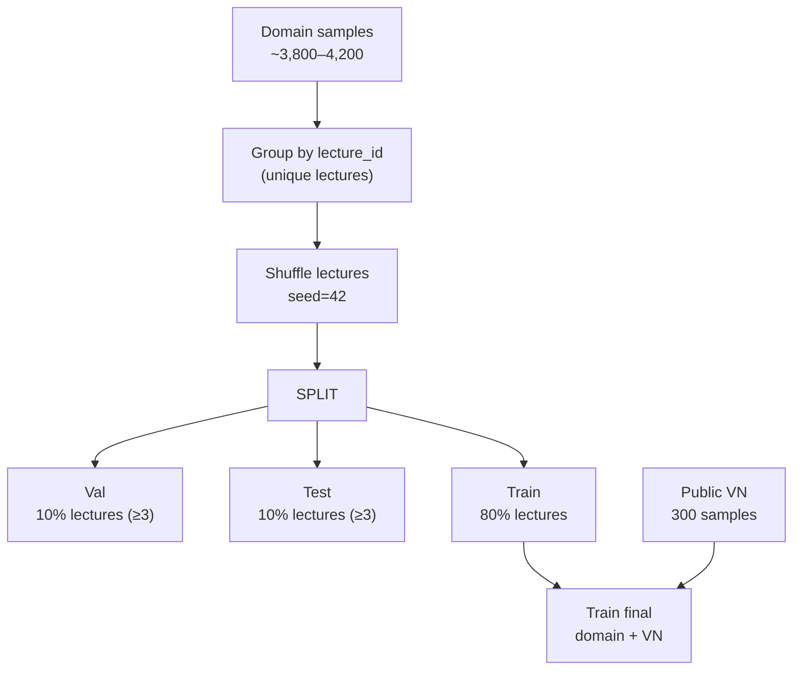
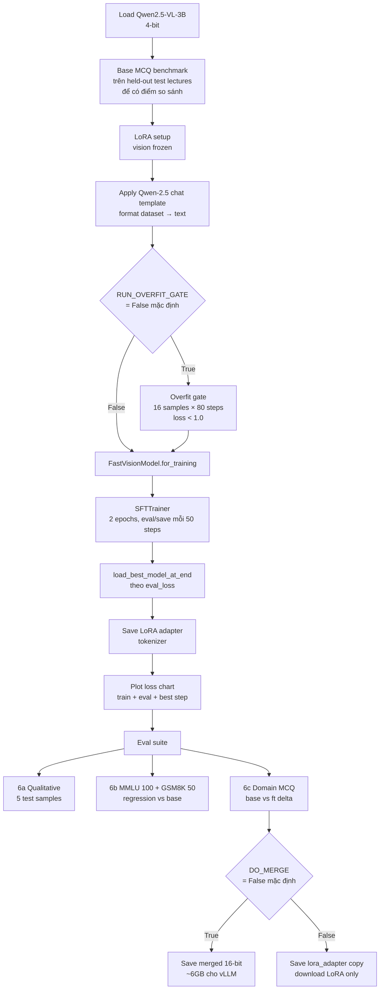

# Fine-tune Pipeline — Qwen2.5-VL-3B-Instruct với Unsloth QLoRA

> Source-of-truth: `FinetuneLoRA-2.ipynb` (40 cells). Doc này mô tả đúng theo từng cell.

## Overview

Fine-tune Qwen2.5-VL-3B-Instruct trên domain data của 3 khóa ML (CS224n, CS231n, CS230) + bổ sung tiếng Việt từ public dataset, sau đó self-host (vLLM) với fallback gpt-4o-mini.



---

## 1. Data Sources

| File / Source | Nội dung | Số lượng | Dùng cho |
|---|---|---|---|
| `question_bank.jsonl` | MCQs có explanation | 1,276 items | train + val + test |
| `units.jsonl` | Learning unit summaries | 376 units | train + val + test |
| `qa_history.jsonl` | Production Q&A logs | 58 entries (optional) | train + val + test |
| `5CD-AI/Vietnamese-alpaca-gpt4-newformat` (HF) | Public VN instruction data | 300 (cap) | **train only** |

> Public VN samples chỉ vào train để tránh contaminate domain eval.

---

## 2. Data Pipeline

### 2a. MCQ → ChatML Variants

Mỗi MCQ → tối đa **3 variants** tùy theo có `explanation`:



**System prompt chung (Cell 8):**
```
You are an expert AI tutor for graduate-level ML courses
(CS224n NLP, CS231n Computer Vision, CS230 Deep Learning).
Answer concisely and educationally. Ground your answers in course material when possible.
```

### 2b. Unit Summaries

Units có `title` + `summary` ≥ 50 ký tự → Q&A:
- User: `[{course_id}] Summarize the key concepts in '{title}'`
- Assistant: `{summary}`

### 2c. Public VN samples (Cell 9–10)

Dataset `5CD-AI/Vietnamese-alpaca-gpt4-newformat`, format `{instruction, input, output}`:
- Shuffle seed=42, lấy tối đa 300 mẫu.
- User content = `{instruction}\n\n{input}` (hoặc chỉ `instruction`).
- Assistant = `output`.
- `lecture_id="__vi__"`, `variant="vi_instruct"` → tách khỏi domain split.

### 2d. Sample counts (ước tính)

| Variant | Samples |
|---|---|
| v1 (direct) | ~1,276 |
| v2 (elaboration) | ~1,200 |
| v3 (distractor) | ~1,200 |
| unit_summary | ~200–376 |
| **Domain total** | **~3,800–4,200** |
| vi_instruct (train-only) | 300 |
| **Grand total** | **~4,100–4,500** |

---

## 3. Train/Val/Test Split (Cell 14)

Split theo `lecture_id` (không split random) để tránh leakage giữa các variants cùng lecture. Tỉ lệ **80 / 10 / 10** trên domain lectures; public VN gộp vào train sau khi split.



> **Lý do split theo lecture:** 3 variants của cùng 1 MCQ có nội dung gần nhau — nếu split theo sample, cùng MCQ xuất hiện ở cả train và val → eval loss giả.

---

## 4. Model & Training Setup

### 4a. Model (Cell 16)

| Config | Giá trị |
|---|---|
| Base model | `unsloth/Qwen2.5-VL-3B-Instruct` |
| Quantization load | 4-bit (QLoRA) |
| Vision tower | **Frozen** — chỉ train language layers |
| Max seq length | 2048 tokens |
| Precision | bf16 nếu sm ≥ 80 (Ampere+), ngược lại fp16 (T4 sm_75) |

> **Tại sao giữ VLM?** Pipeline production gửi `image_base64` (JPEG video frame) vào model. Giữ `FastVisionModel` + freeze vision tower đảm bảo image support không mất sau fine-tune.

### 4b. LoRA Config (Cell 20)

| Param | Giá trị |
|---|---|
| `r` | 16 |
| `lora_alpha` | 16 |
| `lora_dropout` | 0.05 |
| `bias` | none |
| `finetune_vision_layers` | False |
| `finetune_language_layers` | True |
| `finetune_attention_modules` | True |
| `finetune_mlp_modules` | True |
| Gradient checkpointing | unsloth mode |
| `random_state` | 42 |

### 4c. Training Config (Cell 26)

| Param | Giá trị |
|---|---|
| `per_device_train_batch_size` | 2 |
| `gradient_accumulation_steps` | 8 |
| **Effective batch size** | **16** |
| `num_train_epochs` | 2 |
| `learning_rate` | **1e-4** (an toàn hơn với data nhỏ/synthetic-heavy) |
| `lr_scheduler_type` | cosine |
| `warmup_steps` | 50 |
| `optim` | adamw_8bit |
| `bf16 / fp16` | auto theo GPU |
| `eval_strategy` | steps, `eval_steps=50` |
| `save_strategy` | steps, `save_steps=50`, `save_total_limit=3` |
| `load_best_model_at_end` | True |
| `metric_for_best_model` | `eval_loss` |
| `dataset_text_field` | `text` |
| `max_seq_length` | 2048 |
| `dataloader_num_workers` | 2 |

### 4d. Loss masking (Cell 26)

Dùng `train_on_responses_only` — chỉ tính loss trên **assistant tokens**:

```
<|im_start|>system\n...     ← masked
<|im_start|>user\n...       ← masked
<|im_start|>assistant\n...  ← tính loss ở đây
```

---

## 5. Training Flow



---

## 6. Evaluation suite

### 6a. Qualitative (Cell 30)

5 test samples đầu tiên → generate với `temperature=0.1, max_new_tokens=200`. Đối chiếu thủ công Q / Ref / Gen.

### 6b. Tier-0 Benchmark — MMLU + GSM8K (Cell 33)

| Benchmark | N | Metric | Expected (Qwen2.5-3B base) |
|---|---|---|---|
| MMLU (`cais/mmlu`, all) | 100 | Letter accuracy (A/B/C/D) | ~55–60% |
| GSM8K (`openai/gsm8k`, main) | 50 | Exact number match (`#### N`) | ~60–65% |

> **Ngưỡng regression:** không drop > 5% so với base — nếu drop, domain SFT đang đè general capability.

### 6c. Domain MCQ — base vs fine-tuned (Cell 18 + Cell 35)

- **Cell 18 (trước LoRA):** chạy MCQ benchmark trên `bench_items = mcqs có lecture_id ∈ test_lectures`, lưu `base_mcq_acc`.
- **Cell 35 (sau training):** chạy lại trên cùng tập, tính `ft_mcq_acc` và `delta = ft - base`.
- Breakdown by `course_id`.
- Save:
  - `eval/domain_mcq_predictions.jsonl` — per-item: gold, pred, correct.
  - `eval/domain_mcq_summary.json` — `{benchmark_items, base_accuracy, finetuned_accuracy, delta, by_course}`.

---

## 7. Output artifacts

| Path | Size | Dùng cho |
|---|---|---|
| `checkpoints/tutor-vl3b-v1/` | ~100MB | Best LoRA (load_best_at_end) — resume / inference với PEFT |
| `checkpoints/tutor-vl3b-v1/checkpoint-*/` | ~100MB × ≤3 | Step checkpoints (save_total_limit=3) |
| `models/tutor-vl3b-v1-merged/` | ~6GB | vLLM serving (chỉ khi `DO_MERGE=True`) |
| `lora_adapter/` | ~100MB | Bản copy LoRA save riêng cuối notebook |
| `loss_curve.png` | <1MB | Visual confirm training OK |
| `eval/domain_mcq_predictions.jsonl` | <1MB | Per-item predictions để debug |
| `eval/domain_mcq_summary.json` | <1KB | Base/ft/delta + by-course |
| `data/sft/{train,val,test}.jsonl` | ~10MB | SFT dataset đã split |

---

## 8. Giới hạn của dataset này

| Khía cạnh | Đánh giá |
|---|---|
| Giải thích khái niệm ML | ✅ Đủ (~4,100 domain samples) |
| Tutor style / ngữ điệu giải thích | ✅ V2/V3 variants |
| Image/frame support | ✅ Vision tower frozen — base VLM giữ nguyên |
| Visual grounding | ⚠️ Không cải thiện — SFT data text-only |
| Tiếng Việt | ⚠️ 300 samples (5CD-AI) — cải thiện nhẹ, chưa đủ production |
| Multi-turn conversation | ❌ Không có — chỉ single-turn |
| Tool calling | ❌ Không có samples |

**Kết luận:** Phù hợp **v1** với fallback gpt-4o-mini. Visual grounding, multi-turn, tool calling cần data v2.

---

## 9. Kaggle Runbook

```
1. Upload 3 files lên Kaggle Dataset tên "a20-finetune-data"
   - question_bank.jsonl
   - units.jsonl
   - qa_history.jsonl (optional)

2. New Notebook → Import FinetuneLoRA-2.ipynb
   → Add Data: a20-finetune-data
     (DATA_ROOT = /kaggle/input/datasets/nguynnc/a20-finetune-data)
   → Accelerator: GPU T4 x1 (fp16) hoặc A100 (bf16)
   → Internet: On  (cần để pull HF datasets: 5CD-AI, MMLU, GSM8K)

3. Run All (~1.5–2h trên T4)

4. Output tab → download:
   - checkpoints/tutor-vl3b-v1/   (LoRA adapter)
   - eval/                        (predictions + summary)
   - loss_curve.png

5. Nếu cần vLLM serving: set DO_MERGE=True ở Cell 37, chạy lại
   → models/tutor-vl3b-v1-merged/ (~6GB)
```
