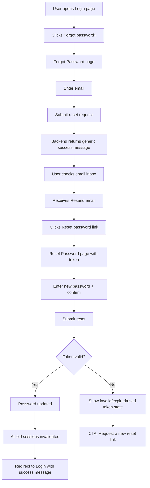
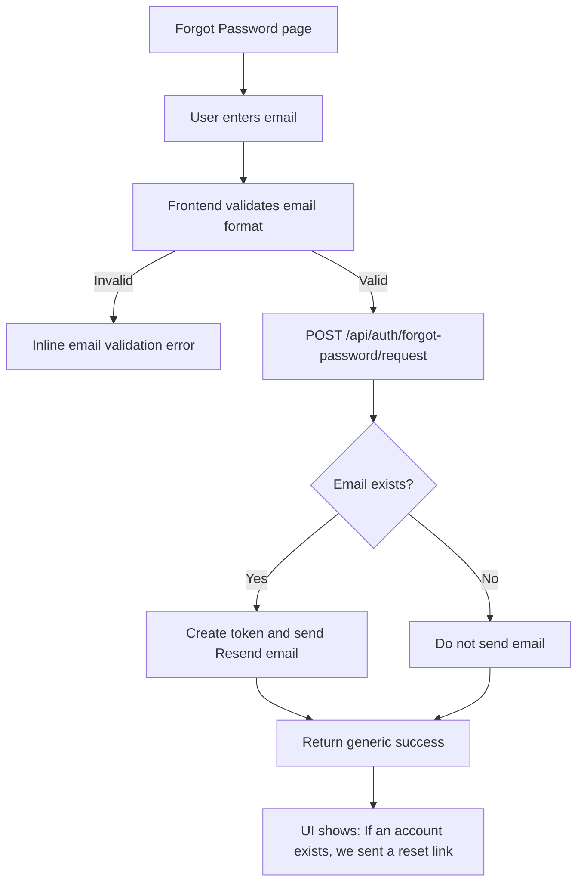
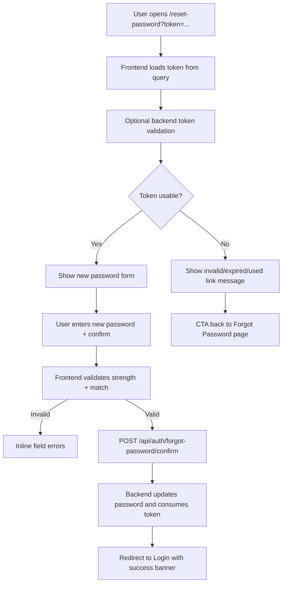
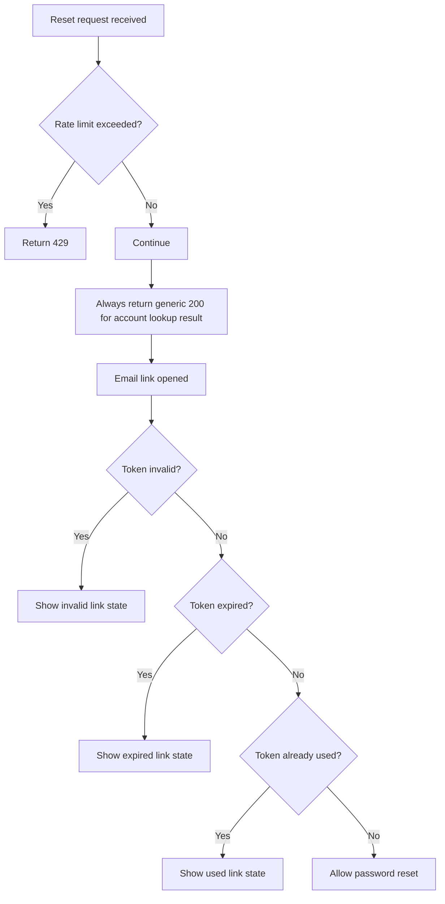

# Forgot Password via Resend

## Summary
- Intended plan document path: `remaining tasks/forgot password/plan.md`
- Replace the current insecure direct-reset flow with a secure 2-step password reset:
  - `/forgot-password`: request reset email
  - `/reset-password?token=...`: set new password from email link
- Use `Resend` to send the reset email.
- After reset success, invalidate all existing sessions and require login again.
- This plan explicitly includes user-facing UX flows and state handling.

## UX Flows

### 1. Main User Journey

### 2. Forgot Password Request UX

### 3. Reset Password Page UX

### 4. Security / Failure Branches

## User-Facing Screens After Completion
- `Login page`
  - keeps normal email/password form
  - adds a visible `Forgot password?` link
  - after successful reset, can show success banner: `Password reset successfully. Please sign in again.`
- `Forgot Password page`
  - single email field only
  - submit button: `Send reset link`
  - success state is generic, never reveals whether email exists
- `Reset Password page`
  - fields: `New password`, `Confirm new password`
  - inline validation for weak or mismatched passwords
  - invalid states:
    - invalid link
    - expired link
    - already-used link
  - each invalid state includes CTA to request a new reset email

## Architecture and Public Interfaces
- Add a database-backed password reset token table, recommended fields:
  - `id`
  - `user_id`
  - `token_hash`
  - `expires_at`
  - `used_at`
  - `created_at`
  - optional `requested_ip`
- Add session invalidation support, recommended as:
  - `users.password_changed_at`
  - or `users.token_version`
- Replace current insecure API behavior:
  - remove legacy direct reset semantics from `POST /api/auth/forgot-password`
  - add `POST /api/auth/forgot-password/request`
    - request: `{ email }`
    - response: `200 { status: "ok" }`
  - add `POST /api/auth/forgot-password/confirm`
    - request: `{ token, new_password }`
    - response: `200 { status: "ok" }`
  - optional: add `POST /api/auth/forgot-password/validate`
    - request: `{ token }`
    - response: `{ valid: boolean, reason?: "invalid" | "expired" | "used" }`
- Use opaque random reset tokens, store only hashed token in DB.
- Default reset token TTL: 30 minutes.
- Backend sends mail through a small mail service abstraction with a Resend-backed implementation.
- Add forgot-password rate limiting:
  - per IP
  - per normalized email

## Files To Touch
- Backend core:
  - `src/routers/auth.py`
  - `src/services/auth_service.py`
  - `src/schemas/auth.py`
  - `src/config.py`
  - `src/repositories/user_repo.py`
  - `src/dependencies/auth.py`
  - `src/models/user.py`
- Backend new files:
  - `src/models/password_reset.py`
  - `src/repositories/password_reset_repo.py`
  - `src/services/email_service.py`
  - `src/services/password_reset_service.py`
  - `alembic/versions/<new_revision>_add_password_reset_tokens_and_password_changed_at.py`
- Frontend:
  - `frontend/components/auth/LoginForm.tsx`
  - `frontend/components/auth/ForgotPasswordForm.tsx`
  - `frontend/app/(auth)/forgot-password/page.tsx`
  - `frontend/app/(auth)/reset-password/page.tsx`
  - `frontend/lib/api.ts`
  - `frontend/types/index.ts`
- Tests:
  - `tests/test_auth_reset_password.py`
  - `tests/test_auth_service_tokens.py`
  - `tests/test_auth_dependency.py`
  - `frontend/tests/unit/auth/auth-page-links.test.tsx`
  - new frontend unit test for reset-password page
- Config/docs:
  - `.env.example`
  - `deploy/ENVIRONMENT_MATRIX.md`
  - `deploy/PRODUCTION_CHECKLIST.md`
  - `README.md`

## Implementation Plan
- Phase 1: Data and session invalidation
  - add reset-token persistence
  - add `password_changed_at` or token-version invalidation
  - make auth dependency reject stale tokens after password reset
- Phase 2: Backend reset flow
  - replace current direct-reset endpoint behavior
  - add request and confirm endpoints
  - generate/store hashed single-use tokens
  - send reset email through Resend
  - enforce generic success response and rate limits
- Phase 3: Frontend UX
  - convert `/forgot-password` to email-only request form
  - add `/reset-password` form page
  - add success/error/expired/used states
  - add login page entry point
- Phase 4: Docs and configuration
  - document Resend setup
  - document required env vars
  - document local and production sender/domain setup

## Configuration Steps
- Add env vars:
  - `RESEND_API_KEY`
  - `EMAIL_FROM`
  - `FRONTEND_BASE_URL`
  - `PASSWORD_RESET_TOKEN_TTL_MINUTES=30`
  - `RATE_LIMIT_FORGOT_PASSWORD_PER_HOUR`
- Resend setup:
  - create Resend account
  - create API key
  - verify sender identity or domain
  - set `EMAIL_FROM` to a verified sender
- Local:
  - set `FRONTEND_BASE_URL=http://localhost:3000`
  - ensure backend outbound network can call Resend
- Production:
  - verify domain DNS in Resend
  - set production app URL as `FRONTEND_BASE_URL`
  - store API key in deployment secret manager

## Test Plan
- Backend tests
  - existing email request returns `200` and triggers mail send
  - unknown email request still returns `200`
  - invalid token is rejected
  - expired token is rejected
  - used token is rejected
  - valid token updates password hash
  - valid token marks reset token used
  - old auth tokens become invalid after password reset
  - forgot-password request rate limiting returns `429`
- Frontend tests
  - login page shows forgot-password link
  - forgot-password page only submits email
  - forgot-password success message is generic
  - reset-password page validates password confirmation
  - reset-password page shows invalid/expired/used token states
  - reset-password success redirects to login
- Manual checks
  - request reset from login page
  - receive real Resend email
  - click link and set new password
  - old password fails
  - old sessions are forced out
  - new login succeeds

## DoD Checklist
- [ ] Insecure direct-reset flow is removed.
- [ ] Forgot-password request no longer accepts `new_password`.
- [ ] Real Resend email is sent with working reset link.
- [ ] Reset token is hashed at rest, single-use, and expires.
- [ ] API never reveals whether an email exists.
- [ ] Successful reset invalidates all prior sessions/tokens.
- [ ] Frontend has separate `/forgot-password` and `/reset-password` pages.
- [ ] Invalid, expired, and used token states are clearly handled in UI.
- [ ] Backend and frontend tests cover happy path and failure path.
- [ ] `.env.example` and deploy docs include all new configuration.
- [ ] Plan content is ready for implementation.

## Assumptions
- Keep Next.js as the user-facing reset UI.
- Use DB-backed reset tokens, not JWT reset links.
- Send reset emails from FastAPI via Resend.
- No async job queue in v1; sending mail inline is acceptable.
- No localization or multi-template email system in v1.
